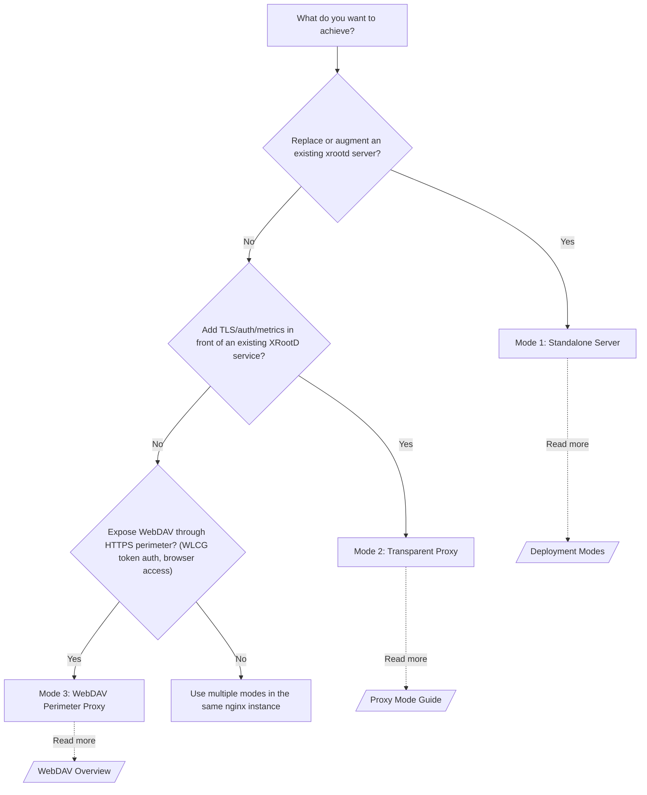

```
██████╗ ██████╗ ██╗██╗  ██╗        ██████╗ █████╗  ██████╗██╗  ██╗███████╗
██╔══██╗██╔══██╗██║╚██╗██╔╝       ██╔════╝██╔══██╗██╔════╝██║  ██║██╔════╝
██████╔╝██████╔╝██║ ╚███╔╝  █████╗██║     ███████║██║     ███████║█████╗
██╔══██╗██╔══██╗██║ ██╔██╗  ╚════╝██║     ██╔══██║██║     ██╔══██║██╔══╝
██████╔╝██║  ██║██║██╔╝ ██╗       ╚██████╗██║  ██║╚██████╗██║  ██║███████╗
╚═════╝ ╚═╝  ╚═╝╚═╝╚═╝  ╚═╝        ╚═════╝╚═╝  ╚═╝ ╚═════╝╚═╝  ╚═╝╚══════╝
```

# BriX-Cache

> **The whole HEP data stack in one nginx binary — `root://`, WebDAV, and S3 — built from snap-together parts you assemble to fit your site, instead of a monolith you bend to fit.**

Physicists at CERN, SLAC, and Fermilab move petabytes of collision data using two protocols nginx has never spoken: **XRootD** (`root://`) and **WebDAV** (`davs://`). This module teaches nginx both — plus an S3-compatible endpoint — so you get the entire HEP data stack inside one binary with all of nginx's battle-tested operations tooling behind it.

> 👋 **New here?** Never heard of XRootD or nginx? [Start with the beginner path](docs/index.md#-i-want-a-working-server---start-here) — you'll have a working server in ~50 minutes.

```text
                         +-----------------+
  xrdcp root://host/...  |                 |  /data/atlas/...  (POSIX)
  ─────────────────────> |                 | ─────────────────>
                         |     BriX-Cache     |
  xrdcp davs://host/...  |    (nginx +     | ─────────────────>  (proxy mode)
                         |     module)     |
  aws s3 cp s3://host/.. |                 |  http://dav-backend/  (WebDAV proxy)
  ─────────────────────> |                 | ─────────────────>
                         +-----------------+
                                 |
                         Prometheus /metrics
```

**Prefer pictures?** The [Architecture Overview](docs/10-architecture/overview.md) has Mermaid diagrams showing every request path.

New to XRootD or grid security? [What Is This Project](docs/01-getting-started/what-is-this.md) answers all the "wait, what?" questions, and [XRootD Basics](docs/02-concepts/xrootd-basics.md) fills in the physics context.

> 📖 **40 minutes from zero to running server:**
> 1. [Before You Start](docs/01-getting-started/before-you-start.md) — Servers, ports, protocols demystified (5 min)
> 2. [What Is This Project?](docs/01-getting-started/what-is-this.md) — Why this exists and what it does (5 min)
> 3. [Getting Started (Full)](docs/01-getting-started/getting-started-full.md) — Build, configure, and verify your first server (30 min)

---

## Architecture at a glance

### Where the module plugs into nginx

Three protocol families enter through nginx's battle-tested event loop, fan out to
the right module, and converge on **one shared module core** before touching a file:

```text
        root:// roots://             davs:// https://              s3://  http(s)
   xrdcp · xrdfs · pyxrootd        curl · rucio · browser        aws-cli · boto3
            │                              │                            │
            │ raw TCP / TLS                │ HTTPS                      │ HTTP/S
            ▼                              ▼                            ▼
 ╔═══════════════════════════════════════════════════════════════════════════════╗
 ║                       n g i n x   e v e n t   l o o p                           ║
 ║                epoll · non-blocking · 1 master + N worker procs                 ║
 ║                                                                                 ║
 ║   ┌──────────────────────────────┐   ┌───────────────────────────────────────┐ ║
 ║   │          stream { }          │   │                http { }               │ ║
 ║   │  ngx_stream_xrootd_module    │   │  webdav · s3 · metrics · dashboard    │ ║
 ║   │  ngx_stream_..._cms_srv      │   │  · srr · xrdhttp_filter modules       │ ║
 ║   │  native root:// / roots://   │   │  davs:// · S3 REST · /metrics · /xrootd│ ║
 ║   └───────────────┬──────────────┘   └──────────────────┬────────────────────┘ ║
 ║                   │                                      │                      ║
 ║                   └──────────────┬───────────────────────┘                     ║
 ║                                  ▼                                              ║
 ║         ┌──────────────  shared module core (src/)  ──────────────┐            ║
 ║         │  auth · path-confine · async-IO · metrics · cache · cms │            ║
 ║         └────────────────────────────┬────────────────────────────┘           ║
 ╚══════════════════════════════════════╪═════════════════════════════════════════╝
                                         ▼
                ┌────────────────────────────────────────────────┐
                │   /data POSIX tree   │   root:// backend        │
                │   (standalone)       │   (transparent proxy /   │
                │                      │    read-through cache)    │
                └────────────────────────────────────────────────┘
```

### Inside the module — `src/` in seven buckets

The source tree is organized by concept, not by accretion: seven top-level
buckets, each owning one question. Any subsystem can be located from its
concept alone:

```text
 src/
 ├─ core/            the nginx plumbing everything rides on — compat shims,
 │                   shared types, config parse/merge, shared memory, and the
 │                   thread-pool async-I/O machinery
 ├─ protocols/       one folder per wire protocol — root/ (the whole root://
 │                   plane: connection → handshake → session → read/write →
 │                   response), webdav/, s3/, ssi/, srr/, dig/, shared/
 ├─ auth/            identity & authorization — gsi/ token/ sss/ krb5/ pwd/
 │                   unix/ host/ voms/, the shared crypto/ PKI core, the
 │                   authz/ ACL engine, and the impersonate/ broker
 ├─ fs/              the storage plane — the VFS is the sole storage truth
 │                   (bytes, namespace, metadata): path/ confinement,
 │                   pluggable backend/ drivers, cache/, tier/, the xfer/
 │                   staging engine, scan/
 ├─ net/             scale-out & interposition — cms/ + manager/ clustering,
 │                   upstream/ + proxy/ relaying, ratelimit/, tap/, mirror/
 ├─ observability/   metrics/ (Prometheus), accesslog/, dashboard/, pmark/
 └─ tpc/             third-party copy — cross-plane by nature, kept top-level

   protocols → "parse the wire"       auth → "may you?"
   fs        → "here are the bytes"   net  → "ask another node"
```

Every request flows the same way: a **protocols** front end parses the wire,
**auth** decides identity and access, and all storage work funnels through the
**fs** VFS — raw file I/O exists only in `src/fs/backend/`. Each directory
carries its own `README.md`; [src/README.md](src/README.md) is the full
subsystem map.

### A `root://` download, wire step by wire step

The native protocol is a request/response conversation over one TCP connection.
Auth happens once; then `open` → `read`-loop → `close`. Path confinement and
checksums are non-negotiable on every byte:

```text
  client                         BriX-Cache                          disk / backend
    │                               │                                    │
    │── handshake (4×0, "root") ───►│                                    │
    │◄──── protocol + TLS hint ─────│  kXR_wantTLS / kXR_ableTLS         │
    │── kXR_login (user, pid) ─────►│                                    │
    │◄──── login resp + sec menu ───│                                    │
    │── kXR_auth (GSI│token│SSS) ──►│  verify cert / JWT / shared secret │
    │◄──── auth ok ─────────────────│  kXR_sigver session armed          │
    │── kXR_open "/data/f.root" ───►│  resolve_path → openat2 confine ──►│ open()
    │◄──── filehandle (fh) ─────────│                                    │
    │═ kXR_read / pgread(fh,off) ══►│  thread-pool preadv ──────────────►│ pread()
    │◄═══ data  (+ per-page CRC32c)═│  event loop stays free to serve    │
    │      … pipelined read loop …  │      other connections             │
    │── kXR_close (fh) ────────────►│  access-log line + metrics ++      │
    │◄──── ok ──────────────────────│                                    │
```

### Why one blocking `read` can't stall 10,000 connections

nginx workers must never block. Every disk syscall is handed to a thread pool;
the worker keeps framing protocol and servicing other sockets while the read is
in flight, then picks up the completion as just another event:

```text
   epoll worker  (never blocks)              thread pool  (blocking syscalls)
   ┌─────────────────────────────┐          ┌────────────────────────────────┐
   │ parse kXR_read frame        │          │  thr-1   preadv()  ──► disk     │
   │ enqueue read task ──────────┼────────► │  thr-2   pwrite()  ──► disk     │
   │ … serve other conns …       │          │  thr-3   CRC32c  (SSE4.2)       │
   │ ◄── completion event ───────┼──────────┤  thr-4   …                      │
   │ frame reply, sendfile / TLS │          └────────────────────────────────┘
   └─────────────────────────────┘           thread_pool default=4, max_queue
        one worker per CPU core               cleartext → file-backed sendfile
                                              TLS       → memory-backed buffers
```

---

## Three ways to deploy

```text
  MODE 1 — Standalone server
  ──────────────────────────
  xrdcp client ──>  BriX-Cache     ──> local POSIX filesystem
                       |
                  auth/TLS/metrics handled here

  MODE 2 — XRootD transparent proxy
  ──────────────────────────────────
  xrdcp client ──>  BriX-Cache     ──> root://backend (xrdceph, HDFS, tape, ...)
                       |                  ^
                  terminates auth    file-handle translation,
                  & TLS, emits       lazy connect, opaque relay
                  metrics

  MODE 3 — WebDAV perimeter proxy
  ────────────────────────────────
  HTTP client  ──>  BriX-Cache     ──> http://internal-dav-server/
  (xrdcp,            |
   browser,     terminates HTTPS,
   rucio)       WLCG token auth,
                metrics
```

Pick whichever fits your site — or combine them:

| Situation | Mode |
|---|---|
| Replacing or augmenting an `xrootd` daemon on a storage node | Standalone |
| Adding TLS, auth, or metrics in front of an existing XRootD service | XRootD proxy |
| Exposing xrootd WebDAV through an HTTPS perimeter (WLCG token auth) | WebDAV proxy |

All three modes share one nginx instance. The `stream {}` block owns native `root://` / `roots://` traffic; `http {}` owns WebDAV, S3, and Prometheus. Mix and match freely.

Not sure which mode you need? The decision only takes 30 seconds:



---

## Get running in 4 commands

```bash
# 1. Download nginx source
curl -O https://nginx.org/download/nginx-1.28.3.tar.gz
tar xzf nginx-1.28.3.tar.gz && cd nginx-1.28.3

# 2. Configure with the module
./configure --with-stream --with-stream_ssl_module --with-http_ssl_module --with-threads \
            --add-module=/path/to/nginx-xrootd

# 3. Build and install
make -j$(nproc) && sudo make install

# 4. Write an nginx.conf (see examples below) and start
nginx -p /prefix -c nginx.conf
```

Want the full story — PKI setup, test tokens, and the test suite? [Quick Install](docs/01-getting-started/quick-install.md) has you covered; [Build Guide](docs/03-configuration/build-guide.md) goes deeper on compiler flags and optional modules.

---

## Working configs in 30 lines

### Standalone server — native XRootD + WebDAV

```nginx
worker_processes auto;
thread_pool default threads=4 max_queue=65536;
events { worker_connections 1024; }

# Native XRootD protocol (xrdcp root://localhost:1094//data/file.root)
stream {
    server {
        listen 1094;
        xrootd on;
        xrootd_root /data;
        xrootd_allow_write on;
    }
}

# WebDAV over HTTPS (xrdcp davs://localhost:8443//data/file.root)
http {
    server {
        listen 8443 ssl;
        ssl_certificate     /etc/grid-security/hostcert.pem;
        ssl_certificate_key /etc/grid-security/hostkey.pem;
        ssl_verify_client   optional_no_ca;
        xrootd_webdav_proxy_certs on;
        location /xrootd/ {
            xrootd_dashboard on;
            xrootd_dashboard_password "change-me";
            xrootd_dashboard_session_ttl 8h;
        }
        location / {
            xrootd_webdav      on;
            xrootd_webdav_root /data;
            xrootd_webdav_cadir /etc/grid-security/certificates;
        }
    }
    server {
        listen 9100;
        location /metrics { xrootd_metrics on; }
    }
}
```

```bash
# Test it
xrdcp /local/file.root root://localhost:1094//data/test.root
xrdcp --allow-http /local/file.root davs://localhost:8443//data/test.root
```

### Transparent XRootD proxy

Slide BriX-Cache in front of any existing XRootD server and immediately gain TLS termination, auth enforcement, and Prometheus metrics — without changing a single line of client or backend config:

```nginx
stream {
    server {
        listen 1094;
        xrootd on;
        xrootd_proxy on;
        xrootd_proxy_upstream ceph-xrootd.site.example:1094;
    }
}
```

```bash
# Clients connect to nginx — the backend is invisible to them
xrdcp root://nginx.site.example//data/file.root /local/file.root
```

The proxy authenticates clients locally, lazily opens a backend connection on the first post-login opcode, translates file handles end-to-end, and relays responses verbatim — all without exposing the backend's identity to clients. Every request still lands in your Prometheus counters and access logs. See [Proxy Mode Guide](docs/05-operations/proxy-mode-guide.md).

### WebDAV perimeter proxy

Let nginx own the hard parts — HTTPS termination and WLCG token validation — then forward plain HTTP inward to your internal DAV server:

```nginx
http {
    server {
        listen 8443 ssl;
        ssl_certificate     /etc/grid-security/hostcert.pem;
        ssl_certificate_key /etc/grid-security/hostkey.pem;

        location / {
            xrootd_webdav_proxy on;
            xrootd_webdav_proxy_upstream http://internal-dav.site.example:8080;
        }
    }
}
```

---

## One filesystem, every client

```text
Path on disk:  /data/atlas/run3/AOD.pool.root
                       |
          +------------+------------+
          |            |            |
   root://host/        davs://host/ s3://host/
   /data/atlas/        /data/atlas/ atlas/
   run3/AOD.pool.root  run3/...     run3/AOD.pool.root
          |            |            |
        xrdcp        xrdcp        aws s3 cp
        xrdfs        curl         XrdClS3
        Python        rucio
        XRootD        browser
        client
```

The same POSIX tree — one set of files, one set of permissions — is visible simultaneously over all three protocols. Checksums, metadata, and XRootD `fattr` extended attributes are consistent regardless of how a client connects. A physicist using `xrdcp`, a pipeline using `rucio`, and a sysadmin using `aws s3 ls` all see the same bytes.

---

## Protocol support

| Protocol | Default port | Transport | Use |
|---|---|---|---|
| `root://` (native XRootD) | 1094 | raw TCP | `xrdcp`, `xrdfs`, Python XRootD client |
| `roots://` (TLS-from-first-byte) | 1095 | TLS | `xrdcp` with strict TLS |
| `davs://` (WebDAV over HTTPS) | 8443 | HTTPS | `xrdcp --allow-http`, rucio, browsers |
| S3-compatible HTTP | site-defined | HTTP/HTTPS | XrdClS3, `aws s3` CLI |

---

## Native client tools

The repository also ships a clean-room client suite in `client/`: `xrdcp`,
`xrdfs`, diagnostics (`xrddiag`, capture/replay, remote-doctor), checksum tools,
GSI/SSS helpers, the `xrootdfs` FUSE mount (with a `--legacy` synchronous mode), a POSIX preload shim,
and the public C library `libxrdc`. These clients are built on the same in-tree
protocol vocabulary as the module and do not depend on upstream `libXrdCl` or
`libXrdSec*`.

See [Native Client Tools](docs/04-protocols/native-client-tools.md) for the
source-verified tool matrix, examples, and current limitations.

---

## Authentication

| Method | Native `root://` | WebDAV `davs://` | S3 |
|---|---|---|---|
| Anonymous | Yes | Yes | Yes |
| GSI / x509 proxy certificates | Yes | Yes | — |
| WLCG / JWT bearer tokens | Yes | Yes | — |
| SSS (shared secret) | Yes | — | — |
| Host (reverse-DNS allowlist) | Yes | — | — |
| Password (`pwd` / XrdSecpwd) | Yes | — | — |
| Kerberos 5 | Yes | — | — |

Every GSI session enforces `kXR_sigver` HMAC-SHA256 request signing. WLCG token scopes (`storage.read`, `storage.write`, `storage.create`) are checked per-path and configurable per location. [Auth Overview](docs/06-authentication/auth-overview.md) explains the layered security model; [PKI Config](docs/06-authentication/pki-config.md) walks through the certificate and JWKS setup.

---

## Full XRootD 5.2 wire protocol

All 32 active opcodes are implemented — `open`, `read`, `pgread`, `readv`, `write`, `pgwrite`, `stat`, `dirlist`, `locate`, `fattr`, `prepare`, `sigver`, `bind`, and the rest. The [Operation Status](docs/05-operations/operation-status.md) table shows every opcode, its implementation status, and any known deviations from the reference.

---

## What's inside

- **Three deployment modes:** standalone server, transparent XRootD proxy, WebDAV perimeter proxy — all in a single nginx binary
- **32 XRootD 5.2 opcodes** fully implemented; see [Operation Status](docs/05-operations/operation-status.md)
- **WebDAV:** OPTIONS, GET, HEAD, PUT, DELETE, MKCOL, PROPFIND, COPY, MOVE,
  LOCK, UNLOCK, HTTP-TPC COPY pull
- **S3-compatible:** GET, HEAD, PUT, DELETE, ListObjectsV2, multipart upload
- **Native client tools:** clean-room `xrdcp`, `xrdfs`, `xrddiag`, checksum
  utilities, GSI/SSS helpers, FUSE mounts, POSIX preload, and `libxrdc`
- **Auth:** anonymous, GSI/x509 proxy certs with `kXR_sigver` signing,
  WLCG/JWT bearer tokens (scope enforcement), SSS shared secret,
  host (reverse-DNS allowlist), password (XrdSecpwd DH-bootstrapped),
  Kerberos 5
- **TLS:** in-protocol `root://` upgrade (`kXR_wantTLS`/`kXR_ableTLS`),
  `roots://` TLS-from-byte-one, HTTPS for WebDAV and S3
- **Transparent XRootD proxy:** lazy upstream connect, file-handle translation,
  opaque opcode relay, full metrics and audit logging, backend invisible to client
- **WebDAV proxy:** terminate HTTPS + WLCG auth at nginx, forward to HTTP/HTTPS backend
- **Manager/cluster:** CMS heartbeat, dynamic server registry, `kXR_redirect`,
  `kXR_locate`, S3 gateway
- **Read-through cache:** XCache-style direct-mode fills from anonymous
  `root://`/`roots://` origin with per-file worker locks. (Optional write-through
  mirroring to origin is [implemented](docs/09-developer-guide/pfc-write-through-plan.md)
  on `kXR_sync`/`kXR_close`).
- **Async I/O:** nginx thread pool for all blocking paths (`read`, `pgread`,
  `readv`, `write`, `pgwrite`, WebDAV PUT); cleartext reads use nginx
  file-backed sendfile paths
- **Prometheus metrics:** per-request counters for XRootD ops, WebDAV, S3,
  auth events, fd cache, TPC — all from a shared low-cardinality metrics zone
- **Config validation:** missing certs, JWKS files, CRLs, or required
  directories cause `nginx -t` to fail with explicit `emerg` errors before any
  traffic is accepted
- **License:** AGPL-3.0-only

---

## Performance & resilience

`BriX-Cache` aims for **parity with reference XRootD on a healthy network** and to
**degrade gracefully when the network is not**. The figures below come from the
in-repo fault-injection harness (`tests/resilience/` — an in-process TCP fault proxy
plus an ASAN+TLS read harness). They are **same-machine (loopback) numbers —
*relative* comparisons, not absolute hardware benchmarks** (loopback throughput is
memory-bandwidth-bound; treat the ratios, not the GB/s).

### Clean network — parity with the reference `xrootd` daemon

Serving a 64 MiB file, `BriX-Cache` matches the reference XRootD server within
run-to-run noise on every transport:

| transport (64 MiB read) | BriX-Cache | reference XRootD |
|---|---|---|
| `root://` | ~1.0–1.2 GB/s | ~1.0–1.2 GB/s |
| HTTP GET (WebDAV vs XrdHttp) | ~1.9–2.2 GB/s | ~1.9–2.2 GB/s |

### Less-than-ideal networking — where the stack holds up

Real links reorder packets, drop them, and reset connections — "bad WiFi from a
laptop abroad", a flaky transatlantic path, a saturated edge. Two cases:

**Packet reordering** is, on TCP, a pure *latency* tax (the kernel reassembles in
order before any byte reaches the application). Every client × server combination
converges to the same curve (~118 MB/s at 1% reorder) and stays **byte-exact** —
`BriX-Cache` and reference XRootD are indistinguishable here.

**Packet loss** (modeled as connection severs — harsher than `netem` drop, which TCP
would merely retransmit) is where *client* resilience decides the outcome, and the
native client + module stack stays correct where the stock stack does not:

| 64 MiB download, 1% loss | BriX-Cache + native `xrdcp` | reference XRootD + `xrdcp` |
|---|---|---|
| `root://` | ✅ **8/8 byte-exact**, bounded (~107 MB/s; ~660 tuned) | ⚠️ completes but 15–45 s stalls (~2.2 MB/s) |
| HTTP | ✅ **8/8 byte-exact** (HTTP `Range`-resume) | ❌ `xrdcp` cannot copy `http://` at all |

The native `xrdcp` rides out a lossy link the way `xrootdfs` does — reconnect,
re-authenticate, reopen the handle, and **resume at the byte offset** — over
`root://` (graceful to ~10% sever-loss) and, as of recent work, over HTTP via
`Range` requests (now correct to ≥1% loss, a **~1000× jump in loss tolerance**:
plain HTTP downloads previously failed above ~0.001%). Integrity is never traded for
speed: transfers that complete are always byte-exact md5; under heavy loss they slow
down, they don't corrupt or silently truncate.

> **In short:** on a good network you get reference-XRootD throughput; on a bad one,
> transfers still **finish, byte-exact**, instead of failing. Full methodology,
> per-level tables, the resilience knobs (`xrootd_pipeline_depth`,
> `xrootd_tcp_congestion`, `XRDC_MAX_STALL_MS`/`XRDC_BACKOFF_BASE_MS`), and the honest
> caveats are in [phase-53: reordering & packet-loss resilience](docs/refactor/phase-53-reordering-loss-resilience.md)
> and [`tests/resilience/`](tests/resilience/).

---

## Every request is observable

```text
  Prometheus scrape

  GET http://nginx:9100/metrics
          |
  xrootd_requests_total{proto="root",op="read",status="ok"} 14302
  xrootd_requests_total{proto="dav",op="GET",status="ok"}   8871
  xrootd_bytes_sent_total{proto="root"}                      9.2e11
  xrootd_auth_total{method="gsi",result="ok"}               4201
  xrootd_auth_total{method="token",result="invalid"}        3
  xrootd_fd_cache_hits_total                                 29441
  ...
```

Every request — XRootD, WebDAV, or S3 — writes a structured access log line and increments protocol-specific counters. Labels are fixed and low-cardinality, so your dashboards stay snappy at scale; no per-file or per-user label explosion. For live operator visibility, enable the HTTPS dashboard at `/xrootd/`; it shows active root/WebDAV/S3/TPC transfers, protocol cards, cache/write-through and cluster health, recent events, and versioned JSON under `/xrootd/api/v1/`. Full PromQL examples, dashboard setup notes, and a ready-made Grafana layout are in the [Monitoring Guide](docs/08-metrics-monitoring/monitoring-guide.md).

---

## What happens on each request

```text
  Native root:// download
  ───────────────────────
  TCP connect -> handshake/login -> kXR_auth (GSI or token)
      -> kXR_open(path) -> kXR_read / kXR_pgread loop
      -> kXR_close -> access log + Prometheus counter

  WebDAV davs:// download
  ───────────────────────
  TLS handshake -> HTTP GET / Range header
      -> cert or bearer-token auth -> file read
      -> response body -> access log + counter

  Proxy mode (XRootD transparent)
  ────────────────────────────────
  Client connect -> nginx authenticates client
      -> first post-login opcode -> lazy upstream connect
      -> handle translation -> relay response verbatim
      -> access log + counter (backend never sees client identity)
```

---

## Testing

The Python test suite is comprehensive by design — `xrdcp` and XRootD Python client behavior, WebDAV, HTTP-TPC interop, auth, ACLs, proxy mode, manager mode, security hardening, cross-backend conformance against reference xrootd, **and XrdHttp/davs:// protocol conformance** between BriX-Cache and the official xrootd daemon.

```bash
# Run the full suite
# Session-level setup handles all required nginx and xrootd instances automatically
pytest -v

# Run cross-compatible tests against both BriX-Cache and reference xrootd
tests/run_cross_compatible_tests.sh

# Target an already-running server (if desired)
export TEST_NGINX_URL=https://ci-nginx.example:8443
pytest -v
```


### Cross-Backend Conformance Tests (Native XRootD)

These modules run unchanged against both BriX-Cache and the reference xrootd daemon — any divergence is a conformance failure:
- `tests/test_file_api.py`
- `tests/test_query.py`
- `tests/test_protocol_edge_cases.py`
- `tests/test_privilege_escalation.py`

Set `TEST_CROSS_BACKEND=nginx` or `TEST_CROSS_BACKEND=xrootd` to target one backend directly. Extra `pytest` arguments are forwarded to both runs.

### XrdHttp/davs:// Conformance Tests (May 2026+)

Three new test modules verify that BriX-Cache's **WebDAV HTTPS endpoint** operates identically to the official xrootd server running its **XrdHttp module**:

| Test File | What It Validates |
|-----------|-------------------|
| `tests/test_xrdhttp_webdav.py` | WebDAV operations: GET, HEAD, PUT, MKCOL, DELETE, PROPFIND, OPTIONS (status codes + content equality) |
| `tests/test_xrdhttp_tpc.py` | HTTP-TPC transfer protocols: pull/push via COPY with Source/Credential headers, SSRF policy enforcement |
| `tests/test_xrdhttp_auth.py` | Authentication consistency: GSI proxy cert auth, bearer token auth, dual-auth cache behavior |

```bash
# Run XrdHttp conformance tests
pytest tests/test_xrdhttp_*.py -v

# Cross-compatibility: run against BOTH backends (BriX-Cache + reference XrdHttp)
TEST_CROSS_BACKEND=nginx pytest tests/test_xrdhttp_webdav.py -v
TEST_CROSS_BACKEND=xrootd pytest tests/test_xrdhttp_webdav.py -v
```

The reference XrdHttp server runs on port **11113** by default (configurable via `TEST_XRDHTTP_HTTPS_PORT`). All three test modules are automatically included in `tests/run_cross_compatible_tests.sh`.

---

## Documentation

Docs are organized as a learning path — newcomers follow 01 → 02 → … and can stop when they have what they need. Contributors use [AGENTS.md](AGENTS.md) for the operation-to-file map and step-by-step implementation recipes.

| Section | Purpose | Main Document |
|---|---|---|
| **01 — Getting Started** | Installation, setup, verification | [Quick Install](docs/01-getting-started/quick-install.md), [What Is This Project](docs/01-getting-started/what-is-this.md) |
| **02 — Concepts** | Domain knowledge for newcomers | [XRootD Basics](docs/02-concepts/xrootd-basics.md), [Deployment Modes](docs/02-concepts/deployment-modes.md) |
| **03 — Configuration** | Build, config reference, TLS | [Config Reference](docs/03-configuration/config-reference.md), [TLS Config](docs/03-configuration/tls-config.md), [Build Guide](docs/03-configuration/build-guide.md) |
| **04 — Protocols** | Protocol-specific guides | [WebDAV Overview](docs/04-protocols/webdav-overview.md), [XRootD Client Interaction](docs/04-protocols/xrootd-client-interaction.md), [Native Client Tools](docs/04-protocols/native-client-tools.md) |
| **05 — Operations** | Production operations, proxy mode, clusters | [Operations Guide](docs/05-operations/operations-guide.md), [Proxy Mode Guide](docs/05-operations/proxy-mode-guide.md), [Cluster Management](docs/05-operations/cluster-management.md) |
| **06 — Authentication** | Auth setup and PKI | [Auth Overview](docs/06-authentication/auth-overview.md), [PKI Config](docs/06-authentication/pki-config.md), [Test PKI Setup](docs/06-authentication/test-pki-setup.md) |
| **07 — Security** | Hardening and security model | [Security Hardening Guide](docs/07-security/hardening-guide.md) |
| **08 — Metrics & Monitoring** | Prometheus metrics, HTTPS dashboard, access logging | [Monitoring Guide](docs/08-metrics-monitoring/monitoring-guide.md), [Dashboard Feature Ideas](docs/08-metrics-monitoring/dashboard-feature-ideas.md) |
| **09 — Developer Guide** | Contributing, testing, development workflow | [Dev Workflow](docs/09-developer-guide/dev-workflow.md), [Testing Runbook](docs/09-developer-guide/testing-runbook.md), [Feature Roadmap](docs/09-developer-guide/feature-roadmap.md), [Contributing](docs/09-developer-guide/contributing.md) |
| **Architecture** | Architecture diagrams, data-path traces, plane-by-plane design | [Architecture Overview](docs/10-architecture/overview.md), [Request Lifecycle](docs/10-architecture/index.md) |
| **Reference** | Deep technical reference (advanced) | [XRootD Concepts Deep](docs/10-reference/xrootd-concepts-deep.md), [Protocol Notes](docs/10-reference/protocol-notes.md), [Quirks & Compromises](docs/10-reference/quirks.md) |

Start at [docs/index.md](docs/index.md) for a guided path based on your experience level.

---

## License

[AGPL-3.0-only](LICENSE). If you modify and deploy this software, you must make source available to users who interact with it over a network.
