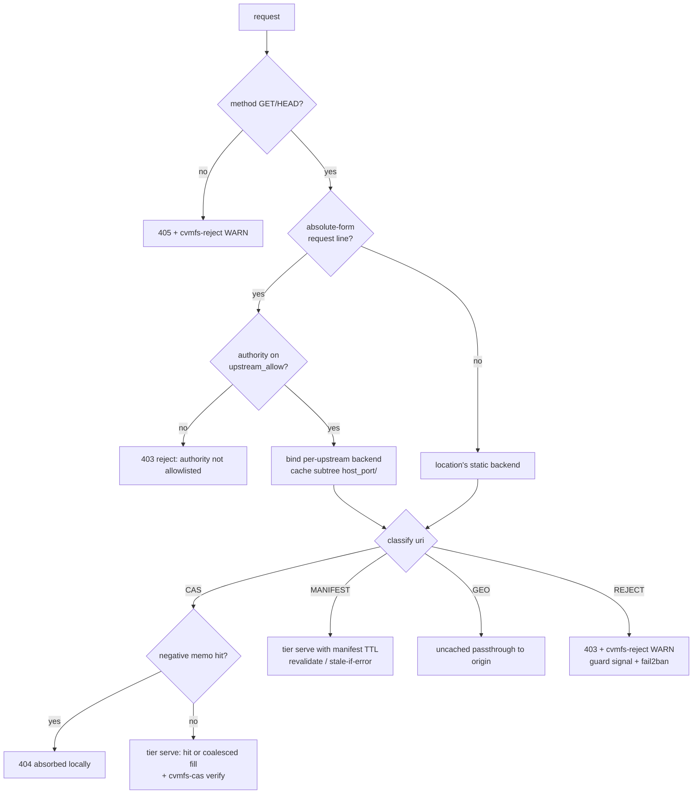
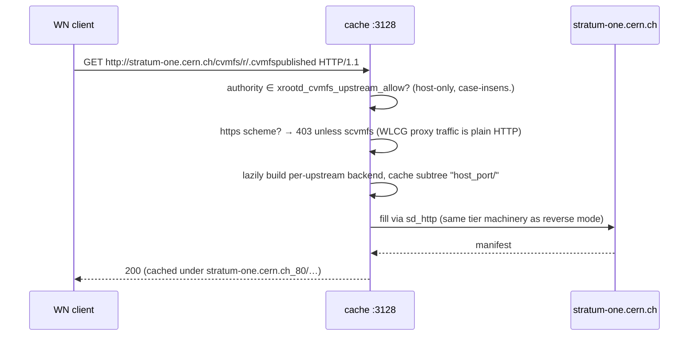

# cvmfs:// — the CVMFS site-cache protocol plane (phase-68)

`cvmfs://` is a dedicated protocol in this module's sense of the word — the
same sense in which S3 is one: HTTP on the wire, but with its own directory
(`src/protocols/cvmfs/`), its own nginx HTTP module and content handler
(`ngx_http_xrootd_cvmfs_module`), its own directive family, its own metric
family, and its own test suites. A `cvmfs://` location is NOT a WebDAV
location: `xrootd_cvmfs on` alone activates it, and none of WebDAV's
methods, auth modes, or dispatch exist on it. What IS shared sits below the
protocol seam: the VFS/tier storage plane (`src/fs/`), the `sd_http` origin
driver, and the `src/core/http/` shared HTTP semantics.

It exists to replace Squid/Varnish as a **Tier-2 site cache** for CVMFS
worker nodes — on networks that lose, reorder, and corrupt packets — with
three properties a generic HTTP cache cannot give you:

1. **Corruption can never be admitted** (content-addressed verify-on-fill);
2. **The client never sees a broken connection** (never-drop semantics);
3. **The operator can see everything** (dedicated metrics, access-log
   identity, dashboard, healthz).

Related reading: deployment runbook (sizing, topology, client config,
pilot procedure) [deploy/cvmfs/README.md](../../deploy/cvmfs/README.md)
· [forward vs reverse proxy concepts](../02-concepts/forward-vs-reverse-proxy.md)
· implementation plan [docs/refactor/phase-68-cvmfs-site-cache.md](../refactor/phase-68-cvmfs-site-cache.md)
· design spec [2026-07-02-cvmfs-site-cache-design.md](../superpowers/specs/2026-07-02-cvmfs-site-cache-design.md)
· runnable demo [deploy/cvmfs/docker/](../../deploy/cvmfs/docker/README.md).

---

## 1. Where it sits

```
 worker nodes (official CVMFS clients, libcurl connection pool)
      │  CVMFS_HTTP_PROXY=http://cache:3128   (proxy mode, absolute-form)
      │  or CVMFS_SERVER_URL=http://cache:PORT/cvmfs/@fqrn@  (reverse mode)
      ▼
┌───────────────────────────────────────────────────────────────────────┐
│ nginx-xrootd cache node                                               │
│                                                                       │
│  listener (so_keepalive, 1h keepalive_timeout, FIN-never-RST)         │
│      │                                                                │
│  [scvmfs preamble]───► only on xrootd_scvmfs listeners (TLS + authz)  │
│      │                                                                │
│  gate (gate.c)                                                        │
│      ├── method filter (GET/HEAD, else 405)                           │
│      ├── proxy-target extraction + allowlist (request.c)              │
│      ├── classifier (classify.c, pure C)                              │
│      │      CAS | MANIFEST | GEO | REJECT                             │
│      ├── negative 404 memo (per worker)                               │
│      └── REJECT → 403 + "cvmfs-reject:" WARN (guard + fail2ban)       │
│      │                                                                │
│  handler (handler.c)                                                  │
│      ├── GEO → uncached passthrough (geo.c)                           │
│      └── CAS/MANIFEST → tier serve:                                   │
│            offload → coalesced fill (fill_retry) → VFS open →         │
│            ranged file response (shared core/http helpers)            │
│      │                                                                │
│  storage tier (src/fs/): read-through cache_store (posix)             │
│      │        verify-on-fill (verify.c, cvmfs-cas) + quarantine       │
│      ▼                                                                │
│  sd_http origin driver: ranked multi-endpoint set, EWMA health,       │
│      one-alternate failover, half-open recovery probes               │
└───────┬───────────────────────────────────────────────────────────────┘
        │ WAN (the lossy part)
        ▼
   Stratum-1 replicas  (CERN / RAL / BNL / FNAL / …)
```

Both planes stay honest about the wire: CVMFS clients speak plain HTTP;
`cvmfs://` names the protocol plane (config, docs, metrics, logs), not a
new wire syntax — exactly as the S3 plane is REST-over-HTTP.

---

## 2. Traffic classification — the protocol grammar

Every request is classified by the pure-C classifier
(`src/protocols/cvmfs/classify.c`, standalone-testable with plain gcc —
`tests/run_cvmfs_classify.sh`). The grammar, exactly as implemented:

```
path      := "/cvmfs/" repo "/" rel
repo      := [a-z0-9.-]+          (first char must not be '.')
rel       := cas | manifest | geo | REJECT
cas       := "data/" 2hex "/" hex{38,126} [suffix]
             (total digest length 40..128 hex; suffix ∈ {C,H,X,M,L,P},
              the CVMFS object-kind letters)
manifest  := ".cvmfspublished" | ".cvmfswhitelist" | ".cvmfsreflog"
geo       := "api/v1.0/geo/" ...
```



| Class | Cache policy | Why |
|---|---|---|
| **CAS** | cached ~forever | content-addressed: the name IS the sha1 of the bytes, so a valid object can never go stale |
| **MANIFEST** | cached `xrootd_cvmfs_manifest_ttl` (default 61 s) | signed mutable metadata: revision pointer must move, but a TTL absorbs the per-WN stampede |
| **GEO** | never cached | the answer depends on who is asking |
| **REJECT** | 403, logged, counted | a CVMFS cache must not be an open proxy or a generic HTTP endpoint |

Methods: GET and HEAD only; anything else is 405 (also logged as a reject).
The classifier runs on the unescaped, query-stripped path nginx already
produced — no second URL parser exists.

---

## 3. Deployment modes (the two wire shapes)

### 3.1 Reverse mode — `CVMFS_SERVER_URL=http://cache:PORT/cvmfs/@fqrn@`

Requests arrive origin-form (`GET /cvmfs/repo/data/ab/cd… HTTP/1.1`); the
location's `xrootd_cvmfs_storage_backend` names the Stratum-1 set.

```mermaid
sequenceDiagram
    participant C1 as WN client A
    participant C2 as WN client B
    participant N as cache (event loop)
    participant W as fill worker (thread pool)
    participant S1 as Stratum-1

    C1->>N: GET /cvmfs/r/data/ab/cd…  (cold)
    N->>N: gate: classify=CAS, miss
    N->>W: post coalesced fill (ONE per key)
    C2->>N: GET same object (while filling)
    N->>N: attach as 2nd waiter on the SAME fill
    W->>S1: GET (ranked endpoint, Range loop)
    S1-->>W: bytes → .part file
    W->>W: sha1(.part) == name?  (cvmfs-cas)
    alt digest matches
        W->>N: publish → cache_store + xmeta
        N-->>C1: 200 (disposition: fill)
        N-->>C2: 200 (disposition: fill, zero extra WAN)
    else mismatch
        W->>W: quarantine .part, retry next endpoint
        W-->>N: all endpoints corrupt → definitive
        N-->>C1: 502 (kept-alive, never a reset)
        N-->>C2: 502 (kept-alive)
    end
    C1->>N: GET same object (later)
    N-->>C1: 200 from cache_store (hit; origin idle)
```

### 3.2 Forward-proxy mode — `CVMFS_HTTP_PROXY=http://cache:3128`

The official client sends **absolute-form** request lines. nginx's request
parser already splits authority and path, so the classifier and every
layer below see exactly the reverse-mode shape (`request.c` adds zero
parsing of its own).



Proxy-mode properties, all security-load-bearing:

- **Allowlist or nothing**: `xrootd_cvmfs_upstream_allow` unset ⇒
  absolute-form is always refused — the cache can never be an open proxy.
- **Per-upstream cache subtrees** (`<host>_<port>/`, `upstreams.c`):
  objects from different Stratum-1s can never alias, even with identical
  paths.
- **Bounded registry**: at most `xrootd_cvmfs_upstream_max` (default 8,
  hard cap 16) distinct upstreams per worker; exhaustion is a loud config
  error, not an eviction.
- **https refused** on plain `cvmfs://` (misconfigured client, not a
  feature request); `scvmfs://` listeners lift this (§8).

Both modes coexist on one listener: an origin-form request on a
proxy-enabled location simply falls through to the static backend.

### 3.3 Geo API passthrough

`/cvmfs/<repo>/api/v1.0/geo/<proxy>/<server-list>` is how a *client* orders
its `CVMFS_SERVER_URL` list at mount time. The cache relays it uncached
(`geo.c`): a bounded in-memory exchange on a fill thread (response cap
64 KiB, timeout 5 s), status and body relayed verbatim. Do not confuse this
with the cache's own origin selection (§5) — the geo API orders the
*client's* view; `xrootd_cvmfs_origin_select` orders the *cache's* fills.

---

## 4. Cache semantics per class

### 4.1 CAS objects — verify-on-fill (`xrootd_cache_verify cvmfs-cas`)

A CVMFS object's name is the SHA-1 of its **raw served bytes** (pinned by
the spike in `tests/cvmfs/spike_cas_hash.sh` against a real Stratum-1 —
the transfer encoding, not the decompressed payload). So the cache needs
no origin-advertised digest: the URL itself is the checksum.

The fill lands in a staged `.part` file; before publish, a fill worker
recomputes sha1 over the part (`xrootd_cache_verify_cvmfs_cas`,
`src/fs/cache/verify.c`) and compares it with the 40-hex name
(case-insensitive; only the 40-hex convention is verifiable — longer
digests commit unverified until repos advertise their hash algorithm):

- **match** → publish; digest recorded in the entry's xmeta.
- **mismatch** → the part is **quarantined** (renamed to
  `<quarantine_dir>/<name>.<epoch>` — operator evidence; with no
  quarantine dir configured it is unlinked), one ERR log names cause and
  fix, `xrootd_cvmfs_verify_failures_total` increments, and the fill
  retries **once per remaining endpoint** (corruption is often
  path-local). All endpoints corrupt ⇒ definitive **502** — proven-bad
  data is never "come back later".

Non-CAS keys (manifests) pass through unverified — they are signed by the
repository and validated by the client.

### 4.2 Manifests — TTL, revalidation, bounded stale-if-error

Fills of MANIFEST-class keys stamp `expires_at = now + manifest_ttl` into
the cache entry's metadata record (the `XROOTD_CINFO_F_EXPIRES` flag bit,
`src/fs/cache/cinfo.h`; round-trip proven by the xmeta unit tests). On a
hit past `expires_at` the entry refills from the origin; if the refill
**fails**, the stale copy keeps being served — but only inside a bounded
window of **10 × TTL** (with the 61 s default: ~10 minutes), after which
the entry is origin trouble like any other and enters the never-drop
hold (§6). A revision bump therefore propagates within one TTL, while a
short Stratum-1 outage never takes down a site's mounts.

### 4.3 Negative cache — absorbing 404 storms

A missing object asked for by a 1000-core farm is a 404 *storm*. Each
worker keeps a 512-slot direct-mapped memo (`gate.c`): FNV-1a-64 of the
full URI → `(hash, until)` slot, TTL `xrootd_cvmfs_negative_ttl` (default
10 s). Population happens in the request-finalization observer — every
serve path that ends 404 feeds it, whatever produced the status. A memo
hit answers 404 locally (`$cvmfs_cache = neg`,
`xrootd_cvmfs_negative_hits_total`). Slot collisions merely overwrite
(one extra origin round-trip); false positives would need a full 64-bit
collision and would self-heal in `negative_ttl` seconds anyway. 404 is a
*definitive* origin answer — it is never retried by the fill engine
(§6), only absorbed here.

---

## 5. Origin / replica selection — how each mirror is chosen

This is the part operators ask about most, so here is the complete
machinery, bottom-up. All of it lives in `src/fs/backend/http/sd_http.c`
(the driver) and `src/protocols/cvmfs/origin_geo.c` / `origin_probe.c`
(the rank producers).

### 5.1 The endpoint set

`xrootd_cvmfs_storage_backend "http://s1a|http://s1b|http://s1c"` — the
pipe syntax deliberately mirrors `CVMFS_SERVER_URL`. Each endpoint carries:

```c
host, port, tls, base_path      /* identity                            */
int  fail_score;                /* EWMA of transport failures          */
_Atomic int rank;               /* selection preference, 0 = best      */
```

Up to `SD_HTTP_EP_MAX` (8) endpoints per backend. **Writes and DELETEs
always go to endpoint 0** — read failover never applies to the write
side, because failing a write over to another origin would split-brain
the store. (For a CVMFS cache the origin is read-only anyway; this
matters for the driver's other users.)

### 5.2 Health: the failure EWMA

Every transport outcome updates the answering endpoint's score
(`sd_http_score`):

```
fail_score ← fail_score × 7/8 + (ok ? 0 : 256)
```

- one failure = 256; sustained failure converges to 256/(1 − 7/8) = **2048**;
- one success starts an exponential decay back toward 0 (half-life ≈ 5–6
  outcomes);
- **HTTP 4xx is NOT a transport failure** — a 404 is the origin
  *answering correctly* that the object doesn't exist; only connect
  refusal/unreachability/timeout/TLS failure/transport errors score.

### 5.3 Preference: policy ranks

The selection policies (§5.5) write an integer `rank` per endpoint
(0 = most preferred). The **effective score** combines both:

```
effective(ep) = rank × 4096 + fail_score
```

The weight constant (4096, `SD_HTTP_RANK_WEIGHT`) is chosen against the
EWMA's 2048 ceiling: **preference is policy, health is protection** — a
preferred-but-sick endpoint is only outranked after roughly 16
consecutive failures push its score deep enough to overcome one rank
step, so transient blips never thrash the ordering, while a genuinely
dead preferred origin does get benched.

### 5.4 Per-request walk: pick → failover → half-open recovery

Every origin request (`sd_http_request_fo`) does:

1. **Pick** the endpoint with the lowest effective score (order-stable on
   ties — configured order is the final tiebreak).
2. **Half-open probe**: every 4th request (a per-instance tick counter),
   if the *rank-preferred* endpoint currently has a nonzero fail_score,
   try it anyway. Scores only move on outcomes, so without this a benched
   origin would stay benched forever; with it, a recovered origin earns
   its score back within a few requests — and if it is still down, the
   in-loop failover below still answers the client.
3. **One-alternate failover**: on a transport failure, retry exactly once
   against the best-scored endpoint *distinct from the first attempt*
   (`xrootd_cvmfs_origin_failovers_total` counts the switch). Two dead
   endpoints ⇒ the attempt fails upward into the never-drop retry loop
   (§6), which will walk the ranking again after backoff.

The endpoint that actually answered is recorded (`last_origin`) and is
what `$cvmfs_origin` and the fill logs display.

### 5.5 The three policies (`xrootd_cvmfs_origin_select`)

Both non-static policies reduce to the same primitive: compute a per-
endpoint metric, then `xrootd_cvmfs_rank_by_metric()` (a stable argsort,
`origin_geo.c`) turns metrics into ranks for `sd_http_set_ranks()`.

| Policy | Metric | When computed | Use when |
|---|---|---|---|
| `static` (default) | configured order | never (ranks all 0 ⇒ order + health) | you know your network |
| `geo` | haversine great-circle km from `xrootd_cvmfs_here` to each `xrootd_cvmfs_origin_coords` | **once at config time** (`nginx -t` fails on missing/mismatched coords) | stable geography, no probe traffic wanted |
| `rtt` | measured TCP connect RTT, EWMA | continuously, per worker | erratic routing — configured order and geography both lie |

**geo details:** standard haversine on a 6371 km sphere; one
`xrootd_cvmfs_origin_coords <host[:port]> <lat>:<lon>` per configured
origin is enforced at config parse — a silent partial ranking is a
misconfiguration, not a fallback.

**rtt details** (`origin_probe.c`): each worker arms a timer per
rtt-selected export — the **first probe fires within 500 ms** of worker
start (ranks exist before the first fill), then every
`xrootd_cvmfs_rtt_interval` (default 60 s, +≤1 s jitter so workers
de-synchronize). A thread-pool task measures a nonblocking TCP connect to
every endpoint (2 s timeout; `getaddrinfo` + `connect` + `poll`, all off
the event loop); an unreachable endpoint samples as 8 s (4× the timeout)
so it ranks last without saturating the EWMA. Samples fold as

```
ewma ← ewma × 0.75 + sample × 0.25       (first sample seeds directly)
```

and the ranked result is pushed into the driver with relaxed atomics
(read by fill threads mid-flight — a torn rank ordering is harmless and
momentary). One INFO line per probe round logs the winner and its EWMA.

### 5.6 Fill-outcome classification (what "failure" even means)

The single source of truth is `src/fs/cache/fill_retry.{h,c}` (convention
#7 of the plan):

| Fill outcome | errno | Class | Action |
|---|---|---|---|
| connect refused / unreachable / timeout / TLS fail | other | RETRY | backoff, walk the ranking again |
| mid-transfer stall / reset (partial `.part` discarded) | other | RETRY | same |
| HTTP 5xx from origin | other | RETRY | same |
| HTTP 404 / 403 from origin | `ENOENT`/`EACCES`… | **DEFINITIVE** | propagate; 404 feeds the negative memo |
| CAS verify mismatch | `EBADMSG` | RETRY while `verify_budget` (= n endpoints) lasts, then DEFINITIVE | quarantine each bad part; all-corrupt ⇒ 502 |
| success | — | OK | publish |

---

## 6. Never-drop semantics — the client-connection contract

The CVMFS client keeps per-proxy failure bookkeeping. A proxy that
*breaks connections* gets skipped — the client falls to the next proxy
group, then DIRECT, after which **every worker node hammers the WAN
individually** and the cache has made things worse than no cache. So the
contract is absolute (T20, proven by `tests/run_cvmfs_holdopen.sh`):

- **A TCP close/reset is NEVER used as an error signal.** Every
  client-visible failure is a well-formed HTTP response with a
  `Content-Length`, on a connection that stays open (`r->keepalive = 1`).
- **504 means "still trying, come back"** — sent with `Retry-After: 2`
  when the hold window expires; the client's retry re-enters on the same
  warm TCP connection and coalesces onto the still-running fill.
- **502 means definitively bad** (CAS mismatch after the whole retry
  budget; both-origins-down inside the window is 504 territory).
- **404 is the origin's answer** — never retried, absorbed by the memo.

```
 client GET (miss)                                       time →
 ├─ fill attempt 1 ✗ (refused)      backoff ~250ms (half-jitter)
 ├─ attempt 2 ✗ (next endpoint)     backoff ~500ms
 ├─ attempt 3 ✗                     backoff ~1s … (doubling, cap 8s)
 │            … client still parked, connection open …
 ├─ t = client_hold (25s): answer 504 + Retry-After: 2  ── connection stays open
 │            fill DETACHES and keeps retrying (budget: fill_max_life 300s)
 ├─ client retries (same TCP conn) → attaches to the SAME fill → waits again
 ├─ origin recovers → fill publishes → waiting request answers 200
 └─ (or) t = 300s detached: fill abandons; next request starts fresh
```

The backoff is `250 ms` doubling to an `8 s` cap, with **half-jitter**
(uniform in `[b/2, b)`) so a farm's worth of fills decorrelates. The
deadline is `xrootd_cvmfs_client_hold` (default 25 s) while ≥1 waiter is
attached — **it must stay below the WN's `CVMFS_TIMEOUT`**, or the client
gives up before the cache answers — and `xrootd_cvmfs_fill_max_life`
(default 300 s) once detached. A client abort never cancels a fill: the
fill completes and populates the cache so the retry is a hit. Stampedes
coalesce: any number of concurrent waiters ride ONE origin fetch
(`stampede_origin_fetches = 1` in the harness).

### 6.1 Connection durability (T21)

Kernel keepalive makes the *cache* the side that detects dead peers,
while middleboxes see steady probes and keep NAT/conntrack state alive.
The canonical listener block (each line proven on the wire by
`tests/run_cvmfs_keepalive.sh`, including getsockopt-level assertions):

```nginx
    # so_keepalive=idle:intvl:cnt → SO_KEEPALIVE + TCP_KEEPIDLE/KEEPINTVL/KEEPCNT
    # 60s idle probe start beats typical stateful-firewall idle drops (300s+)
    listen 3128 so_keepalive=60s:10s:6 backlog=2048;

    keepalive_timeout  3600s;      # hold WN connections for an hour idle
    keepalive_requests 1000000;    # never recycle a healthy connection early
    send_timeout          300s;    # slow WN ≠ dead WN
    client_header_timeout 300s;
    reset_timedout_connection off; # a FIN, never an RST, if we must close
```

### 6.2 Error mapping (handler exit codes)

CVMFS-flavoured `errno → HTTP` (`cvmfs_errno_status`, `handler.c`) —
origin-side trouble is a **gateway** error, never a 500:

| errno | HTTP | meaning |
|---|---|---|
| `ENOENT` `ENOTDIR` `ENAMETOOLONG` | 404 | origin's definitive answer |
| `EACCES` `EPERM` `EXDEV` `ELOOP` | 403 | denied |
| `EIO` | **502** | the origin transfer was bad, not the client request |
| (hold expiry) | **504** + Retry-After | still trying — never counted as a fill failure |
| everything else | shared module table | genuine local faults only |

---

## 7. Security and abuse handling

Three independent layers, all active in the same config (proven by the
[docker demo](../../deploy/cvmfs/docker/README.md)):

1. **The gate** (protocol-level): everything that is not a CVMFS traffic
   shape is 403 + exactly one stable WARN line (convention #4):

   ```
   … [warn] … cvmfs-reject: method=GET uri="/…" client=1.2.3.4 class=reject
       cause="path is not a CVMFS traffic shape" fix="only /cvmfs/<repo>/…"
   ```

   The URI is passed through `xrootd_sanitize_log_string()` first (wire
   bytes never reach the log raw). The prefix `cvmfs-reject:` is a stable
   contract — the fail2ban filter and the httpguard log-phase classifier
   both key on it.

2. **The bad-actor guard** (phase-65, `xrootd_guard on` on the same
   location): bounces scanner junk (`.php`, `.env`, `wp-*`, …) in the
   ACCESS phase before the cvmfs handler runs, and emits one audit line
   per signal to `xrootd_guard_audit_log` for the `xrootd-guard-*`
   fail2ban jails. On a cvmfs listener use `xrootd_guard_bounce_status
   403` (not 444) — the never-drop contract extends to abusers we might
   have misclassified.

3. **fail2ban** (`deploy/fail2ban/`): filter
   `filter.d/nginx-xrootd-cvmfs.conf` matches the `cvmfs-reject:` line
   (regex verified by `tests/test_fail2ban_regex.py` against the
   committed sample log); the jail ships with `maxretry 20 / findtime 60
   / bantime 600` — drastically above accidental curl-debugging rates,
   drastically below scanner rates. The guard jails are stricter
   (signature hits ban instantly).

`scvmfs://` adds transport security and client authz on top — see §8.
The dashboard and metrics ports are **operator surfaces**: firewall them;
the dashboard additionally requires its password (and shows client IPs
and paths by design).

---

## 8. scvmfs:// (EXPERIMENTAL)

A secure variant layered **on** `cvmfs://`, not beside it (T22): one
handler core, plus a security preamble (`secure.c`) that runs first on
locations with `xrootd_scvmfs on`:

1. **TLS required** — the listener must be `listen … ssl`; a plain
   request is refused (nginx core 400s it before we run; the preamble
   guards mixed listeners as well).
2. **Optional client authz** — `xrootd_scvmfs_authz bearer` validates
   `Authorization: Bearer` tokens through the **same SciTokens issuer
   registry** the WebDAV and stream token paths use (READ scope suffices
   for a read-only protocol; no registry loaded ⇒ fail closed).
   VOMS/GSI client-cert mode is future work.
3. An admitted request sets `ctx->secure`, which **unlocks https
   authorities** in proxy mode (plain `cvmfs://` refuses them) and counts
   in `xrootd_scvmfs_requests_total`.

Experimental status is structural: own directives (`xrootd_scvmfs*`), own
suite (`tests/run_scvmfs.sh`), excluded from the acceptance gate and the
pilot; it can slip or be cut without touching the `cvmfs://` deliverable.

---

## 9. Observability (T16)

### Prometheus (`/metrics`, `xrootd_metrics on`)

Dedicated family (`src/observability/metrics/cvmfs.c`):

| Series | Meaning |
|---|---|
| `xrootd_cvmfs_requests_total{class="cas\|manifest\|geo\|reject"}` | request mix (class set is fixed → bounded cardinality, INVARIANT #8) |
| `xrootd_cvmfs_fills_total` / `xrootd_cvmfs_fill_failures_total` | origin fills published / failed definitively (a 504 hold-expiry is neither — the detached fill may still publish) |
| `xrootd_cvmfs_verify_failures_total` | CAS mismatches (the network-corruption evidence) |
| `xrootd_cvmfs_origin_failovers_total` | read attempts that switched endpoint (via an injected hook — the driver stays ngx-free) |
| `xrootd_cvmfs_negative_hits_total` | 404s absorbed by the memo |
| `xrootd_cvmfs_bytes_served_total{source="hit\|fill"}` | LAN-out split by disposition |
| `xrootd_cvmfs_origin_bytes_total` | WAN-in (counts every attempt's bytes, including discarded corrupt fills — WAN cost is WAN cost) |
| `xrootd_scvmfs_requests_total` | requests admitted by the scvmfs preamble |

**Per-repository families** (the same measures sliced by fqrn): a site
serves O(20) repositories, so `repo` is a usable label — but the name
arrives from the wire, so the set is **bounded by construction**: a
32-slot SHM table registers the first 31 distinct fqrns seen and folds
everything past capacity into `repo="_other"` (a scanner minting random
repo names cannot explode the series space or the SHM). Claim races
resolve lowest-index-wins; the exporter skips duplicates.

| Series (all `{repo="<fqrn>"}`) | Meaning |
|---|---|
| `xrootd_cvmfs_repo_requests_total{repo,class}` | request mix per repository |
| `xrootd_cvmfs_repo_files_accessed_total` | CAS objects served OK (hit or fill) — file-access operations, not distinct files |
| `xrootd_cvmfs_repo_cache_hits_total` / `_cache_misses_total` | disposition split per repository |
| `xrootd_cvmfs_repo_fills_total` / `_fill_failures_total` | origin fills per repository |
| `xrootd_cvmfs_repo_verify_failures_total` | CAS mismatches per repository (which experiment's WAN path corrupts) |
| `xrootd_cvmfs_repo_negative_hits_total` | absorbed 404s per repository |
| `xrootd_cvmfs_repo_bytes_served_total{repo,source="hit\|fill"}` | LAN-out per repository (what each experiment pulls from the cache) |
| `xrootd_cvmfs_repo_origin_bytes_total` | WAN-in per repository (what each experiment costs the WAN) |

```promql
# per-experiment hit ratio (5m)
sum by (repo) (rate(xrootd_cvmfs_repo_bytes_served_total{source="hit"}[5m]))
  / sum by (repo) (rate(xrootd_cvmfs_repo_bytes_served_total[5m]))

# which repository dominates WAN pulls
topk(5, sum by (repo) (rate(xrootd_cvmfs_repo_origin_bytes_total[5m])))

# per-experiment access rate
sum by (repo) (rate(xrootd_cvmfs_repo_files_accessed_total[5m]))
```

Hit ratio and WAN-saved are one PromQL expression away:
`bytes_served{hit} / (bytes_served{hit}+bytes_served{fill})`. Additionally
`XROOTD_PROTO_CVMFS` joined the unified per-protocol enum, so **every**
existing `{proto=…}` family (bytes, IO ops/latency, cache hit/miss) grew a
`cvmfs` label with zero new plumbing, and the live dashboard's transfer
table tags cvmfs requests.

### Access log variables

Registered at preconfiguration: `$cvmfs_class` (`cas|manifest|geo|reject|-`),
`$cvmfs_cache` (`hit|fill|stale|neg|-`), `$cvmfs_origin` (`host:port` that
answered the most recent fill; display-only, racy-by-design under
concurrent fills). Suggested format:

```nginx
log_format cvmfs '$remote_addr [$time_local] "$request" $status '
                 '$body_bytes_sent class=$cvmfs_class cache=$cvmfs_cache '
                 'origin=$cvmfs_origin';
```

### healthz

`GET /healthz` (`xrootd_health on`) gains
`"cvmfs_origins":[{"host":…,"port":…,"fail_score":…},…]` — the live EWMA
scores of §5.2, per configured http backend.

---

## 10. Directive reference

| Directive | Default | Meaning |
|---|---|---|
| `xrootd_cvmfs on\|off` | off | makes the location a dedicated CVMFS endpoint |
| `xrootd_cvmfs_storage_backend "http://s1a[\|http://s1b…]"` | — | ordered Stratum-1 origin set (pipe = `CVMFS_SERVER_URL` syntax); first is the write side, reads fail over by health |
| `xrootd_cvmfs_cache_store posix:<dir>` | — | the cache tier's physical store |
| `xrootd_cache_verify off\|cvmfs-cas` | off | CAS verify-on-fill (§4.1) |
| `xrootd_cvmfs_quarantine_dir <dir>` | "" (unlink) | where verify-mismatch parts land |
| `xrootd_cvmfs_manifest_ttl <sec>` | 61 | MANIFEST-class TTL (§4.2) |
| `xrootd_cvmfs_negative_ttl <sec>` | 10 | per-worker 404 memo TTL (§4.3) |
| `xrootd_cvmfs_upstream_allow <host>…` | unset | proxy-mode authority allowlist (unset = proxy mode off) |
| `xrootd_cvmfs_upstream_max <n>` | 8 | max distinct proxy-mode upstreams per worker (cap 16) |
| `xrootd_cvmfs_origin_select static\|geo\|rtt` | static | origin selection policy (§5.5) |
| `xrootd_cvmfs_origin_coords <host[:port]> <lat>:<lon>` | — | one origin's coordinates (geo; one per origin, `nginx -t` enforced) |
| `xrootd_cvmfs_here <lat>:<lon>` | — | this cache's coordinates (geo) |
| `xrootd_cvmfs_rtt_interval <sec>` | 60 | RTT probe period (first probe < 500 ms after worker start) |
| `xrootd_cvmfs_client_hold <sec>` | 25 | never-drop hold; MUST stay below the WN's `CVMFS_TIMEOUT` |
| `xrootd_cvmfs_fill_max_life <sec>` | 300 | detached-fill retry budget |
| `xrootd_cvmfs_thread_pool <name>` | default | async fill/relay pool |
| `xrootd_scvmfs on\|off` | off | EXPERIMENTAL secure preamble (§8; needs `listen … ssl`) |
| `xrootd_scvmfs_authz none\|bearer` | none | scvmfs client authz mode |

---

## 11. Evidence — the module works as claimed

### 11.1 Test suites (all self-contained; mock Stratum-1 + fault injection)

| Suite | Proves |
|---|---|
| `tests/run_cvmfs_classify.sh` | classifier grammar incl. adversarial shapes (standalone gcc, no nginx) |
| `tests/run_cvmfs_reverse.sh` | cold fill / warm hit byte-exact, stampede coalescing = 1 origin fetch, gate rejects, `/metrics` counters |
| `tests/run_cvmfs_verify.sh` | injected corruption ⇒ 0 corrupt admissions, quarantine populated, verify metric |
| `tests/run_cvmfs_failover.sh` | one origin stalled ⇒ transparent failover, no client-visible error |
| `tests/run_cvmfs_manifest.sh` | manifest TTL / revalidate on bump / bounded stale-if-error |
| `tests/run_cvmfs_proxy.sh` | absolute-form proxy mode, per-upstream cache isolation, allowlist security-neg |
| `tests/run_cvmfs_select.sh` | static order / geo coords / rtt probe each drive the fill's endpoint choice |
| `tests/run_cvmfs_holdopen.sh` | hold+retry to deadline, 504-keepalive (connection provably reused), detached fill completes, retry hits |
| `tests/run_cvmfs_keepalive.sh` | SO_KEEPALIVE/KEEPIDLE/KEEPINTVL/KEEPCNT on the wire, connection survives error answers, neg-control listener |
| `tests/run_scvmfs.sh` | TLS-only enforcement, bearer authz gate, cvmfs-parity through the preamble |
| `tests/test_cvmfs_mock.py` / `test_cvmfs_harness.py` | the lab itself (CAS layout, fault modes, metrics math) |
| `tests/test_fail2ban_regex.py` | the fail2ban filters match the real log shapes (committed samples) |
| `tests/cvmfs/run_matrix.sh` (root) | the full netem comparison matrix below |

### 11.2 Fresh run (2026-07-02, tree at `61adfc9`, all suites serial)

Verbatim output — every check, no elisions:

```
=== run_cvmfs_classify.sh ===
run_cvmfs_classify: 15 checks OK
=== run_cvmfs_reverse.sh ===
  ok   cvmfs directives parse
  ok   cold+warm byte-exact
  ok   warm hit served from cache
  ok   stampede: exactly 1 origin fetch
  ok   expired manifest revalidated (TTL)
  ok   geo passthrough
  ok   traversal rejected
  ok   non-class path rejected
  ok   write method rejected
  ok   negative cache absorbed repeat 404
  ok   reject line guard-parsable
  ok   metrics: cas requests counted (49)
  ok   metrics: proto=cvmfs on module-wide families
  ok   metrics: fill bytes counted
  ok   access log: cold read logged as class=cas cache=fill
  ok   access log: warm read logged as cache=hit
  ok   healthz: cvmfs_origins present
=== run_cvmfs_verify.sh ===
  ok   corrupt fill → 502, not admitted
  ok   corrupt part quarantined
  ok   verify failure counted in /metrics (2)
  ok   clean retry byte-exact
  ok   verify=off admits corruption (documented gap)
  ok   poisoned cache re-serves it
=== run_cvmfs_failover.sh ===
  ok   failover fill from secondary
  ok   secondary actually served it
  ok   primary reused after recovery (2 fills)
  ok   both-down → held then clean 504
=== run_cvmfs_manifest.sh ===
  ok   fresh manifest from cache
  ok   expired manifest revalidated
  ok   stale-if-error serve
=== run_cvmfs_proxy.sh ===
  ok   proxy-mode byte-exact
  ok   proxy-mode warm hit cached
  ok   second upstream independent
  ok   disallowed upstream rejected
=== run_cvmfs_select.sh ===
  ok   unit: haversine+argsort
  ok   static: first-listed served
  ok   geo: nearer origin served
  ok   rtt: probe pre-ranked live origin first
  ok   geo misconfig rejected
=== run_cvmfs_holdopen.sh ===
  ok   held through outage, served on recovery
  ok   504-keepalive + same-socket retry
  ok   detached fill populated cache (abort didn't cancel)
  ok   404 immediate (no hold)
=== run_cvmfs_keepalive.sh ===
  ok   keepalive timer armed on cvmfs listener
  ok   neg-control has no keepalive (assert is not vacuous)
  ok   200 reqs + 403 on one socket
=== run_scvmfs.sh ===
  ok   scvmfs TLS parity byte-exact
  ok   plain HTTP on scvmfs listener refused
  ok   bearer: missing/garbage token → 401
  ok   scvmfs requires cvmfs (nginx -t)
=== pytest: mock Stratum-1 + harness + fail2ban filters ===
18 passed, 4 skipped        (skips: fail2ban binary not on the dev box)
```

All ten shell suites exited 0. Highlights worth reading twice:
`stampede: exactly 1 origin fetch` (coalescing), `corrupt fill → 502, not
admitted` + `corrupt part quarantined` (verify-on-fill), `both-down → held
then clean 504` and `504-keepalive + same-socket retry` (never-drop),
`detached fill populated cache (abort didn't cancel)`, and the
`verify=off admits corruption` **negative control** — the suite proves the
protection is doing the work, not an accident of the setup.

### 11.3 The comparison matrix (why not stock nginx / squid)

From the committed Gate-2 numbers
([deploy/cvmfs/baselines/RESULTS.md](../../deploy/cvmfs/baselines/RESULTS.md)):
under **persistent** origin corruption, stock nginx `proxy_cache` admitted
and re-served every corrupted fill (`corrupt_served=32` at
`error_rate=0.0` — silent, sticky cache poisoning, the exact Tier-2
failure mode), while this module admitted **zero** corrupt bytes
(`corrupt_served=0`) with **zero broken client connections**
(`conn_failures=0`) — every bad fill became a well-formed 502 with the
part quarantined, and the client's own retry semantics did the rest.
The full netem profile sweep (`loss/reorder/jitter/site`) is one root
command: `sudo tests/cvmfs/run_matrix.sh`.

### 11.4 Live demo

A single CentOS Stream 9 container running the cache (proxy mode, real
Stratum-1 allowlist), dashboard, Prometheus, guard, and in-container
fail2ban — with an automated smoke that fetches real repository objects
through it and proves a reject storm gets banned:
[deploy/cvmfs/docker/README.md](../../deploy/cvmfs/docker/README.md).
