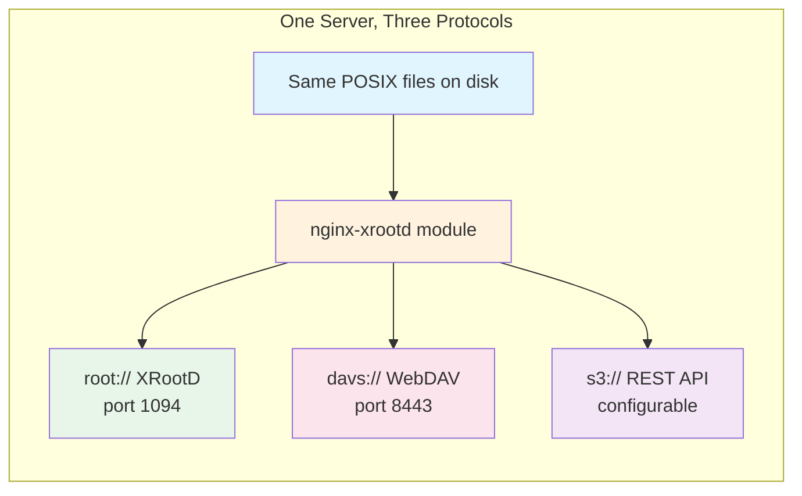
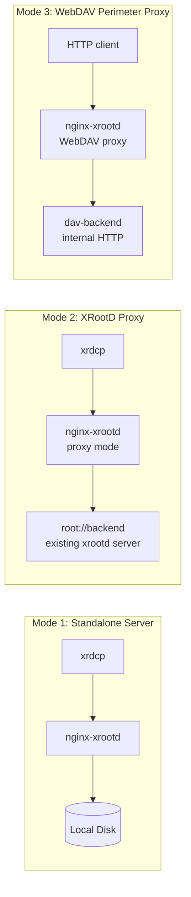
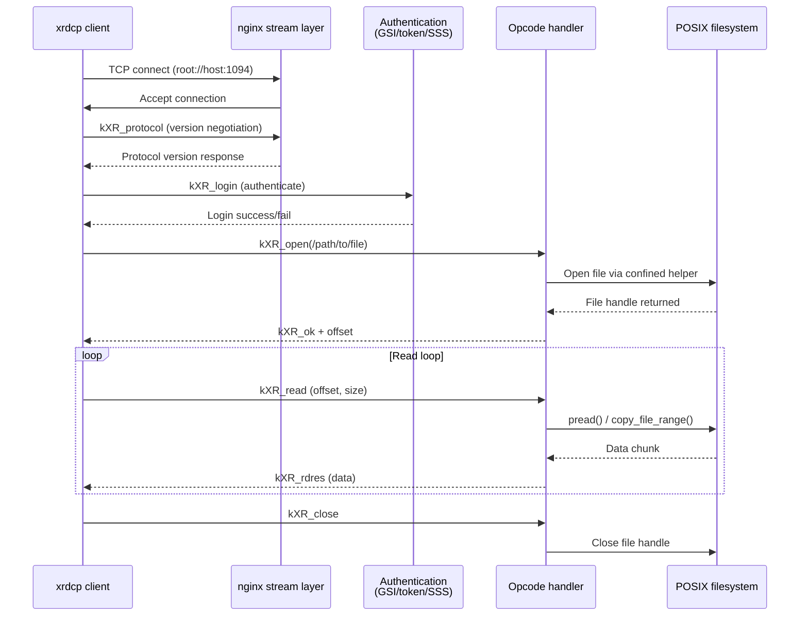
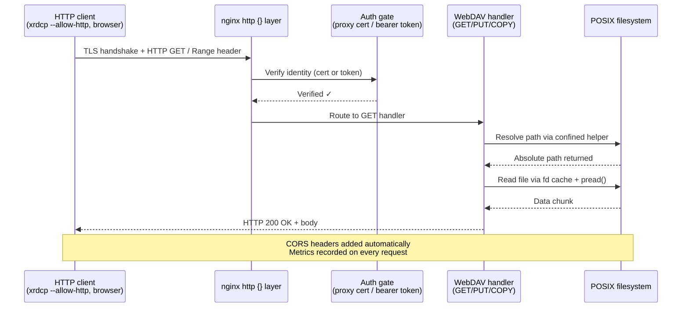
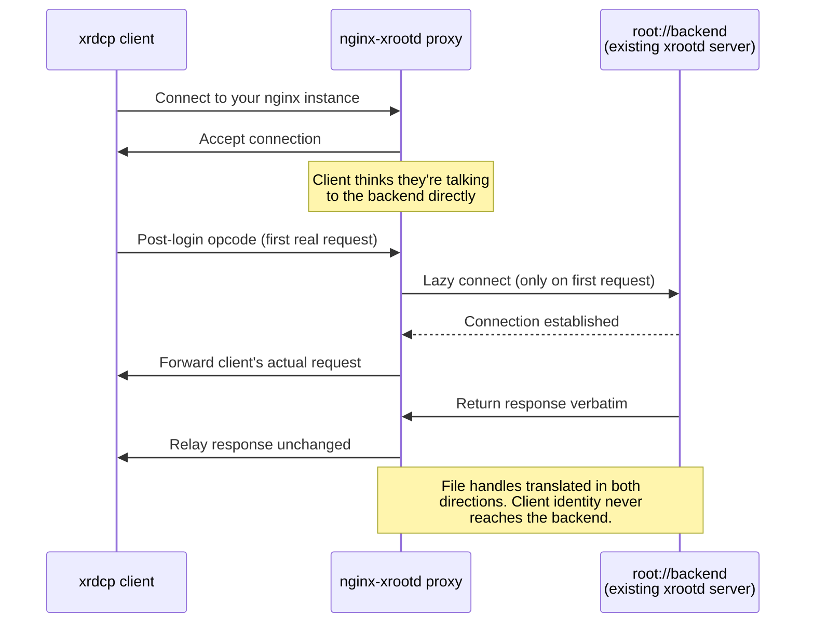

# Architecture Overview

> **Navigation:** [← Back to docs/index](../index.md) | [For newcomers: What Is This Project?](../01-getting-started/what-is-this.md)
>
> > **For newcomers:** This page shows you *how everything fits together* at a glance. Prefer diagrams over walls of text? Start here. For detailed code paths, see [Architecture Deep Dive](../09-developer-guide/architecture-overview.md).
> 
> > **Quick navigation:** [Request Lifecycle Diagram](#request-lifecycle---all-protocols) below shows the step-by-step flow for each protocol.

---

## Before You Read — The Big Picture



**One line, three views.** The same files on disk are served through three different protocols. You configure them in one `nginx.conf`, they share the same filesystem and (optionally) the same authentication system.

---

## High-Level Architecture

```mermaid
graph TB
    subgraph Clients["Clients"]
        xrdcp[xrdcp<br/>XRootD client]
        curl[curl / HTTP tools<br/>xrdcp --allow-http]
        aws[aws s3 CLI<br/>XrdClS3]
        python[XRootD Python client]
        browser[Browser<br/>WebDAV access]
    end
    
    subgraph nginx["nginx process"]
        stream[stream {} block<br/>XRootD protocol]
        http[http {} block]
        
        subgraph httpLayers["HTTP layer"]
            webdav[WebDAV handler<br/>GET, PUT, COPY, MOVE]
            s3[S3 handler<br/>REST API]
            metrics[Prometheus /metrics<br/>observability]
        end
        
        subgraph xrootdLayer["Stream layer"]
            native[Native XRootD<br/>open/read/write/stat]
            proxy[XRootD proxy mode<br/>transparent relay]
        end
    end
    
    subgraph Storage["Local POSIX filesystem"]
        files[Files on disk<br/>same data, three views]
    end
    
    xrdcp --> stream
    curl -.-> http
    aws -.-> http
    python --> stream
    browser -.-> http
    
    stream --> native
    stream --> proxy
    
    http --> webdav
    http --> s3
    http --> metrics
    
    native --> files
    proxy --> files
    webdav --> files
    s3 --> files
```

**Key insight:** The same POSIX files are served through three independent protocol handlers. Each handler is a separate nginx module path — the `stream {}` block for XRootD, the `http {}` block for WebDAV and S3.

---

## Protocol Comparison

| Aspect | Native XRootD (`root://`) | WebDAV (`davs://`) | S3 (`s3://`) |
|---|---|---|---|
| **Transport** | Raw TCP (or `roots://` TLS) | HTTPS | HTTP/HTTPS |
| **Port** | 1094 (default) | 8443 (default) | Configurable |
| **Client tools** | `xrdcp`, `xrdfs`, Python XRootD | `xrdcp --allow-http`, curl, rucio | `aws s3 cp` |
| **Auth methods** | GSI cert, JWT token, SSS, anonymous | Proxy cert, bearer token, anonymous | SigV4 or anonymous |
| **Best for** | High-throughput bulk transfers | Browser access, secure perimeter | Cloud-native tools, S3 SDKs |

---

## Deployment Modes



All three modes can run in the same nginx instance. See [Deployment Modes](../02-concepts/deployment-modes.md) for details.

---

## Request Lifecycle — All Protocols

### Native XRootD (`root://`) Download Flow



### WebDAV (`davs://`) Download Flow



### Proxy Mode (XRootD Transparent) Flow



---

## Architecture Files Quick Reference

| Layer | Key Source File | Purpose |
|---|---|---|
| **Stream entry** | `src/stream/` | nginx stream module initialization |
| **Connection handling** | `src/connection/handler.c`, `recv.c` | TCP accept, read loop, send events |
| **XRootD handshake** | `src/handshake/dispatch.c` | Protocol negotiation, session setup |
| **Session dispatch** | `src/handshake/dispatch_session.c` | Session-level opcode routing |
| **Read path** | `src/read/`, `src/aio/` | open/read/readv/pgread/stat/locate |
| **Write path** | `src/write/` | write/writev/pgwrite/sync/truncate |
| **WebDAV dispatch** | `src/webdav/dispatch.c` | HTTP method routing, TPC detection |
| **S3 handler** | `src/s3/handler.c` | REST API entry point and routing |

For the complete operation-to-file mapping, see [AGENTS.md](../../AGENTS.md).

---

## Related Reading

- **[What Is This Project?](../01-getting-started/what-is-this.md)** — Plain English explanation of what this module does
- **[Deployment Modes](../02-concepts/deployment-modes.md)** — Which deployment pattern fits your needs
- **[Architecture Deep Dive](../09-developer-guide/architecture-overview.md)** — Code paths, state machines, internals
- **[XRootD Basics](../02-concepts/xrootd-basics.md)** — Understanding the XRootD protocol before diving into nginx-xrootd
