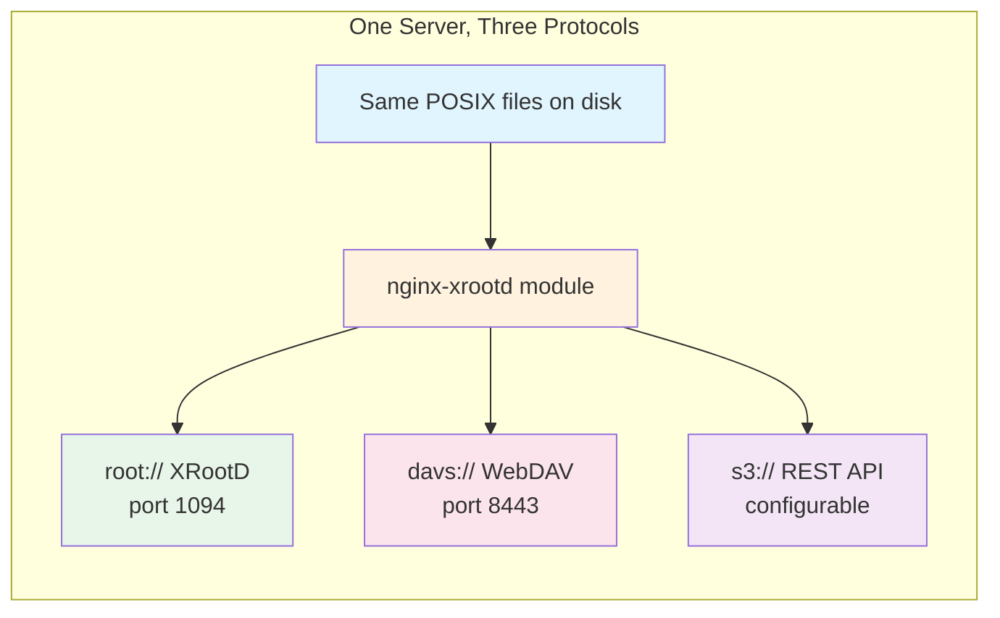
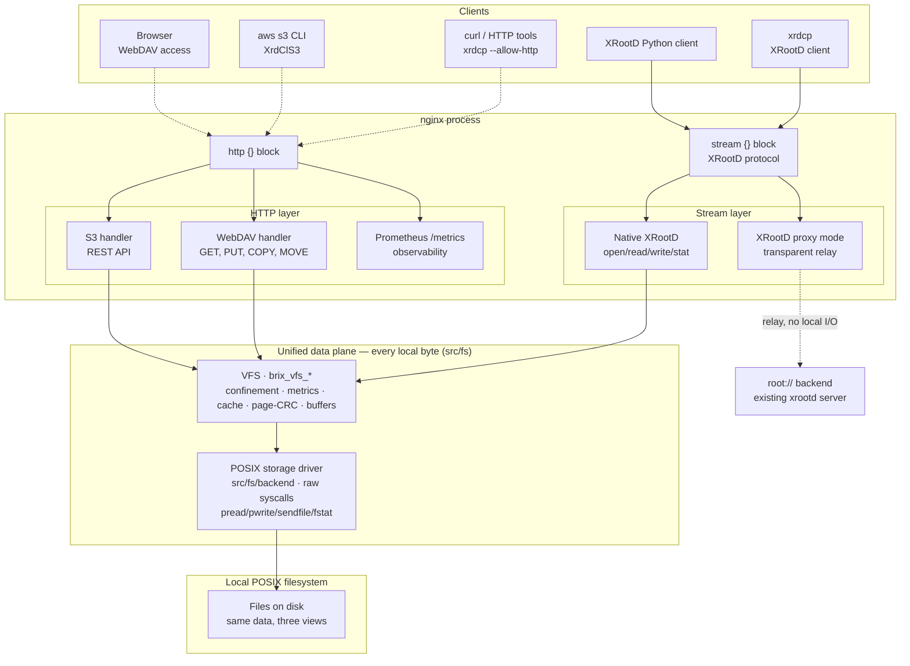
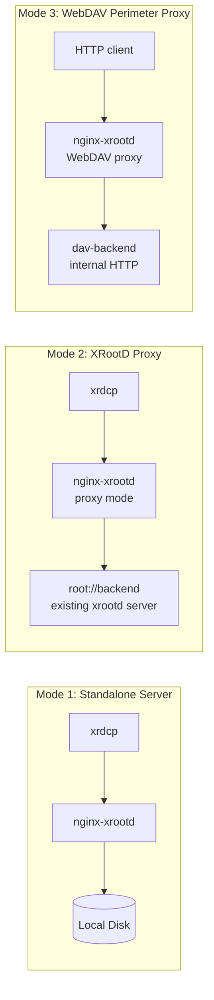
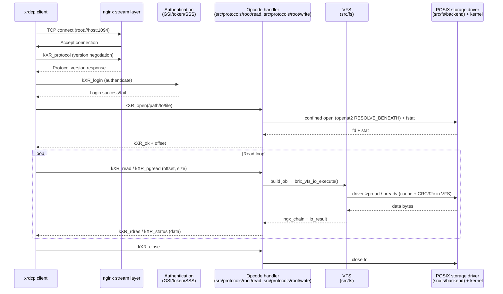
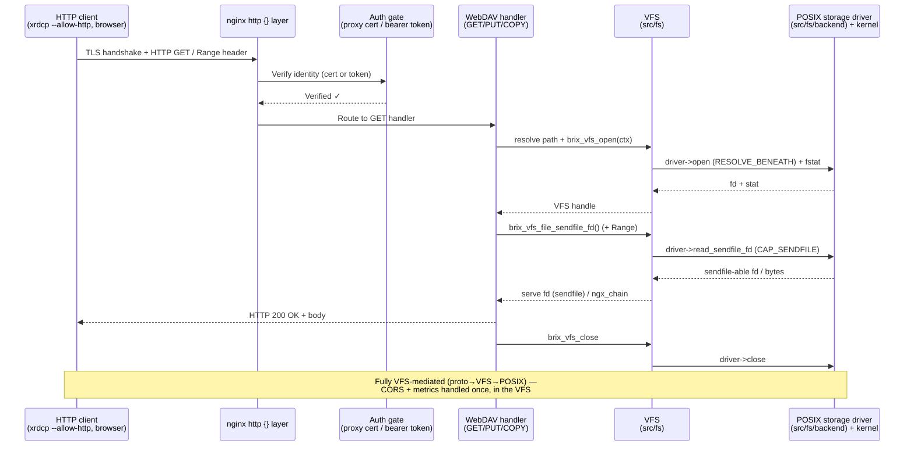
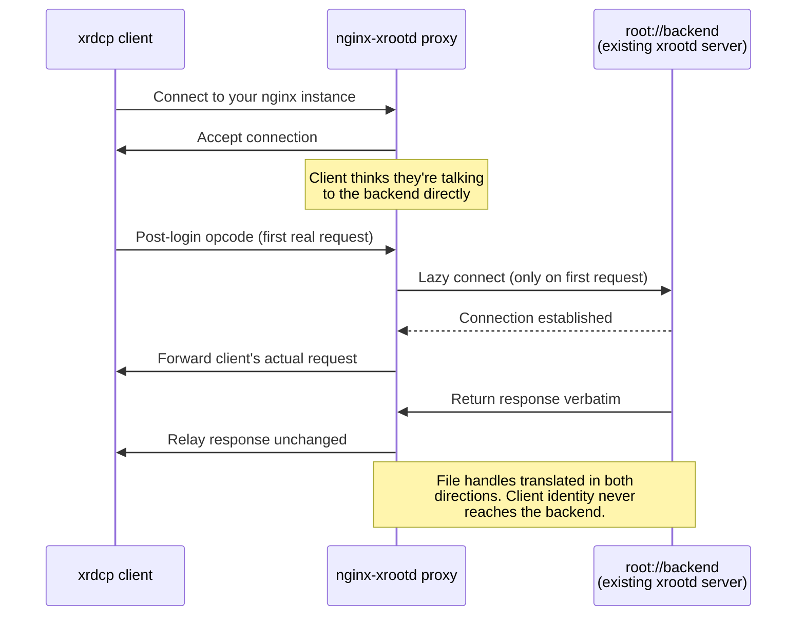

# Architecture Overview

> **Navigation:** [← Back to docs/index](../index.md) | [For newcomers: What Is This Project?](../01-getting-started/what-is-this.md)
>
> > **For newcomers:** This page shows you *how everything fits together* at a glance. Prefer diagrams over walls of text? Start here. For detailed code paths, see [Architecture Deep Dive](../09-developer-guide/architecture-overview.md).
> 
> > **Quick navigation:** [Request Lifecycle Diagram](#request-lifecycle---all-protocols) below shows the step-by-step flow for each protocol.

---

## Before You Read — The Big Picture



**One line, three views.** The same files on disk are served through three different protocols. You configure them in one `nginx.conf`, they share the same filesystem and (optionally) the same authentication system.

---

## High-Level Architecture



**Key insight:** The same POSIX files are served through three independent protocol *front ends* — the `stream {}` block for XRootD, the `http {}` block for WebDAV and S3 — but they are **not** three independent data paths. Every byte they read or write funnels through **one** unified data plane: the front end calls the VFS (`src/fs/`, `brix_vfs_*`), which applies confinement, metrics, caching and page-CRC once, then calls the **POSIX storage driver** (`src/fs/backend/`) for the raw syscall. (Proxy mode is the exception — it relays to a backend XRootD server and touches no local files.)

---

## The Data Plane: One Path for Every Byte (proto ↔ VFS ↔ POSIX)

The three front ends differ only in *how a request arrives*. The moment a request
needs to touch a file, every protocol converges on the **same three-layer data
plane**, so confinement, metrics, access logging, caching, and page-CRC are
implemented exactly once and inherited by every front end:

```text
  Front ends:  root:// (stream) · WebDAV (HTTP) · S3 (HTTP) · CMS data-server
                       │
                       │  each populates an brix_vfs_ctx_t and calls brix_vfs_*()
                       ▼
  ── VFS — the "vfs" layer (src/fs/) ───────────────────────────────
       • re-checks RESOLVE_BENEATH confinement
       • emits the Prometheus metric + access-log line
       • read-through / write-through cache
       • per-page CRC32c (pgread/pgwrite) + buffer shaping
       • owns every EINTR / short-I/O / coalescing loop
                       │
                       │  calls the storage-driver vtable (brix_sd_driver_t)
                       ▼
  ── Storage driver — the "posix" layer (src/fs/backend/) ──────────
       POSIX driver (default) — one verbatim syscall per slot:
         open(openat2 RESOLVE_BENEATH) · pread / preadv · pwrite ·
         copy_file_range · ftruncate · fsync · fstat
                       │
                       ▼
  ── Local POSIX filesystem ────────────────────────────────────────
```

**Why this matters:**

- **No protocol handler issues a raw file syscall.** `pread`/`pwrite`/`preadv`/
  `copy_file_range`/`fstat` on file data exist only inside `src/fs/backend/`. A
  handler that needs bytes calls a `brix_vfs_*` entry point — never `open`/`read`
  directly. That is what makes confinement, metering, and CRC impossible to drift
  between protocols.
- **The VFS owns *policy*; the driver owns *mechanism*.** The VFS keeps every
  EINTR/short-I/O/coalescing loop and builds the nginx buffer chain; only the raw
  syscall lives behind a driver slot, so behaviour is byte-identical on POSIX.
- **The driver is pluggable.** POSIX is the default and only shipping backend, but
  the seam (`brix_sd_driver_t` in `src/fs/backend/sd.h`) is capability-typed, so a
  block or object/S3 backend can register and become primary **without any change
  above it** — handlers, metrics, cache, and access logs are untouched.
- **Two VFS surfaces, one driver.** HTTP/S3 use the metered entry points
  (`brix_vfs_open`, `brix_vfs_file_sendfile_fd`, `brix_vfs_close`,
  `brix_vfs_stat`, the staged-write family) on the event loop; the `root://` byte
  I/O (`kXR_read/write/readv/pgread/pgwrite/sync`) flows through the worker-safe I/O
  core (`brix_vfs_io_execute()`), on the AIO thread pool or inline. Both surfaces
  reach disk through the same POSIX storage driver.

See [`src/fs/README.md`](../../src/fs/README.md) and
[`src/fs/backend/README.md`](../../src/fs/backend/README.md) for the implementation,
and [phase-54](../refactor/phase-54-vfs-thread-safe-io-core.md) /
[phase-55](../refactor/phase-55-storage-backend-abstraction.md) for the design.

---

## Protocol Comparison

| Aspect | Native XRootD (`root://`) | WebDAV (`davs://`) | S3 (`s3://`) |
|---|---|---|---|
| **Transport** | Raw TCP (or `roots://` TLS) | HTTPS | HTTP/HTTPS |
| **Port** | 1094 (default) | 8443 (default) | Configurable |
| **Client tools** | `xrdcp`, `xrdfs`, Python XRootD | `xrdcp --allow-http`, curl, rucio | `aws s3 cp` |
| **Auth methods** | GSI cert, JWT token, SSS, anonymous | Proxy cert, bearer token, anonymous | SigV4 or anonymous |
| **Best for** | High-throughput bulk transfers | Browser access, secure perimeter | Cloud-native tools, S3 SDKs |

---

## Deployment Modes



All three modes can run in the same nginx instance. See [Deployment Modes](../02-concepts/deployment-modes.md) for details.

---

## Request Lifecycle — All Protocols

### Native XRootD (`root://`) Download Flow



### WebDAV (`davs://`) Download Flow



### Proxy Mode (XRootD Transparent) Flow



---

## Architecture Files Quick Reference

| Layer | Key Source File | Purpose |
|---|---|---|
| **Stream entry** | `src/protocols/root/stream/` | nginx stream module initialization |
| **Connection handling** | `src/protocols/root/connection/handler.c`, `recv.c` | TCP accept, read loop, send events |
| **XRootD handshake** | `src/protocols/root/handshake/dispatch.c` | Protocol negotiation, session setup |
| **Session dispatch** | `src/protocols/root/handshake/dispatch_session.c` | Session-level opcode routing |
| **Read path** | `src/protocols/root/read/`, `src/core/aio/` | open/read/readv/pgread/stat/locate (frames VFS results onto the wire) |
| **Write path** | `src/protocols/root/write/` | write/writev/pgwrite/sync/truncate (frames VFS results onto the wire) |
| **WebDAV dispatch** | `src/protocols/webdav/dispatch.c` | HTTP method routing, TPC detection |
| **S3 handler** | `src/protocols/s3/handler.c` | REST API entry point and routing |
| **Unified data plane (VFS)** | `src/fs/` | `brix_vfs_*` — the single path every protocol's file I/O takes: confinement, metrics, cache, page-CRC, buffer shaping |
| **Storage driver (POSIX)** | `src/fs/backend/` | Pluggable backend beneath the VFS; the POSIX driver issues the raw `pread`/`pwrite`/`sendfile`/`fstat` syscalls |

For the complete operation-to-file mapping, see [AGENTS.md](../../AGENTS.md).

---

## Related Reading

- **[What Is This Project?](../01-getting-started/what-is-this.md)** — Plain English explanation of what this module does
- **[Deployment Modes](../02-concepts/deployment-modes.md)** — Which deployment pattern fits your needs
- **[Architecture Deep Dive](../09-developer-guide/architecture-overview.md)** — Code paths, state machines, internals
- **[XRootD Basics](../02-concepts/xrootd-basics.md)** — Understanding the XRootD protocol before diving into BriX-Cache
