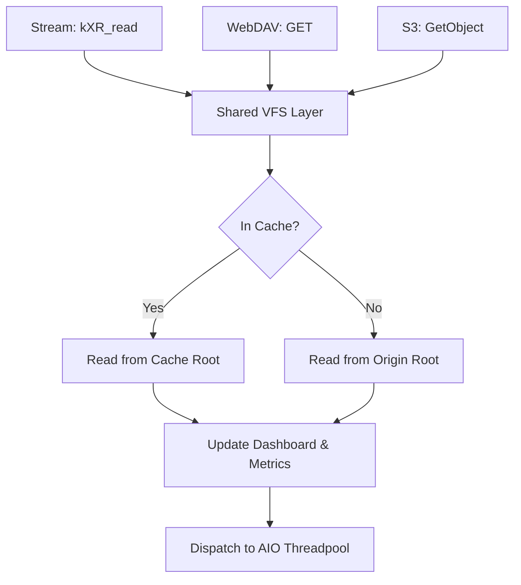
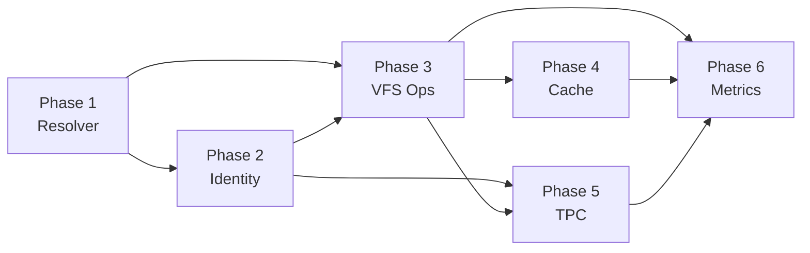

# nginx-xrootd Protocol Unification Strategy
**Version:** 1.0
**Date:** June 5, 2026
**Status:** PROPOSAL

## 1. Introduction
The `nginx-xrootd` module supports two distinct protocol families: the binary XRootD stream protocol and the HTTP-based REST protocols (WebDAV, S3). Currently, these layers share low-level logic (like token validation) but maintain redundant implementations for high-level operations such as path resolution, I/O orchestration, and metric tracking.

This document outlines the strategy for "Deep Unification"—moving core logic into protocol-agnostic shared services to improve security, reduce technical debt, and ensure feature parity.

---

## 2. Core Unification Areas

### A. The "Universal" Path Resolver
Currently, the codebase has two primary path resolvers:
1.  **Stream Resolver (`src/path/resolve_path_variants.c`):** Integrated with `ngx_str_t`, handles `mkdirpath` logic, and logs via stream context.
2.  **HTTP/S3 Resolver (`src/core/compat/path.c`):** Pure C, handles `ENOENT` parent walking for PUT/COPY, and uses numeric return codes.

#### Proposed Architecture: `xrootd_path_v2`
A single resolver will be implemented in `src/path/unified.c` with the following signature:

```c
typedef struct {
    unsigned int allow_missing_tail:1; // For PUT/MKDIR
    unsigned int require_directory:1;  // For MKCOL/DIRLIST
    unsigned int skip_cache_check:1;   // For direct origin access
} xrootd_path_opts_t;

int xrootd_path_resolve(
    const char *root_canon,
    const char *req_path,
    xrootd_path_opts_t opts,
    char *resolved_out,
    size_t outsz
);
```

**Security Invariants:**
- **Double-Check Boundary:** `realpath()` followed by `strncmp()` against the root.
- **Component Sanitization:** Rejection of `\0`, `..`, and control characters *before* any syscall.
- **Depth Guard:** `xrootd_count_path_depth` to prevent CPU-exhaustion via deeply nested symbolic links.

---

### B. Identity and Authorization Unification
Identity state is currently fragmented across `xrootd_ctx_t` (Stream) and `ngx_http_xrootd_webdav_req_ctx_t` (HTTP).

#### Proposed Structure: `xrootd_identity_t`
```c
typedef struct {
    ngx_str_t  dn;             // GSI Distinguished Name
    ngx_str_t  subject;        // JWT 'sub' claim
    ngx_array_t *vo_list;      // Extracted VOMS/Groups
    ngx_array_t *scopes;       // Token write/read scopes
    unsigned int is_authenticated:1;
    unsigned int is_admin:1;
} xrootd_identity_t;
```

**Workflow Unification:**
1.  **Auth Phase:** Extract credentials (Cert/Token) and populate `xrootd_identity_t`.
2.  **Policy Phase:** Pass the identity object to `xrootd_check_vo_acl()` or `xrootd_check_authdb()`.
3.  **Result:** Authorization logic becomes 100% protocol-neutral.

---

### C. Unified VFS & I/O Orchestration
The most significant duplication exists in the I/O path. Both `src/read/read.c` and `src/webdav/get.c` independently handle:
- Read-through cache lookups.
- AIO thread-pool dispatching.
- dashboard transfer slot updates.

#### The I/O Hook Pattern
Instead of each protocol calling `pread()` or `sendfile()` directly, they should use a shared I/O dispatcher:



---

## 3. Metric & Logging Consistency
Currently, metrics are siloed (e.g., `webdav.bytes_tx` vs `stream.bytes_tx`). 

### Proposed Unified Metric Slots
We will move to an **Op-Centric** metric model rather than a **Protocol-Centric** one.
- `xrootd_io_bytes_read` (Labeled by: `proto=[stream|webdav|s3]`)
- `xrootd_io_ops_total` (Labeled by: `op=[read|write|stat|delete]`)

This allows for a single Prometheus query to show the total throughput of the server regardless of protocol.

---

## 4. Implementation Phasing

Each phase has a dedicated implementation plan document. Phases must be completed in dependency order.

| Phase | Document | Focus | Risk | Est. Effort |
|:---|:---|:---|:---|:---|
| 1 | [PHASE1_RESOLVER_IMPLEMENTATION.md](unification/PHASE1_RESOLVER_IMPLEMENTATION.md) | Unified path resolver (`src/path/unified.c`) | HIGH | 8–12 h |
| 2 | [PHASE2_IDENTITY_ABSTRACTION.md](unification/PHASE2_IDENTITY_ABSTRACTION.md) | Single `xrootd_identity_t` for GSI/Token/SSS/SigV4 | HIGH | 10–14 h |
| 3 | [PHASE3_VFS_OPERATIONS.md](unification/PHASE3_VFS_OPERATIONS.md) | `src/fs/` VFS layer — open/read/write/stat/dir | CRITICAL | 16–24 h |
| 4 | [PHASE4_CACHE_UNIFICATION.md](unification/PHASE4_CACHE_UNIFICATION.md) | Transparent cache for all three protocols | HIGH | 12–16 h |
| 5 | [PHASE5_TPC_UNIFICATION.md](unification/PHASE5_TPC_UNIFICATION.md) | Shared TPC credential/auth/registry | HIGH | 14–20 h |
| 6 | [PHASE6_METRICS_OBSERVABILITY.md](unification/PHASE6_METRICS_OBSERVABILITY.md) | Op-centric metrics, unified access log, dashboard | MEDIUM | 8–12 h |

### Dependency Graph



### Phase 1: Resolver Consolidation
- Move `src/core/compat/path.c` logic into `src/path/unified.c`.
- Replace all protocol-specific resolution calls with `xrootd_path_resolve()`.
- **Validation:** Cross-protocol test suite (`tests/run_cross_compatible_tests.sh`).

### Phase 2: Identity Abstraction
- Create `src/core/types/identity.h` with `xrootd_identity_t`.
- Refactor `src/auth/token/`, `src/auth/gsi/`, `src/auth/sss/`, and `src/s3/auth_sigv4_verify.c` to populate the identity struct.
- Update `src/auth/authz/acl.c` to consume `xrootd_identity_t *`.

### Phase 3: VFS Operation Abstraction
- Implement `src/fs/` directory with full open/read/write/stat/dir/mutation API.
- Replace direct I/O in `src/read/`, `src/write/`, `src/webdav/`, and `src/s3/` with VFS calls.
- Enforce TLS buffer invariant and pgwrite CRC32c in VFS layer.

### Phase 4: Cache Unification
- Introduce `src/cache/open.c` as the unified cache entry point called by `xrootd_vfs_open()`.
- Extend cache to serve WebDAV and S3 reads (currently stream-only).
- Add `.meta` sidecar for ETag-based freshness; unify writethrough decision.

### Phase 5: TPC Unification
- Create `src/tpc/common/` with shared credential, authorization, registry, and metrics.
- Both stream TPC and WebDAV TPC call the common layer for all credential and auth logic.
- Unified transfer registry visible to all workers and the dashboard.

### Phase 6: Metrics & Observability
- Replace protocol-centric metric slots with op-centric slots labeled by `proto=`.
- Emit JSON-Lines unified access log from VFS layer.
- Consolidate stream and HTTP dashboard transfer tables.

---

## 5. Risk Assessment
| Risk | Mitigation |
|:---|:---|
| **Performance Overhead** | Use `ngx_inline` for shared helpers and avoid extra memory copies. |
| **Regression in Security** | Maintain a "Golden Test Set" of known traversal attacks that must pass before any merge. |
| **Protocol Specifics** | Keep the "Wire-to-Internal" mapping thin but separate (e.g., kXR_open flags vs HTTP Range). |

---

## 6. Conclusion
Unifying the `nginx-xrootd` architecture will transform the module from a collection of protocol handlers into a **High-Performance Filesystem Gateway**. By centralizing the path, auth, and I/O layers, we reduce the surface area for bugs and prepare the codebase for future features like `io_uring` and advanced erasure-coding backends.
