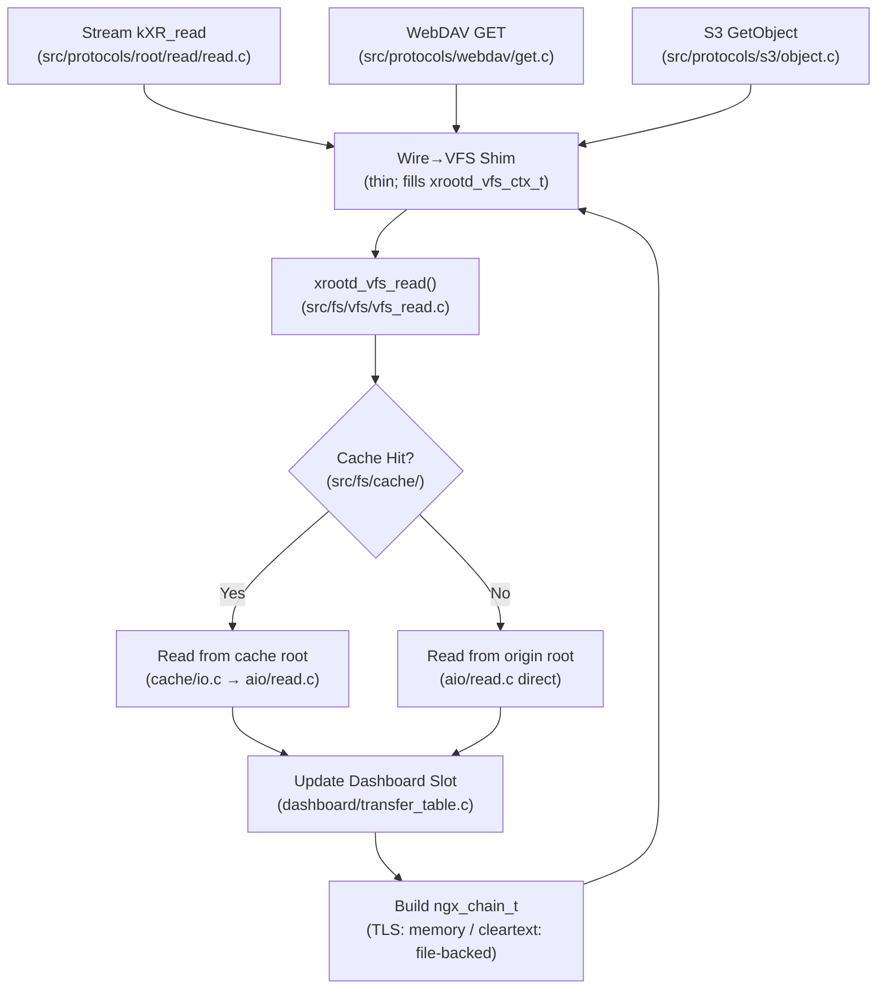

# Phase 3: VFS Operation Abstraction - Implementation Plan

**Status:** PLANNING  filw
**Phase:** 3 of 6 (Protocol Unification)  
**Depends On:** Phase 1 (Unified Path Resolver), Phase 2 (Identity Abstraction)  
**Estimated Effort:** 16-24 hours  
**Risk Level:** CRITICAL (replaces hot I/O paths across all three protocols)  
**Target:** `src/fs/` VFS layer — a single set of file operations called by Stream, WebDAV, and S3

---

## Executive Summary

This is the central phase of the unification project. Today each protocol family implements its own open/read/write/stat logic, duplicating:

- Cache hit/miss checks (three copies: `src/protocols/root/read/open_cache.c`, `src/protocols/webdav/get.c`, `src/protocols/s3/object.c`)
- AIO thread-pool dispatch (four entry points across `src/core/aio/`)
- Dashboard transfer slot registration (`src/observability/dashboard/transfer_table.c`)
- Error-to-wire-status translation (errno → kXR → HTTP status scattered everywhere)

After Phase 3, each protocol handler calls a thin "wire-to-VFS" translation layer, invokes the shared VFS operation, and receives a result. All cache, AIO, and dashboard logic lives exclusively in `src/fs/`.

---

## Current Duplication Map

### Read Path

```
Stream kXR_read
  └─ src/protocols/root/read/open_request.c      (open + stat)
  └─ src/protocols/root/read/read.c              (pread → AIO dispatch)
  └─ src/protocols/root/read/open_cache.c        (cache hit check)
  └─ src/core/aio/read.c               (thread-pool read)
  └─ src/observability/dashboard/transfer_table.c (slot tracking)

WebDAV GET
  └─ src/protocols/webdav/get.c             (range parse, open, sendfile)
  └─ src/protocols/webdav/io.c              (low-level I/O helpers)
  └─ src/protocols/webdav/fs/               (fd cache)
  └─ src/core/aio/read.c               (same thread-pool, separate call site)
  └─ src/observability/dashboard/http_tracking.c (separate slot tracking)

S3 GetObject
  └─ src/protocols/s3/object.c              (range parse, open, send)
  └─ src/protocols/s3/util.c                (I/O helpers)
  └─ src/core/aio/read.c               (same thread-pool, third call site)
```

### Write Path

```
Stream kXR_write / kXR_pgwrite
  └─ src/protocols/root/write/write.c
  └─ src/protocols/root/write/pgwrite.c          (CRC32c per page)
  └─ src/core/aio/write.c

WebDAV PUT
  └─ src/protocols/webdav/put.c
  └─ src/protocols/webdav/io.c

S3 PutObject / UploadPart
  └─ src/protocols/s3/put.c
  └─ src/protocols/s3/multipart_*.c
  └─ src/core/aio/write.c
```

### Stat / Directory

```
Stream kXR_stat / kXR_statx
  └─ src/protocols/root/read/stat.c
  └─ src/protocols/root/read/statx.c

WebDAV PROPFIND / HEAD
  └─ src/protocols/webdav/propfind.c
  └─ src/protocols/webdav/resource.c

S3 HeadObject / ListObjectsV2
  └─ src/protocols/s3/object.c (HEAD)
  └─ src/protocols/s3/list_objects_v2.c + list_walk.c
```

---

## Target Architecture

### New Directory: `src/fs/`

```
src/fs/
  vfs.h          — Public API: all VFS operations + result types
  vfs_open.c     — xrootd_vfs_open()
  vfs_read.c     — xrootd_vfs_read()
  vfs_write.c    — xrootd_vfs_write()
  vfs_stat.c     — xrootd_vfs_stat()
  vfs_dir.c      — xrootd_vfs_opendir() + xrootd_vfs_readdir()
  vfs_unlink.c   — xrootd_vfs_unlink() + xrootd_vfs_rmdir()
  vfs_rename.c   — xrootd_vfs_rename()
  vfs_mkdir.c    — xrootd_vfs_mkdir()
  vfs_sync.c     — xrootd_vfs_sync() + xrootd_vfs_truncate()
  vfs_internal.h — Internal helpers (not public)
```

### Core VFS Header: `src/fs/vfs/vfs.h`

```c
#ifndef XROOTD_VFS_H
#define XROOTD_VFS_H

#include <ngx_config.h>
#include <ngx_core.h>
#include "../types/identity.h"
#include "../path/unified.h"

/* -----------------------------------------------------------------------
 * VFS Open Flags — protocol-agnostic equivalents of O_RDONLY/O_WRONLY
 * ----------------------------------------------------------------------- */
#define XROOTD_VFS_O_READ        0x01
#define XROOTD_VFS_O_WRITE       0x02
#define XROOTD_VFS_O_CREATE      0x04   /* O_CREAT */
#define XROOTD_VFS_O_EXCL        0x08   /* O_EXCL — fail if exists */
#define XROOTD_VFS_O_TRUNC       0x10   /* O_TRUNC */
#define XROOTD_VFS_O_APPEND      0x20
#define XROOTD_VFS_O_MKDIRPATH   0x40   /* Create intermediate dirs */
#define XROOTD_VFS_O_NOCACHE     0x80   /* Bypass read cache */

/* -----------------------------------------------------------------------
 * VFS File Handle
 * Opaque to callers — size chosen by VFS layer at open time.
 * ----------------------------------------------------------------------- */
typedef struct xrootd_vfs_file_s xrootd_vfs_file_t;

/* -----------------------------------------------------------------------
 * VFS Stat Result
 * ----------------------------------------------------------------------- */
typedef struct {
    off_t        size;
    time_t       mtime;
    time_t       ctime;
    ngx_uint_t   mode;          /* S_IFREG / S_IFDIR */
    ino_t        ino;
    unsigned int is_directory:1;
    unsigned int is_regular:1;
} xrootd_vfs_stat_t;

/* -----------------------------------------------------------------------
 * VFS I/O Result (read / write)
 * ----------------------------------------------------------------------- */
typedef struct {
    off_t        offset;        /* Actual start offset served */
    size_t       length;        /* Bytes transferred */
    uint32_t     crc32c;        /* CRC32c (pgread/pgwrite only; 0 otherwise) */
    unsigned int from_cache:1;  /* Read was served from local cache */
    unsigned int eof:1;         /* Read hit end-of-file */
} xrootd_vfs_io_result_t;

/* -----------------------------------------------------------------------
 * VFS Call Context
 * Wraps everything the VFS layer needs that is common across operations.
 * ----------------------------------------------------------------------- */
typedef struct {
    ngx_pool_t          *pool;
    ngx_log_t           *log;
    xrootd_identity_t   *identity;     /* Verified principal (from Phase 2) */
    xrootd_path_result_t resolved;     /* Resolved path (from Phase 1) */
    unsigned int         is_tls:1;     /* TLS connection — use memory buffers */
    unsigned int         want_pgcrc:1; /* Caller wants per-page CRC32c */
} xrootd_vfs_ctx_t;

/* -----------------------------------------------------------------------
 * VFS API
 * ----------------------------------------------------------------------- */

/*
 * Open a file and return an opaque handle.
 * On error returns NULL; *err_out is set to errno.
 */
xrootd_vfs_file_t *xrootd_vfs_open(xrootd_vfs_ctx_t *ctx,
                                    ngx_uint_t flags,
                                    int *err_out);

/*
 * Close a VFS handle and release all associated state (fd cache, AIO, slot).
 */
ngx_int_t xrootd_vfs_close(xrootd_vfs_file_t *fh, ngx_log_t *log);

/*
 * Read [offset, offset+length) into chain.
 * Dispatches to AIO threadpool if needed; updates dashboard slot.
 */
ngx_int_t xrootd_vfs_read(xrootd_vfs_file_t *fh,
                           off_t offset,
                           size_t length,
                           ngx_chain_t **out,
                           xrootd_vfs_io_result_t *result);

/*
 * Write data from chain starting at offset.
 * Handles pgwrite CRC32c if ctx->want_pgcrc.
 */
ngx_int_t xrootd_vfs_write(xrootd_vfs_file_t *fh,
                            off_t offset,
                            ngx_chain_t *in,
                            xrootd_vfs_io_result_t *result);

/*
 * Stat a path (does not require an open handle).
 */
ngx_int_t xrootd_vfs_stat(xrootd_vfs_ctx_t *ctx,
                           xrootd_vfs_stat_t *stat_out);

/*
 * Directory operations.
 */
typedef struct xrootd_vfs_dir_s xrootd_vfs_dir_t;

xrootd_vfs_dir_t *xrootd_vfs_opendir(xrootd_vfs_ctx_t *ctx, int *err_out);
ngx_int_t         xrootd_vfs_readdir(xrootd_vfs_dir_t *dh,
                                      ngx_str_t *name_out,
                                      xrootd_vfs_stat_t *stat_out);
ngx_int_t         xrootd_vfs_closedir(xrootd_vfs_dir_t *dh, ngx_log_t *log);

/*
 * Mutation operations (write-gated: conf->allow_write must be set).
 */
ngx_int_t xrootd_vfs_unlink(xrootd_vfs_ctx_t *ctx);
ngx_int_t xrootd_vfs_rmdir(xrootd_vfs_ctx_t *ctx, unsigned int recursive);
ngx_int_t xrootd_vfs_rename(xrootd_vfs_ctx_t *ctx,
                             const xrootd_path_result_t *dst);
ngx_int_t xrootd_vfs_mkdir(xrootd_vfs_ctx_t *ctx, mode_t mode,
                            unsigned int parents);
ngx_int_t xrootd_vfs_truncate(xrootd_vfs_file_t *fh, off_t length);
ngx_int_t xrootd_vfs_sync(xrootd_vfs_file_t *fh);

#endif /* XROOTD_VFS_H */
```

---

## Internal VFS Data Flow



---

## Implementation Steps

### Step 1 — VFS Open (`src/fs/vfs/vfs_open.c`)

Extract and merge logic from `src/protocols/root/read/open_request.c` and `src/protocols/webdav/fs/` fd cache:

1. Validate `conf->allow_write` if `XROOTD_VFS_O_WRITE` is set.
2. Check fd cache (`src/protocols/webdav/fs/` → consolidate into `src/fs/vfs/fd_cache.c`).
3. Call `open(2)` with appropriate flags; store fd in `xrootd_vfs_file_t`.
4. Populate file size and mtime from `fstat(2)` into the handle.
5. Register dashboard transfer slot (`xrootd_dashboard_slot_open()`).

The handle struct (`xrootd_vfs_file_s`) is defined only in `vfs_internal.h`:

```c
struct xrootd_vfs_file_s {
    int               fd;
    off_t             size;
    time_t            mtime;
    ngx_pool_t       *pool;
    xrootd_vfs_ctx_t *ctx;
    unsigned int      from_cache:1;
    unsigned int      is_tls:1;
    ngx_uint_t        dashboard_slot;
};
```

### Step 2 — VFS Read (`src/fs/vfs/vfs_read.c`)

Key invariant from AGENTS.md: TLS connections use `b->memory=1` (memory-backed buffers); cleartext connections use `b->file` for sendfile. This logic currently exists separately in `src/protocols/root/read/read.c` and `src/protocols/webdav/get.c`.

```
xrootd_vfs_read():
  1. Validate offset + length against fh->size (prevent over-read)
  2. If fh->from_cache: dispatch to cache/io.c path
     Else: dispatch to aio/read.c
  3. In AIO callback:
     - If fh->is_tls: allocate ngx_buf_t with b->memory=1, ngx_memcpy
     - Else:          allocate ngx_buf_t with b->file = fh->fd
  4. If ctx->want_pgcrc: compute CRC32c per 4K page; store in result
  5. xrootd_dashboard_slot_update(fh->dashboard_slot, bytes_read)
  6. XROOTD_PROXY_METRIC_INC(read, ok)  -- or error variant
  7. Fill xrootd_vfs_io_result_t and return chain
```

### Step 3 — VFS Write (`src/fs/vfs/vfs_write.c`)

Merge logic from `src/protocols/root/write/write.c` and `src/protocols/webdav/put.c`:

- `pgwrite` mode (`XROOTD_VFS_O_WRITE` + `ctx->want_pgcrc`): validate CRC32c per 4K page before committing; return kXR_status 4007 framing error on mismatch (stream only — wire-layer concern, not VFS concern; VFS returns `NGX_DECLINED` and caller handles framing).
- Normal write: `pwrite(2)` via `aio/write.c`.
- S3 multipart: `src/protocols/s3/multipart_*.c` remains S3-specific but calls `xrootd_vfs_write()` for each part's actual data write.

### Step 4 — VFS Stat (`src/fs/vfs/vfs_stat.c`)

Merge `src/protocols/root/read/stat.c`, `src/protocols/root/read/statx.c`, and `src/protocols/webdav/resource.c` stat logic:

```c
ngx_int_t xrootd_vfs_stat(xrootd_vfs_ctx_t *ctx, xrootd_vfs_stat_t *out)
{
    struct stat st;
    if (lstat(ctx->resolved.resolved.data, &st) == -1) {
        // errno → NGX_FILE_NOT_FOUND or NGX_ERROR
    }
    out->size  = st.st_size;
    out->mtime = st.st_mtime;
    out->ino   = st.st_ino;
    out->mode  = st.st_mode;
    out->is_directory = S_ISDIR(st.st_mode);
    out->is_regular   = S_ISREG(st.st_mode);
    return NGX_OK;
}
```

Protocol-specific translation (kXR_StatInfo bitmap, WebDAV `<D:resourcetype>`, S3 `ETag` + `Last-Modified`) stays in the protocol layer.

### Step 5 — Replace Call Sites

Once `src/fs/` is complete:

**`src/protocols/root/read/read.c`** becomes:
```c
// 1. Build xrootd_vfs_ctx_t from stream context
// 2. Call xrootd_vfs_open() + xrootd_vfs_read()
// 3. Translate xrootd_vfs_io_result_t → kXR response framing
```

**`src/protocols/webdav/get.c`** becomes:
```c
// 1. Parse HTTP Range header
// 2. Build xrootd_vfs_ctx_t from request context
// 3. Call xrootd_vfs_open() + xrootd_vfs_read()
// 4. Return ngx_chain_t directly to output filter
```

**`src/protocols/s3/object.c`** becomes:
```c
// 1. Parse x-amz-byte-range
// 2. Build xrootd_vfs_ctx_t
// 3. Call xrootd_vfs_open() + xrootd_vfs_read()
// 4. Build S3 XML/binary response
```

---

## File Inventory

### New files
| File | Purpose |
|:---|:---|
| `src/fs/vfs/vfs.h` | Public VFS API |
| `src/fs/vfs/vfs_internal.h` | `xrootd_vfs_file_t` internals |
| `src/fs/vfs/vfs_open.c` | Open + fd cache integration |
| `src/fs/vfs/vfs_read.c` | Read + AIO + TLS/sendfile split |
| `src/fs/vfs/vfs_write.c` | Write + AIO + pgwrite CRC32c |
| `src/fs/vfs/vfs_stat.c` | Stat (lstat + type detection) |
| `src/fs/vfs/vfs_dir.c` | opendir/readdir/closedir |
| `src/fs/vfs/vfs_unlink.c` | unlink + rmdir (recursive) |
| `src/fs/vfs/vfs_rename.c` | rename(2) with lock check |
| `src/fs/vfs/vfs_mkdir.c` | mkdir + mkdirpath |
| `src/fs/vfs/vfs_sync.c` | fsync + ftruncate |
| `src/fs/vfs/fd_cache.c` | Consolidated fd cache (from `src/protocols/webdav/fs/`) |

### Modified files (call sites updated to use VFS API)
| File | Change |
|:---|:---|
| `src/protocols/root/read/read.c` | Replace direct I/O with `xrootd_vfs_read()` |
| `src/protocols/root/read/open_request.c` | Delegate to `xrootd_vfs_open()` |
| `src/protocols/root/read/open_cache.c` | Absorbed into `vfs_open.c` cache path |
| `src/protocols/root/read/stat.c` | Delegate to `xrootd_vfs_stat()` |
| `src/protocols/root/read/statx.c` | Delegate to `xrootd_vfs_stat()` (extended fields) |
| `src/protocols/root/write/write.c` | Delegate to `xrootd_vfs_write()` |
| `src/protocols/root/write/pgwrite.c` | Delegate to `xrootd_vfs_write()` with `want_pgcrc=1` |
| `src/protocols/root/write/mv.c` | Delegate to `xrootd_vfs_rename()` |
| `src/protocols/root/write/rm.c` | Delegate to `xrootd_vfs_unlink()` |
| `src/protocols/root/write/mkdir.c` | Delegate to `xrootd_vfs_mkdir()` |
| `src/protocols/root/write/sync.c` | Delegate to `xrootd_vfs_sync()` |
| `src/protocols/root/write/truncate.c` | Delegate to `xrootd_vfs_truncate()` |
| `src/protocols/webdav/get.c` | Replace direct I/O with `xrootd_vfs_read()` |
| `src/protocols/webdav/put.c` | Replace direct I/O with `xrootd_vfs_write()` |
| `src/protocols/webdav/namespace.c` | Replace move/rm/mkdir with VFS calls |
| `src/protocols/webdav/propfind.c` | Replace stat with `xrootd_vfs_stat()` |
| `src/protocols/webdav/resource.c` | Replace stat helpers with `xrootd_vfs_stat()` |
| `src/protocols/webdav/io.c` | Remove (logic absorbed into `src/fs/`) |
| `src/protocols/s3/object.c` | Replace I/O with `xrootd_vfs_read()` / `xrootd_vfs_stat()` |
| `src/protocols/s3/put.c` | Replace I/O with `xrootd_vfs_write()` |
| `src/protocols/s3/list_objects_v2.c` | Replace opendir with `xrootd_vfs_opendir()` |
| `src/protocols/s3/list_walk.c` | Replace readdir with `xrootd_vfs_readdir()` |
| `src/protocols/root/dirlist/handler.c` | Replace opendir/readdir with VFS calls |
| `src/core/config/config.h` | Add all `src/fs/*.c` to `NGX_ADDON_SRCS` |

---

## Critical Invariants Preserved

1. **TLS buffer rule**: `vfs_read.c` checks `fh->is_tls`; memory-backed buffers for TLS, file-backed for cleartext. **Never mixed.**
2. **pgread/pgwrite framing**: CRC32c computed per 4K page in `vfs_write.c` when `want_pgcrc=1`. The kXR_status(4007) framing is still done by the stream layer — VFS returns `NGX_DECLINED` on CRC mismatch; stream layer sends the error response.
3. **`conf->allow_write` gate**: Checked in `xrootd_vfs_open()` before any `O_WRONLY` open. Mutation calls that bypass open (e.g., `xrootd_vfs_unlink()`) also check this gate.
4. **Confinement**: `xrootd_vfs_ctx_t.resolved` must have been produced by Phase 1's `xrootd_path_resolve()`. VFS functions assert `resolved.is_confined == 1` in debug builds.

---

## Testing Strategy

### Unit Tests (extend `tests/test_vfs.py`)

1. **Open + read + close** — regular file, success.
2. **Range read** — offset + length within file bounds.
3. **Over-read** — offset beyond EOF → `result.eof=1`, short read.
4. **TLS vs cleartext** — buffer backing differs; test both modes.
5. **Write + sync** — create, write, sync, verify content.
6. **pgwrite CRC mismatch** — returns `NGX_DECLINED`.
7. **Unlink** — file gone after call.
8. **Mkdir with parents** — intermediate dirs created.
9. **Rename** — atomic rename across same filesystem.
10. **Stat directory** — `is_directory=1`.

### Cross-Protocol Consistency Tests

- Same file read via Stream kXR_read, WebDAV GET, and S3 GetObject must return identical content and identical byte count in metrics.
- Same file stat via kXR_stat, PROPFIND, and S3 HeadObject must return identical `size` and `mtime`.
- Write via kXR_write, then read via WebDAV GET — content must match.

### Performance Baseline

Before Phase 3 begins, capture baseline throughput numbers:

```bash
# Read throughput baseline
xrdcp root://localhost:11094//testfile /dev/null  # Stream
curl -k https://localhost:8443/testfile -o /dev/null  # WebDAV
```

After Phase 3 completes, regression must be < 2% on same hardware.

---

## Risk Assessment

| Risk | Mitigation |
|:---|:---|
| AIO event-loop interaction changes | Keep `src/core/aio/` unchanged; VFS calls it, not the reverse |
| Dashboard slot accounting broken | Unit test: open → read → close → assert slot count returns to zero |
| TLS buffer regression | Explicit test: TLS read must never produce a file-backed `ngx_buf_t` |
| pgwrite CRC32c broken | Stream integration test with pgwrite enabled |
| S3 multipart atomicity | Multipart abort must clean up all partial part files via VFS unlink |
| Performance regression | Benchmark before/after; target ≤ 2% overhead |

---

## Completion Criteria

- [ ] `src/fs/` directory exists with all listed files
- [ ] All stream read/write handlers call VFS API — no direct `open(2)`/`pread(2)` in `src/protocols/root/read/` or `src/protocols/root/write/`
- [ ] All WebDAV handlers call VFS API — no direct I/O in `src/protocols/webdav/get.c` or `src/protocols/webdav/put.c`
- [ ] All S3 handlers call VFS API — no direct I/O in `src/protocols/s3/object.c` or `src/protocols/s3/put.c`
- [ ] TLS/cleartext buffer invariant enforced and tested
- [ ] pgwrite CRC32c path passes stream integration tests
- [ ] Cross-protocol read consistency test passes (same file, same bytes, all three protocols)
- [ ] Performance regression ≤ 2% vs baseline
- [ ] `make -j$(nproc)` clean with no warnings
