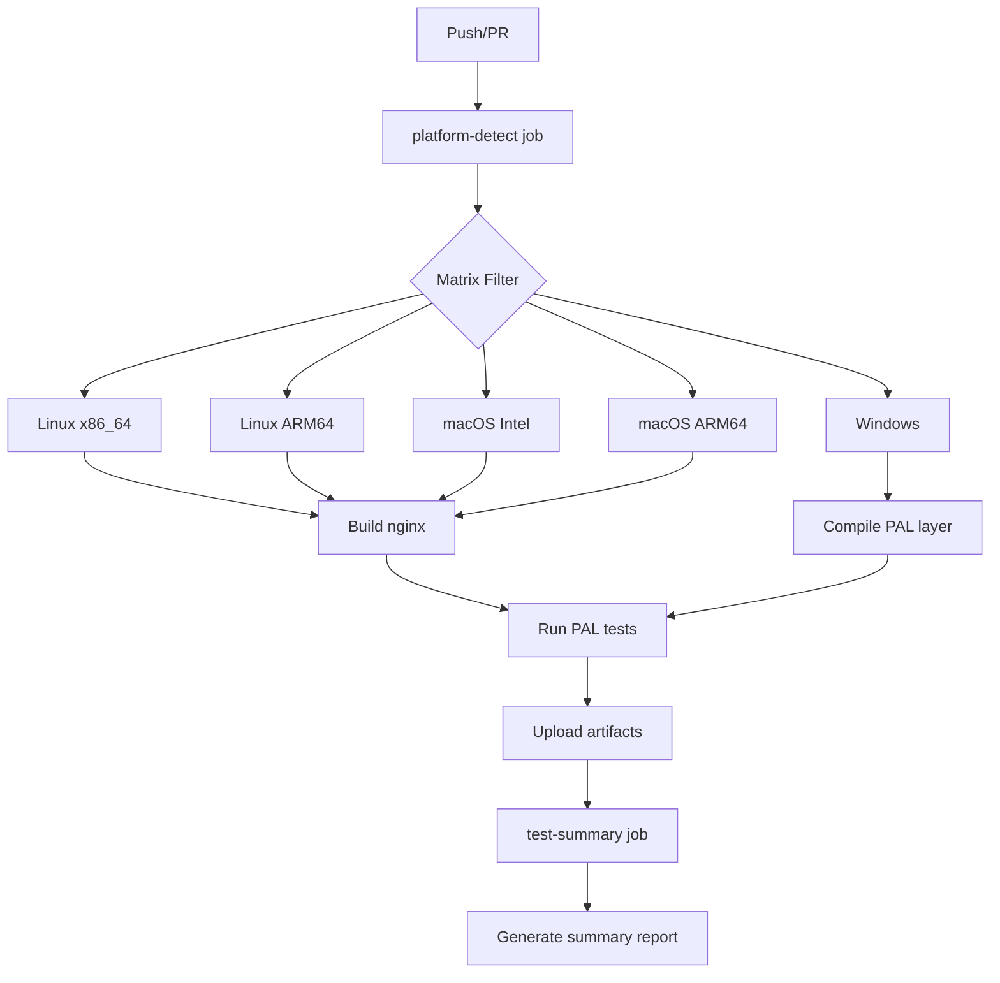

# GitHub Actions Platform Matrix Configuration

This document describes the cross-platform testing matrix for the BriX-Cache Platform Abstraction Layer (PAL).

## Matrix Overview

The CI/CD pipeline tests across **5 platform configurations**:

| Runner | Platform | Architecture | Compiler | Optimization Profile | Priority |
|--------|----------|--------------|----------|---------------------|----------|
| `ubuntu-24.04` | Linux | x86_64 | GCC 13 | `auto` | High |
| `ubuntu-24.04-arm` | Linux | ARM64 | GCC 13 | `arm64` | High |
| `macos-12` | macOS | x86_64 (Intel) | Clang 14 | `intel` | Medium |
| `macos-14` | macOS | ARM64 (Apple Silicon) | Clang 15 | `apple_silicon` | High |
| `windows-2022` | Windows | x86_64 | MSVC 2022 | `generic` | Low |

## Platform-Specific Configuration

### 1. Linux x86_64 (ubuntu-24.04)

**Purpose**: Primary production platform, baseline performance

**Configuration**:
```yaml
os: ubuntu-24.04
platform: linux
arch: x86_64
cc: gcc
optimize: auto
```

**Build Flags**:
```bash
-march=x86-64-v3
-mtune=haswell
-O3
-fno-plt
```

**Tests**:
- ✅ Full PAL API test suite
- ✅ Byte-order operations validation
- ✅ File descriptor operations
- ✅ Zero-copy transfers (sendfile, splice)
- ✅ Random number generation

**Artifacts**:
- `nginx-linux-x86_64` - Compiled nginx binary
- `test-results-linux-x86_64` - JUnit XML test results

---

### 2. Linux ARM64 (ubuntu-24.04-arm)

**Purpose**: ARM64 server platforms (AWS Graviton, Ampere Altra)

**Configuration**:
```yaml
os: ubuntu-24.04-arm
platform: linux
arch: arm64
cc: gcc
optimize: arm64
```

**Build Flags**:
```bash
-march=armv8-a
-march=armv8-a+crc  # If CRC32 extension available
-O3
```

**ARM64-Specific Tests**:
- ✅ CRC32 hardware acceleration detection
- ✅ NEON/ASIMD instruction usage
- ✅ Byte-order operations (little-endian)
- ✅ Atomic operation correctness
- ✅ Alignment requirement validation

**Verification**:
```bash
# Check for ARM64-specific instructions
objdump -d nginx | grep -i "crc32"
objdump -d nginx | grep -i "neon\|adv\|asimd"
```

**Artifacts**:
- `nginx-linux-arm64` - ARM64 nginx binary
- `test-results-linux-arm64` - Test results

---

### 3. macOS Intel (macos-12)

**Purpose**: Legacy Intel Mac support, cross-compilation baseline

**Configuration**:
```yaml
os: macos-12
platform: darwin
arch: x86_64
cc: clang
optimize: intel
```

**Build Flags**:
```bash
-march=x86-64-v3
-mtune=haswell
-O3
-framework Security  # For SecRandomCopyBytes
```

**macOS-Specific Tests**:
- ✅ 6-parameter xattr signature
- ✅ sendfile() signature translation
- ✅ mkstemp-based anon_fd
- ✅ kqueue event handling
- ✅ FSEvents file watching

**Verification**:
```bash
file objs/nginx
# Expected: Mach-O 64-bit executable x86_64
```

**Artifacts**:
- `nginx-macos-intel` - Intel macOS binary
- `test-results-macos-intel` - Test results

---

### 4. macOS Apple Silicon (macos-14)

**Purpose**: Modern Apple Silicon (M1/M2/M3) optimization

**Configuration**:
```yaml
os: macos-14
platform: darwin
arch: arm64
cc: clang
optimize: apple_silicon
```

**Build Flags**:
```bash
-march=armv8.5-a
-mcpu=apple-m1  # or apple-m2, apple-m3
-O3
-flto=thin  # If LTO enabled
-framework Security
-framework Accelerate  # For SIMD optimizations
```

**Apple Silicon Tests**:
- ✅ ARM64 byte-order operations
- ✅ Accelerate framework integration
- ✅ APFS clonefile optimization
- ✅ Firestorm/Icestorm core detection
- ✅ Random generation (SecRandomCopyBytes)

**Verification**:
```bash
file objs/nginx
# Expected: Mach-O 64-bit executable arm64

otool -hv objs/nginx | grep -i "arm64"
```

**Artifacts**:
- `nginx-macos-arm64` - Apple Silicon binary
- `test-results-macos-arm64` - Test results

---

### 5. Windows (windows-2022)

**Purpose**: Windows development/testing (⚠️ beta)

**Configuration**:
```yaml
os: windows-2022
platform: windows
arch: x86_64
cc: msvc
optimize: generic
```

**Build Flags**:
```bash
/D_WIN32_WINNT=0x0602  # Windows 8 minimum
/DWIN32_LEAN_AND_MEAN
/D_CRT_SECURE_NO_WARNINGS
/link ws2_32.lib advapi32.lib kernel32.lib
```

**⚠️ Windows Limitations**:
- nginx/Windows is **beta** (per nginx.org)
- Only `select()`/`poll()` support
- Lower performance/scalability expected
- Missing: XSLT, image filter, GeoIP, embedded Perl

**Windows Tests**:
- ✅ PAL Windows layer compilation
- ✅ HANDLE/fd abstraction
- ✅ Win32 API compatibility
- ⚠️ Limited runtime testing (nginx/Windows beta)

**Verification**:
```powershell
# Check PAL Windows layer compilation
cl /c src\platform\windows\posix_wrapper.c
```

**Artifacts**:
- `test-results-windows` - Test results (if available)

---

## Test Execution Flow



## Artifact Retention

| Artifact Type | Retention | Purpose |
|---------------|-----------|---------|
| nginx binaries | 30 days | Manual testing, debugging |
| Test results (XML) | 7 days | CI/CD integration |
| Test results (summary) | 30 days | Historical tracking |

## Platform-Specific Steps

### Linux (x86_64 & ARM64)

```yaml
steps:
  - name: Install dependencies
    run: |
      sudo apt-get update
      sudo apt-get install -y build-essential libssl-dev ...
  
  - name: Configure nginx
    run: |
      ./configure --add-module=${{ github.workspace }}
  
  - name: Build
    run: make -j$(nproc)
  
  - name: Test
    run: python3 -m pytest tests/platform/ -v
```

### macOS (Intel & Apple Silicon)

```yaml
steps:
  - name: Install dependencies
    run: |
      brew install openssl pcre2 libxml2 ...
  
  - name: Configure nginx
    run: |
      BRIX_OPTIMIZE=<profile> ./configure --add-module=${{ github.workspace }}
  
  - name: Build
    run: make -j$(sysctl -n hw.ncpu)
  
  - name: Test
    run: python3 -m pytest tests/platform/ -v
```

### Windows

```yaml
steps:
  - name: Setup MSVC
    uses: ilammy/msvc-dev-cmd@v1
  
  - name: Install dependencies
    run: choco install -y openssl.light pcre2 ...
  
  - name: Configure
    run: |
      Write-Host "Windows configuration (experimental)"
  
  - name: Build PAL layer
    run: |
      cl /c src\platform\windows\posix_wrapper.c
  
  - name: Test
    run: python3 -m pytest tests/platform/ -v
```

## Selective Testing

Use workflow dispatch to test specific platforms:

```bash
# Test all platforms (default)
workflow_dispatch: platform=all

# Test only Linux ARM64
workflow_dispatch: platform=linux-arm64

# Test only macOS Apple Silicon
workflow_dispatch: platform=macos-arm64
```

## Failure Handling

| Failure Type | Action | Notification |
|--------------|--------|--------------|
| Build failure | Block PR, mark check failed | GitHub notification |
| Test failure | Mark check failed, continue matrix | GitHub notification |
| Single platform failure | Mark matrix as partial success | Comment on PR |
| All platforms fail | Block PR, urgent review | @team mention |

## Performance Benchmarks

Each platform records:
- Build time (seconds)
- Binary size (MB)
- Test execution time (seconds)
- Memory usage (MB)

Benchmarks are uploaded as artifacts for historical tracking.

## Adding New Platforms

To add a new platform to the matrix:

1. Add entry to `platform-detect` job matrix
2. Create new job with platform-specific steps
3. Add platform-specific tests (optional)
4. Update this documentation
5. Test workflow locally with `act` tool

Example:
```yaml
test-new-platform:
  name: New Platform
  runs-on: <runner>
  needs: platform-detect
  env:
    BRIX_PLATFORM: <platform>
    BRIX_ARCH: <arch>
  steps:
    - ...
```

## Troubleshooting

### Common Issues

**Linux ARM64 runner unavailable**:
- Use `ubuntu-24.04-arm` (GitHub-hosted)
- Or self-hosted ARM64 runner

**macOS build fails**:
- Check Homebrew package versions
- Verify Xcode command line tools installed

**Windows compilation errors**:
- Ensure MSVC environment is set up
- Check Win32 API headers available

**Test timeouts**:
- Increase `TEST_TIMEOUT` in test file
- Check for resource contention on runner

## References

- [GitHub Actions Runners](https://docs.github.com/en/actions/using-github-hosted-runners/about-github-hosted-runners)
- [Workflow Syntax](https://docs.github.com/en/actions/reference/workflow-syntax-for-github-actions)
- [Matrix Builds](https://docs.github.com/en/actions/using-jobs/using-a-matrix-for-your-jobs)
- [BriX-Cache PAL Documentation](../../../src/platform/README.md)

---

**Last Updated**: 2025-12-12  
**Maintainer**: Platform Abstraction Layer Team
