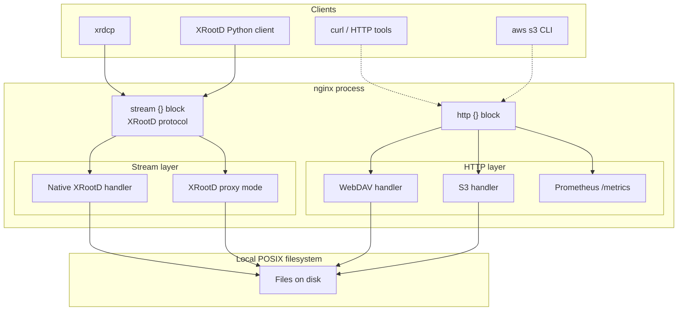
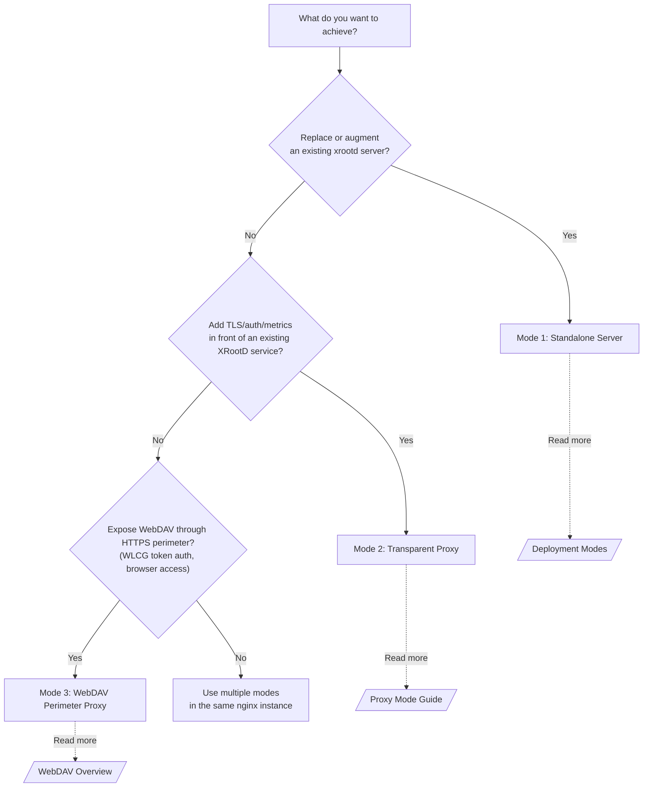
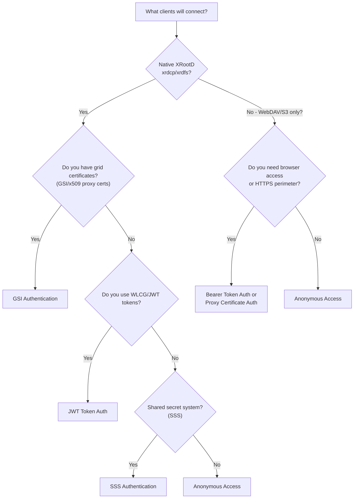

# Documentation — Find What You Need Fast

Don't wade through directories. This page routes you straight to what matters based on **what you're trying to do**. Newcomers: start at the top and work down. Returning users: jump straight to the section you need.

---

## 🚀 I Want a Working Server — Start Here

### New to XRootD or nginx? Go in this order.

| Step | Document | Time | What You'll Learn |
|------|----------|------|-------------------|
| 1 | [Before You Start](01-getting-started/before-you-start.md) | 5 min | What servers, ports, and protocols are (no jargon) |
| 2 | [What Is This Project?](01-getting-started/what-is-this.md) | 5 min | Why this exists — XRootD + nginx in plain English |
| 3 | [Getting Started (Full)](01-getting-started/getting-started-full.md) | 30 min | Build, configure, and verify your first server |
| 4 | [XRootD Basics](02-concepts/xrootd-basics.md) | 10 min | Understand XRootD concepts (optional but helpful) |
| 5 | [Glossary](10-reference/glossary.md) *(reference)* | — | Look up terms as you encounter them *(don't read sequentially)* |

**50 minutes. Server running. All three protocols verified.**

> **Prefer a diagram first?** The [Architecture Overview](11-architecture/overview.md) shows every request path at a glance. Highly recommended before reading any config.

---

## 🏗️ How It All Fits Together

**The key thing to understand:** every protocol handler reads the same POSIX files. There is no translation layer or format conversion — the bytes on disk are the bytes on the wire.

---

### Already know XRootD? Skip ahead.

| Step | Document | Time |
|------|----------|------|
| 1 | [Getting Started (Full)](01-getting-started/getting-started-full.md) | 20 min |
| 2 | Pick your protocol below → | — |

---

## 📦 Choose Your Deployment Mode

Three patterns. Pick the one that matches where BriX-Cache lives in your stack:

**Quick comparison:**

| Mode | When to use | Client sees | Backend is... |
|------|-------------|-------------|---------------|
| **Standalone server** | Replacing or augmenting an `xrootd` daemon on a storage node | Your nginx instance | Local POSIX filesystem (no backend) |
| **Transparent proxy** | Adding TLS, auth, or metrics in front of an existing XRootD service | Your nginx instance | An existing xrootd server (`root://backend`) |
| **WebDAV perimeter proxy** | Exposing internal WebDAV through HTTPS with WLCG token auth | Your HTTPS endpoint | An internal HTTP/HTTPS WebDAV server |

All three modes run inside a single nginx instance. Details: [Deployment Modes](02-concepts/deployment-modes.md).

---

## 📖 Documentation by Topic

### Getting Started
*Install the software, get your first server answering requests, and verify it works.*

| Document | Description |
|----------|-------------|
| [What Is This Project?](01-getting-started/what-is-this.md) | Plain English: what XRootD is, why nginx module, three deployment modes |
| [Before You Start](01-getting-started/before-you-start.md) *(new)* | Concepts primer for people unfamiliar with servers, ports, or building from source |
| [Getting Started (Full)](01-getting-started/getting-started-full.md) | Comprehensive guide — concepts, build, config, and verification in one place |
| [Quick Start Guide](01-getting-started/quick-start-guide.md) | Condensed build → configure → test path for the impatient |
| [First Server Verification](01-getting-started/first-server.md) | Checklist to verify all protocols work correctly |

### The Underlying Concepts
*Domain knowledge that makes the config directives and auth model click.*

| Document | Description |
|----------|-------------|
| [XRootD Basics](02-concepts/xrootd-basics.md) | What XRootD is, how clients talk to servers, authentication methods |
| [Deployment Modes](02-concepts/deployment-modes.md) | Three ways to run this software — which one fits your situation? |
| [How It Works](02-concepts/how-it-works.md) | Request lifecycle from connection to response (with debugging tips) |
| [Forward vs Reverse Proxy](02-concepts/forward-vs-reverse-proxy.md) | The proxy models (forward, reverse, transparent relay, caching) and which feature — tap proxy, relay, cvmfs, mirror, TPC — uses each, with data-flow diagrams |

### Building & Configuration
*Every directive, every build flag, every deployment pattern — all here.*

| Document | Description |
|----------|-------------|
| [Build Guide](03-configuration/build-guide.md) | Detailed nginx source build with all dependencies |
| [Configuration Reference](03-configuration/config-reference.md) | All directives with defaults (complete reference) |
| [TLS Configuration](03-configuration/tls-config.md) | `root://` upgrade, `roots://`, HTTPS setup |
| [Production Deployment](03-configuration/production-deployment.md) | Production deployment patterns and best practices |
| [Deployment Configuration Reference](10-reference/comparison/deployment-reference.md) | Side-by-side BriX-Cache and vanilla XRootD snippets for root, HTTP, token, GSI, packet marking, user mapping, cache, TPC, monitoring, mirroring, staging, and traffic-control deployments |

### Protocols & Clients
*What actually happens on the wire — how each protocol and client type behaves.*

| Document | Description |
|----------|-------------|
| [WebDAV Overview](04-protocols/webdav-overview.md) | WebDAV operations, LOCK/UNLOCK, x509 and bearer token setup |
| [XRootD Client Interaction](04-protocols/xrootd-client-interaction.md) | How `xrdcp`, `xrdfs`, and Python clients interact with the server |
| [Native Client Tools](04-protocols/native-client-tools.md) | Clean-room `xrdcp`, `xrdfs`, diagnostics, checksum tools, FUSE mounts, POSIX preload, and `libxrdc` |
| [HTTP TPC Reference](04-protocols/http-tpc-reference.md) | Third-party copy comparison between HTTP-TPC and native XRootD TPC |
| [CMS Cluster Protocol (`cms://`)](04-protocols/cms-protocol.md) | The cmsd↔cmsd management wire protocol — framing, manager↔server↔client negotiation, and cmsd-compliance gotchas |
| [gsiftp:// GSI Data Channel](04-protocols/gsiftp-data-channel-security.md) | GridFTP DCAU/`PROT P` data-channel security deep dive (delegated-credential presentation, chain-completion + unexpected-EOF gotchas) with ASCII diagrams and a `root://` comparison |

### Authentication & Security
*Access control from anonymous read to full WLCG grid identity. Pick your auth model, then configure it.*

#### Which auth method do you need?

| Document | Description |
|----------|-------------|
| [Authentication Overview](06-authentication/auth-overview.md) | Anonymous, GSI/x509, WLCG/JWT, SSS setup and comparison |
| [Identity → UNIX mapping](06-authentication/identity-mapping.md) | How X.509/VOMS/VO or token/SSS identities map to local UNIX user & group, and how admins force/override a mapping |
| [Per-request impersonation](06-authentication/impersonation.md) | Optional (off by default): run open/metadata ops as the mapped local UNIX user via a privileged broker, so files are owned by — and DAC is enforced for — the real user |
| [Authorization (native authdb)](06-authentication/authorization.md) | The default `native` authdb engine (`u/g/p/a` records) |
| [Authorization (XrdAcc)](06-authentication/authorization-xrdacc.md) | The XrdAcc-compatible engine + full authdb grammar |
| [PKI Configuration](06-authentication/pki-config.md) | Grid/WLCG/OSG security model overview — what you need to know about certificates |
| [Test PKI Setup](06-authentication/test-pki-setup.md) | Generate test CA, certs, proxies, VOMS for development |
| [Test Token Generation](06-authentication/test-token-generation.md) | Generate local WLCG/JWT signing keys and tokens for testing |

#### Security Hardening
*Transport encryption, process isolation, attack surface reduction — the complete checklist.*

| Document | Description |
|----------|-------------|
| [Security Hardening Guide](07-security/hardening-guide.md) | Four-layer security model, hardening checklist, production recommendations |
| [Threat Model & Security Posture](07-security/threat-model.md) | Adversarial threat actors, existing controls, Phase 28 hardening (CMS sss auth, TPC SSRF, side-channels, admin blast radius, concurrency limits), and deferred items |
| [Codebase Hardening — Findings & Summary (2026-06)](09-developer-guide/lessons-codebase-hardening-2026-06.md) | Retrospective of the whole-tree hardening pass: link-time hardening (PIE/RELRO/BIND_NOW), `safe_size.h` overflow-guard adoption, in-process libFuzzer targets, ASan/UBSan lane, oidc-token exec hardening, systemd sandbox — with residual follow-ups |

### Running in Production
*Day-to-day operations: opcode support, proxy mode, clusters, and manager configuration.*

| Document | Description |
|----------|-------------|
| [Operations Guide](05-operations/operations-guide.md) | All 32 XRootD opcodes supported, status table, edge cases |
| [Operation Status](05-operations/operation-status.md) | Per-opcode implementation status table |
| [Proxy Mode Guide](05-operations/proxy-mode-guide.md) | Transparent XRootD MITM proxy design and configuration |
| [Cluster Management](05-operations/cluster-management.md) | CMS heartbeat, dynamic registry, redirect semantics |
| [Hierarchical Cluster](05-operations/hierarchical-cluster.md) | Multi-level cluster topology patterns |
| [Manager Mode](05-operations/manager-mode.md) | Manager node configuration and operation |
| [Troubleshooting](05-operations/troubleshooting.md) | Symptom-first decision tree: won't-start, auth, 5xx, saturation, cluster/TPC |
| [Capacity Planning](05-operations/capacity-planning.md) | Sizing workers/connections/FDs, thread pool, SHM zones, transfer budget |
| [Certificate & Token Rotation](05-operations/certificate-rotation.md) | Hot-reload of JWKS/CRL/authdb + graceful host-cert roll without dropping requests |
| [Upgrade Procedure](05-operations/upgrade-procedure.md) | RPM upgrade/rollback, the 2-`.so` module-load order, libbz2 SONAME caveat |
| [SELinux Hardening](05-operations/selinux-hardening.md) | SELinux for admins new to it: what the shipped brix policy module confines, rollout runbook, denial debugging |
| [Remote-host test suite](05-operations/remote-host-test-suite.md) | Install the RPMs on a fresh host + run the pytest fleet — source build vs. shipped `.so`, with the `load_module` injection |
| [/cvmfs Automount](05-operations/cvmfs-automount.md) | `brixMount autofs` umbrella daemon: stock-client-style /cvmfs on-demand mounts with zero autofs/systemd dependency (WSL2 OOTB), symlink-farm design, packaging + conflict matrix |

### Observability & Monitoring
*Every request lands in a counter. Here's how to read them.*

| Document | Description |
|----------|-------------|
| [Monitoring Guide](08-metrics-monitoring/monitoring-guide.md) | Prometheus counters, access log format, what to watch for |
| [Live Transfer Monitor](05-operations/live-transfer-monitor.md) | The real-time active-transfer view in the HTTPS dashboard |
| [Dashboard Feature Ideas](08-metrics-monitoring/dashboard-feature-ideas.md) | Useful future additions for the HTTPS monitoring dashboard |

---

## 🏗️ Architecture (Diagrams First)

Visual overview of every request path and component relationship. **Start here if you're faster with diagrams than text.**

| Document | Description |
|----------|-------------|
| **[Architecture Overview](11-architecture/overview.md)** | Mermaid diagram, deployment modes, request flows, file reference index |
| [Logical Pathways (Tier 1 & 2)](11-architecture/logical-pathways.md) | Core data/security pathways vs clustering/advanced features |
| [Tier 1 Stream Data Paths](11-architecture/tier1-stream-data-paths.md) | Per-opcode walkthrough of the core stream wire operations |
| [Tier 2 Stream Data Paths](11-architecture/tier2-stream-data-paths.md) | Per-opcode walkthrough of the advanced/clustering stream operations |
| [Cross-Protocol Unification](11-architecture/cross-protocol-unification.md) | How root/WebDAV/S3 share resolution, identity, VFS, and metrics |

> The architecture overview targets operators and newcomers. For source-level deep dives — state machines, call graphs, buffer lifetimes — go to [Developer Guide → Architecture](09-developer-guide/architecture-overview.md).

---

## 👷 Developer Guide

Contributing code? Start here. Everything you need to navigate the source tree, run tests, and ship changes.

| Document | Description |
|----------|-------------|
| [Development Workflow](09-developer-guide/dev-workflow.md) | Source tree layout, utilities, local development setup |
| [Coding Standards](09-developer-guide/coding-standards.md) | C style, naming, documentation, and review expectations |
| [XrdSecgsi Handshake](09-developer-guide/xrdsecgsi-handshake.md) | The real GSI handshake (client & server) — protocol, exact wire formats, and every gotcha; how `./client/xrdfs` authenticates to stock EOS |
| [Lessons — TPC + VFS](09-developer-guide/lessons-tpc-vfs.md) | Field guide from the native-TPC (GSI/async/TLS/delegation) and VFS storage-driver work — the non-obvious things that cost real time (GSI interop traps, gate-first testing, build/test gotchas) |
| [Lessons — The Migration Era (2026)](09-developer-guide/lessons-migration-era-2026.md) | Synthesis of the phase 55–66 structural migrations: map-driven move mechanics and their limits (splits/dissolutions), gate-first migration, guard+backlog discipline, build-system traps, the writev wire-parity case study, and the consolidated pre-merge checklist |
| [Development History, Decisions & Lessons Learnt](09-developer-guide/development-history.md) | Master index — start here for "why does this look this way" / "has this been hit before" questions, synthesized from ~234 session-memory records |
| [History — Protocols & Feature Phases](09-developer-guide/history-protocols-and-feature-phases.md) | Native XRootD/pgread-pgwrite wire fidelity, S3, WebDAV extras, CMS mesh, proxy mode, pipelining, mirroring, dashboard, monitoring/AF-bridging, SciTags, federation (Pelican) |
| [History — Storage & Caching](09-developer-guide/history-storage-and-caching.md) | VFS seam closure, composable cache tiers, pluggable backends (pblock, Ceph/RADOS, S3, CVMFS), FRM/tape staging dissolution, unified cache state |
| [History — Client Tooling](09-developer-guide/history-client-tooling.md) | Native xrdcp/xrdfs, FUSE (xrootdfs), CVMFS native client (brixMount), GSI client interop, the "swiss army client" vision |
| [History — Testing & Incidents](09-developer-guide/history-testing-and-incidents.md) | Test harness evolution, conformance suites, chaos/reload/load testing, production postmortems (incl. the "host overloaded" banned-diagnosis incident) |
| [History — Security & Credentials](09-developer-guide/history-security-and-credentials.md) | Auth gate ordering, credential forwarding, TPC delegation, impersonation, GSI/TLS negotiation, vulnerabilities found & fixed, XrdAcc |
| [History — Build, Infra & Decisions](09-developer-guide/history-build-infra-and-decisions.md) | Build system mechanics, packaging, codebase-wide refactors, and the standing working agreements for AI agents in this repo |
| [Testing Runbook](09-developer-guide/testing-runbook.md) | Running tests, cross-compatible test harness, troubleshooting |
| [Test ↔ Protocol Mapping](09-developer-guide/test-protocol-mapping.md) | Which test files cover which protocol areas |
| [Adversarial Hardening Tests](09-developer-guide/adversarial-testing.md) | Evil-actor suites (worker-crash hunt, race detection, hostile wire parsing) — what they attack and how the codebase defends |
| [Contributing Guide](09-developer-guide/contributing.md) | How to submit changes, code style expectations |
| [Feature Roadmap](09-developer-guide/feature-roadmap.md) | Planned features and priorities |
| [Refactor Series](refactor/00-overview.md) | Design records for the phased refactor work (phase-NN) |
| [Optimizations](09-developer-guide/optimizations.md) | Performance work and hot paths (read before touching read/WebDAV/auth code) |
| [Lifecycle Startup & Shutdown Performance](09-developer-guide/lifecycle-startup-shutdown-performance.md) | Measure-first pass over process lifecycle: phase instrumentation, the lazy GSI keypool win (16ms→1.2ms/worker), and the profiling harness |
| [Postmortem — Proxy Splice Under-drain Stall](09-developer-guide/postmortem-proxy-splice-underdrain-stall.md) | How a flaky mesh-topology test was traced to an `xrootd_proxy` zero-copy splice stall on large reads, and the self-healing fallback that fixed it — plus the systematic-debugging lessons |
| [Client Mount & Connect Latency](09-developer-guide/client-mount-connect-latency.md) | Measure-first pass over `xrootdfs` mount / `xrdfs` connect: why the mount opened 5 serial connections, the parallel-eager + `--lazy-streams` fix, the GSI-rtag concurrency prerequisite, and connect-path micro-wins |
| [Source Reduction Plan](09-developer-guide/source-reduction-plan.md) | External-library and nginx built-in delegation plan with LOC estimates |
| [Deployment Hardening](09-developer-guide/deployment-hardening.md) | Hardened systemd unit directives, capability bounding set rationale, build-side RELRO/PIE defaults, and operator checklist for tightening/widening the sandbox |

---

## 📚 Deep Reference

⚠️ **Advanced material** — assumes you already have the software running and want to understand protocol internals, design trade-offs, or implementation details.

| Document | Description |
|----------|-------------|
| [Glossary](10-reference/glossary.md) *(enhanced)* | All terminology explained, cross-referenced from other docs |
| [XRootD Concepts (Deep)](10-reference/xrootd-concepts-deep.md) | Protocol framing, session model, cluster topology *(17 sections)* |
| [Protocol Notes](10-reference/protocol-notes.md) | Wire-protocol details for developers |
| [Quirks & Compromises](10-reference/quirks.md) | Design mismatches and trade-offs with official xrootd |
| [Handler Reference](10-reference/handler-reference.md) | Function signatures and call patterns |
| [Core Types](10-reference/types.md) | Struct definitions used throughout the codebase |
| [Design Rationale](10-reference/design-rationale.md) | Why BriX-Cache exists, comparison with official xrootd |
| [Gaps vs Official XRootD](10-reference/gaps-vs-xrootd.md) | Features in official xrootd not yet implemented |
| [Protocol Gap Analysis](10-reference/protocol-gaps-vs-xrootd.md) | Per-opcode/plugin gap comparison against reference xrootd v5.2 |
| [XRootD Feature Matrix](10-reference/xrootd-feature-matrix.md) | Cross-reference of every XRootD feature, plugin, and interop surface |
| [Feature Gaps](10-reference/feature-gaps.md) | Incomplete features and corner cases across the three protocols |
| [BriX-Cache vs Canonical xrootd](10-reference/comparison-nginx-xrootd-vs-canonical.md) | Detailed behavioural comparison with the reference daemon |

---

## 🛤️ Learning Paths — "How Long Do I Have?"

### "I need to understand this project today" (30 minutes)
1. [Before You Start](01-getting-started/before-you-start.md) — basic concepts primer
2. [What is this project?](01-getting-started/what-is-this.md)
3. [Getting Started (Full)](01-getting-started/getting-started-full.md) — covers install + concepts in one doc
4. [XRootD Basics](02-concepts/xrootd-basics.md)

### "I need to operate this in production" (1.5 hours)
1. All of the above
2. [Configuration Reference](03-configuration/config-reference.md)
3. [Authentication Overview](06-authentication/auth-overview.md) + [TLS Configuration](03-configuration/tls-config.md)
4. **[Security Hardening Guide](07-security/hardening-guide.md)** — verify your deployment is secure
5. [Monitoring Guide](08-metrics-monitoring/monitoring-guide.md)
6. [Cluster Management](05-operations/cluster-management.md) if multi-node

### "I want to contribute code" (2 hours)
1. All of the above
2. [Development Workflow](09-developer-guide/dev-workflow.md)
3. [Testing Runbook](09-developer-guide/testing-runbook.md)
4. **[Security Hardening Guide](07-security/hardening-guide.md)** — security-sensitive changes need negative test cases
5. **[Architecture Overview](11-architecture/overview.md)** — visual guide, then protocol-specific docs for your area
6. AGENTS.md (project root) — Operation-to-file index, implementation recipes

### "I'm a security-conscious operator" (2 hours)
1. **[Security Hardening Guide](07-security/hardening-guide.md)** — start here if security is your priority
2. [Authentication Overview](06-authentication/auth-overview.md) + [PKI Configuration](06-authentication/pki-config.md)
3. [TLS Configuration](03-configuration/tls-config.md) + [Security Hardening Guide](07-security/hardening-guide.md) (re-read with context)
4. [Monitoring Guide](08-metrics-monitoring/monitoring-guide.md) — monitor for security events
5. Review: `tests/test_security_hardening.py`, `tests/test_privilege_escalation.py`

---

## 📁 Old Documentation Paths

The original flat structure has been migrated to the numbered sections above. Old URLs still resolve — update your bookmarks when you get a chance:

<!-- doc-paths:off — the left column deliberately names paths that no longer exist -->
| Deprecated Path | New Location |
|---|---|
| `docs/getting-started.md` | [01-getting-started/quick-install.md](01-getting-started/quick-install.md) |
| `docs/background.md` | [02-concepts/xrootd-basics.md](02-concepts/xrootd-basics.md) |
| `docs/architecture/*` | [`11-architecture/`](11-architecture/) + [`09-developer-guide/`](09-developer-guide/) |
| `docs/configuration/*` | [`03-configuration/`](03-configuration/) |
| `docs/contributing/*` | [`09-developer-guide/`](09-developer-guide/) |
| `docs/metrics/*` | [`08-metrics-monitoring/`](08-metrics-monitoring/) |
| `docs/operations/*` | [`05-operations/`](05-operations/) |
| `docs/pki/*` | [`06-authentication/`](06-authentication/) |
| `docs/reference/*` | [`10-reference/`](10-reference/) |
| `docs/testing/*` | [`09-developer-guide/`](09-developer-guide/) |
| `docs/webdav/*` | [`04-protocols/`](04-protocols/) |
<!-- doc-paths:on -->

Full migration details: [MIGRATION-NOTICE.md](MIGRATION-NOTICE.md)

---

## Recent Changes

- **May 2026 — Documentation restructuring:** Removed numbered sections in favor of topic-based categories. Added Mermaid diagrams for deployment mode selection and authentication decisions. Improved cross-linking throughout. Newcomers should start at [I Want a Working Server](#-i-want-a-working-server---start-here).
- **May 2026 — Documentation improvements:** Added [Architecture Overview](11-architecture/overview.md) with Mermaid diagrams for visual learners and request lifecycle diagrams for all three protocols. Enhanced [Glossary](10-reference/glossary.md) with A-Z quick lookup, missing terms (Manager Mode, Cluster Mode, JWKS, HTTP-TPC vs native TPC), and fixed all broken cross-references.
- **May 2026 — Documentation cleanup:** Merged duplicate docs (`quick-install.md` → `getting-started-full.md`, deleted `xrootd-background.md`). Removed orphaned stub files from `optimizations/` and `testing/`. Archived planning documents to `_archive/`.
- **Section 07 — Security Hardening** (new): Consolidated security guidance including the four-layer security model and production hardening checklist
- All legacy flat paths are deprecated; see mapping above for updates
