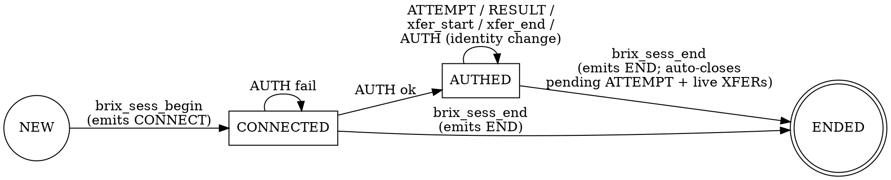

# Session-Lifecycle Audit Logging (`brix_sesslog`) — Design

**Date:** 2026-07-07
**Status:** Approved design, pending implementation plan

---

## 1. Goal

Emit a small, correlated set of session-lifecycle audit messages — about 4–6
per typical session — into the existing brix access log, uniform across
**every** protocol and access pattern the server handles: inbound
`root://`/`roots://`, WebDAV (`http`/`davs`), S3, `cvmfs://`, cms (inbound and
outbound), and server-initiated activity (native and WebDAV TPC transfers,
cache origin fills). Every message for a session carries the same unique
session ID so an operator can reconstruct the whole session with one grep.

The six event kinds:

| # | Event | Meaning | Cardinality per session |
|---|---|---|---|
| 1 | `CONNECT` | a session began: protocol, direction, peer, auth method offered | exactly 1, always first |
| 2 | `AUTH` | authentication outcome: ok/fail, method, identity, VO | 0..N (0 if the session never authenticates; >1 on retry-after-failure or identity change on a keepalive connection) |
| 3 | `ATTEMPT` | a resource access was attempted: path + access mode | 1 per resource access |
| 4 | `RESULT` | outcome of that attempt: ok/fail + error reason | exactly 1 per ATTEMPT |
| 5 | `XFER` | a transfer stopped (complete / aborted / interrupted by nginx shutdown): bytes moved vs expected, duration, average speed | 1 per data transfer; **must be emitted for in-flight transfers when nginx shuts down** |
| 6 | `END` | the session ended: reason and session duration | exactly 1, always last |

A typical single-file `xrdcp` download therefore emits exactly 6 lines:
CONNECT, AUTH, ATTEMPT, RESULT, XFER, END.

## 2. Decisions made during brainstorming

- **Destination:** the existing brix access log stream (per-protocol
  `brix_access*.log` fds, batched writer `brix_alog_emit()` in
  `src/observability/accesslog/access_log.c`), not `error.log` and not a new
  file.
- **HTTP session model — hybrid:** session = TCP connection (one session ID
  per connection, CONNECT/END once). AUTH is logged when identity is first
  established on that connection and re-logged only if the identity changes.
  ATTEMPT/RESULT/XFER are per request within the connection.
- **Event taxonomy:** six events with **separate ATTEMPT and RESULT lines**.
- **Config:** a new `brix_session_log on|off` directive (default **on**),
  independent of the per-request access-log lines.
- **Scope: everything.** All inbound client sessions plus every
  server-initiated connection (TPC pulls/pushes, cache origin fills, cms
  outbound) get their own session ID and lifecycle events, with the format as
  uniform as possible regardless of protocol/auth/direction. Server-initiated
  sessions carry `parent=<sess-id>` linking them to the triggering client
  session where one exists.

## 3. Session lifecycle state machine

Every session, regardless of plane, walks this machine. Emitting functions
enforce it defensively (out-of-order calls are coerced or dropped with one
WARN, never crash):



Rules enforced by the glue layer:

- `RESULT ok` is never emitted from state CONNECTED for authenticated planes
  (an access cannot succeed without identity); `RESULT fail` can (e.g.
  `err="auth-required"`).
- `brix_sess_end` from any state: first auto-emit `RESULT fail
  err="session-closed"` if an ATTEMPT is pending, then `XFER aborted` (or
  `shutdown` when `ngx_exiting`) for every still-linked transfer, then END.
- Everything after END is a silent no-op (`end_logged` guard).

---

## 4. Line grammar

### 4.1 General shape

Every event is exactly one line appended to the access log through the
existing batched writer. The line shares the access log's timestamp
convention (`strftime "%d/%b/%Y:%H:%M:%S %z"` via `ngx_timeofday()`, as in
`access_log.c` Phase 3):

```
[07/Jul/2026:14:03:22 +0000] SESS <id> <EVENT> <k>=<v> [<k>=<v> ...]
```

ABNF (after the timestamp prefix):

```
sess-line   = "SESS" SP sess-id SP event SP fields
sess-id     = 16LHEX                       ; 64-bit, lowercase hex
event       = "CONNECT" / "AUTH" / "ATTEMPT" / "RESULT" / "XFER" / "END"
fields      = field *(SP field)
field       = key "=" value / status
status      = "ok" / "fail" / "complete" / "aborted" / "shutdown"
              ; bare positional token, always the FIRST token after the
              ; event name, only on AUTH/RESULT (ok|fail) and XFER
              ; (complete|aborted|shutdown)
key         = 1*(ALPHA / "_")
value       = bare / quoted
bare        = 1*(%x21-7E except DQUOTE SP "=")   ; enums, numbers, ids
quoted      = DQUOTE *san-char DQUOTE            ; sanitized free text
```

**Quoting rule:** enum/numeric/id fields (`proto`, `dir`, `mode`, `method`,
`authmethod`, `bytes`, `dur`, `avg`, `parent`, `reason`, and the positional
status token) are bare. Free-text fields that can contain arbitrary wire
bytes — `path`, `user`, `vo`, `err`, `peer` — are **always double-quoted**
and pass through `brix_sanitize_log_string()` first, which escapes control
bytes, `"`, `\`, and non-ASCII to `\xNN`; the quoted form is therefore
unbreakable (no raw quote, space-split ambiguity, or newline can survive
sanitization). A parser can split on unquoted spaces safely.

**Field order is fixed** per event (exactly as written in §4.2) so lines are
also grep-friendly without a parser, and so the uniformity test (§8.2) can
compare field-name sequences across planes byte-for-byte.

**Reference parse regex** (one line, after timestamp strip; used verbatim by
`tests/sesslog_lib.py`):

```
^SESS (?P<id>[0-9a-f]{16}) (?P<event>CONNECT|AUTH|ATTEMPT|RESULT|XFER|END)
 (?P<rest>(?:[a-z_]+=(?:"(?:[^"\\]|\\x[0-9a-fA-F]{2}|\\\\|\\")*"|[^ "=]+)
 |ok|fail|complete|aborted|shutdown)(?: ...)*)$
```

### 4.2 The six line formats (field order normative)

```
SESS <id> CONNECT proto=<proto> dir=<in|out> peer="<addr>" authmethod=<am> [parent=<id>]

SESS <id> AUTH <ok|fail> method=<am> user="<identity|->" vo="<vo|->" [err="<token>"]

SESS <id> ATTEMPT path="<path>" mode=<mode>

SESS <id> RESULT <ok|fail> path="<path>" mode=<mode> [err="<token>"]

SESS <id> XFER <complete|aborted|shutdown> path="<path>" mode=<mode> bytes=<n>/<expected|-> dur=<ms> avg=<bytes_per_s>

SESS <id> END reason=<reason> dur=<ms>
```

### 4.3 Enumerations (closed sets — adding a value is a spec change)

| Field | Values | Notes |
|---|---|---|
| `proto` | `root` `webdav` `s3` `cvmfs` `cms` `tpc` `fill` | `root` covers roots:// (TLS is transport, not proto); `webdav` covers http and davs |
| `dir` | `in` `out` | `in` = we accepted the connection; `out` = we initiated it |
| `authmethod`/`method` | `gsi` `token` `sss` `krb5` `pwd` `unix` `host` `sigv4` `anon` | on CONNECT: the strongest method the listener offers; on AUTH: the method actually used |
| `mode` | `read` `write` `meta` `delete` `list` `copy` | mapping tables per plane in §7 |
| XFER status | `complete` `aborted` `shutdown` | `complete` = natural end; `aborted` = peer vanished / error / truncation; `shutdown` = worker exiting with transfer in flight |
| AUTH/RESULT status | `ok` `fail` | |
| END `reason` | `client-disconnect` `server-close` `timeout` `shutdown` `error` | derivation rules per plane in §7; conservative — ambiguous → `error` |

### 4.4 Field semantics and edge cases

- **`<id>`** — 16 lowercase hex chars (64 bits). Minted once per session by
  `brix_sess_begin()` via `RAND_bytes(8)` (OpenSSL is always linked); on the
  never-expected failure path, fallback
  `(uint64_t)ngx_pid << 48 ^ monotonic_counter++ ^ ngx_random()`.
  Requirement: uniqueness within a log-retention window, not
  unpredictability. **Distinct from** the wire-level root:// `sessid`
  (`ctx->login.sessid`, 16 bytes issued at kXR_login,
  `connection/handler.c:63-67`) — the wire sessid is a protocol artifact and
  stays untouched.
- **`peer`** — remote address as nginx renders it (`c->addr_text`), quoted
  (IPv6 contains `:`). For `dir=out`: the remote host:port we dialed. `-`
  when unavailable.
- **`parent`** — present only on `dir=out` sessions triggered by another
  session (TPC pull triggered by a client COPY; demand cache fill). Value =
  the triggering session's sess-id. Omitted when nothing triggered it (cms
  outbound, prefetch fill).
- **`user`** — the authenticated identity in native form: GSI subject DN,
  token `sub` claim (issuer-qualified if configured), sss/krb5 principal,
  unix username, S3 access-key-id, peer hostname for `host`, `-` for anon.
- **`vo`** — primary VO where the method yields one (GSI/VOMS `primary_vo`,
  token issuer-mapped group); `-` otherwise.
- **`bytes=<n>/<expected|->`** — `n` = bytes actually moved when the transfer
  stopped. `expected` = content-length / stat size known at transfer start;
  `-` when unknown (chunked PUT, unbounded stream). `mode=read`: bytes sent
  to the consumer. `mode=write`: bytes durably accepted. `mode=copy` (TPC
  client-facing): total object bytes transferred by the copy.
- **`dur`** — milliseconds, `ngx_current_msec` delta, clamped ≥0 (same
  clock-skew floor as the access log). On XFER: transfer duration (from
  `xfer_start`). On END: session duration (from `brix_sess_begin`).
- **`avg`** — integer bytes/second = `n * 1000 / max(dur, 1)`. `dur=0` →
  `n * 1000`; `n=0` → `avg=0`. 64-bit arithmetic throughout (a 100 GiB
  transfer must not overflow).
- **AUTH cardinality** — 0 AUTH lines is legal (probe that connects and sends
  nothing; teardown before login). Pure-anon service (cvmfs, plain-http GET)
  emits `AUTH ok method=anon user="-"` when the first request is admitted, so
  every *served* session has an AUTH line. Multiple AUTH lines occur on
  (a) fail-then-retry (root:// allows up to `BRIX_MAX_AUTH_ATTEMPTS`), and
  (b) identity change across requests on one HTTP keepalive connection.
- **ATTEMPT/RESULT pairing** — every ATTEMPT is matched by exactly one RESULT
  with identical `path`+`mode`. If the session dies in between, the teardown
  path emits `RESULT fail err="session-closed"` before END (invariant: no
  dangling ATTEMPT in a complete session log).
- **Truncation** — a formatted line is capped at 4096 bytes (same as the
  access-log line buffer). Overflow truncates the *value* (never a key or the
  structure) and appends `...` inside the closing quote. A line is never
  split across writes (the batch writer takes whole lines).

### 4.5 `err` reason tokens (closed set + fallback)

Stable short tokens, never raw `strerror` text. Three mapping functions in
the core (§6.1); the tables are exhaustive over the codes the callers can
produce, everything else falls back to `code:<n>`.

| Token | errno sources | kXR sources | HTTP sources |
|---|---|---|---|
| `not-found` | ENOENT, ENOTDIR | kXR_NotFound | 404 |
| `permission` | EACCES, EPERM | kXR_NotAuthorized | 403 |
| `invalid` | EINVAL, ENAMETOOLONG | kXR_ArgInvalid, kXR_ArgMissing, kXR_ArgTooLong | 400 |
| `io` | EIO | kXR_IOError | 500, 502 |
| `no-memory` | ENOMEM | kXR_NoMemory | 507 |
| `no-space` | ENOSPC, EDQUOT | kXR_NoSpace | 507 |
| `locked` | — | kXR_FileLocked | 423 |
| `exists` | EEXIST | kXR_InvalidRequest (open new on existing) | 409, 412 |
| `busy` | EBUSY | kXR_inProgress | 503 |
| `auth-required` | — | kXR_NotAuthorized pre-auth | 401 |
| `scope` | — | — (token scope denial, root token auth) | 403 with scope-denial cause |
| `expired-cert` | — | GSI chain validation: expired | TLS/auth layer |
| `bad-signature` | — | sigver failure; GSI handshake failure | S3 SigV4 mismatch |
| `acl-deny` | — | authdb/acc denial | authdb/acc denial |
| `unsupported` | EOPNOTSUPP | kXR_Unsupported | 405, 501 |
| `timeout` | ETIMEDOUT | — | 504, origin stall |
| `session-closed` | — (synthesized by teardown, §3) | — | — |
| `code:<n>` | any other errno | any other kXR code | any other status |

Where the caller has a *cause* distinction the HTTP status alone loses (403
from ACL vs 403 from scope), the call site passes the specific token; the
status-based mapper is the fallback, not the only path.

### 4.6 Worked examples

Inbound root:// + GSI single-file read (the canonical 6 lines):

```
[..] SESS 9f3ac1e2b4d87a10 CONNECT proto=root dir=in peer="10.0.0.5:41234" authmethod=gsi
[..] SESS 9f3ac1e2b4d87a10 AUTH ok method=gsi user="/DC=ch/DC=cern/CN=alice" vo="cms"
[..] SESS 9f3ac1e2b4d87a10 ATTEMPT path="/data/run7/f.root" mode=read
[..] SESS 9f3ac1e2b4d87a10 RESULT ok path="/data/run7/f.root" mode=read
[..] SESS 9f3ac1e2b4d87a10 XFER complete path="/data/run7/f.root" mode=read bytes=1073741824/1073741824 dur=2604 avg=412343905
[..] SESS 9f3ac1e2b4d87a10 END reason=client-disconnect dur=2711
```

Auth failure then retry on the same root:// connection:

```
[..] SESS 4410cc2e91ab77f0 CONNECT proto=root dir=in peer="10.0.0.7:39002" authmethod=gsi
[..] SESS 4410cc2e91ab77f0 AUTH fail method=gsi user="-" vo="-" err="expired-cert"
[..] SESS 4410cc2e91ab77f0 AUTH ok method=gsi user="/DC=ch/CN=bob" vo="atlas"
[..] SESS 4410cc2e91ab77f0 END reason=client-disconnect dur=880
```

WebDAV TPC pull — client session + correlated outbound session:

```
[..] SESS 51c22e0aa9310f77 CONNECT proto=webdav dir=in peer="192.0.2.9:55010" authmethod=gsi
[..] SESS 51c22e0aa9310f77 AUTH ok method=gsi user="/DC=ch/CN=fts3" vo="atlas"
[..] SESS 51c22e0aa9310f77 ATTEMPT path="/store/dst.root" mode=copy
[..] SESS c003b1de55e2a940 CONNECT proto=tpc dir=out peer="src.example.org:443" authmethod=gsi parent=51c22e0aa9310f77
[..] SESS c003b1de55e2a940 AUTH ok method=gsi user="/DC=ch/CN=fts3" vo="atlas"
[..] SESS c003b1de55e2a940 ATTEMPT path="/remote/src.root" mode=read
[..] SESS c003b1de55e2a940 RESULT ok path="/remote/src.root" mode=read
[..] SESS c003b1de55e2a940 XFER complete path="/remote/src.root" mode=read bytes=524288000/524288000 dur=9120 avg=57487719
[..] SESS c003b1de55e2a940 END reason=server-close dur=9188
[..] SESS 51c22e0aa9310f77 RESULT ok path="/store/dst.root" mode=copy
[..] SESS 51c22e0aa9310f77 XFER complete path="/store/dst.root" mode=copy bytes=524288000/524288000 dur=9245 avg=56710438
[..] SESS 51c22e0aa9310f77 END reason=client-disconnect dur=9377
```

Worker shutdown mid-transfer (partial bytes, shutdown reason):

```
[..] SESS 7ab0d1f2c3e4a5b6 XFER shutdown path="/data/big.root" mode=read bytes=311427072/1073741824 dur=1502 avg=207341592
[..] SESS 7ab0d1f2c3e4a5b6 END reason=shutdown dur=1560
```

Hostile filename (injection attempt rendered inert — one line, spoof text
escaped inside quotes):

```
[..] SESS 2f00aa13d4e5b6c7 ATTEMPT path="/tmp/x\x0aSESS 0000000000000000 END reason=shutdown dur=0" mode=read
```

---

## 5. Architecture overview

```
                 ┌────────────────────────────────────────────────┐
   plane hooks   │  src/observability/sesslog/                    │
 (root/webdav/   │                                                │
  s3/cvmfs/cms/  │  sesslog.c        ngx-free core:               │
  tpc/fill)      │    • enums, brix_sess_t, brix_sess_xfer_t      │
      │          │    • 6 pure formatters (sanitizer injected)    │
      ▼          │    • err-token mappers (errno/kXR/HTTP)        │
 brix_sess_begin │                                                │
 brix_sess_auth  │  sesslog_ngx.c    nginx glue:                  │
 brix_sess_...   │    • per-worker fixed-slot registry            │
 brix_sess_end   │    • id minting (RAND_bytes)                   │
      │          │    • timestamp prefix + emit                   │
      │          │    • shutdown walk                             │
      ▼          └───────────────┬────────────────────────────────┘
                                 ▼
                  brix_alog_emit(fd, line, n)
                  (existing batched writer: 64 KiB per-worker buffer,
                   1 s flush timer, flush on fd switch, O_APPEND)
                                 ▼
                  the plane's existing brix access-log fd
```

Design principles:

- **One formatter** — no plane formats its own lines; uniformity is
  structural, not conventional.
- **ngx-free core** — pure functions of their arguments (no globals, clock,
  I/O; everything injected), unit-testable standalone like `src/net/guard/`
  and `src/tap/`. No `goto`; functional/modular per coding-standards.
- **NULL-tolerant glue** — every glue function no-ops on a NULL session
  handle so call sites are branch-free.
- **Main-thread-only emission** — threaded contexts never call sesslog (§5.4).

### 5.1 Core: `src/observability/sesslog/sesslog.h` + `sesslog.c`

```c
#define BRIX_SESSLOG_ID_LEN      16           /* hex chars, no NUL      */
#define BRIX_SESSLOG_LINE_MAX    4096
#define BRIX_SESSLOG_PATH_MAX    1024         /* pre-sanitization cap   */
#define BRIX_SESSLOG_USER_MAX    512          /* matches ctx dn[512]    */
#define BRIX_SESSLOG_VO_MAX      128          /* matches primary_vo     */
#define BRIX_SESSLOG_PEER_MAX    80
#define BRIX_SESSLOG_ERR_MAX     32           /* err tokens are short   */

typedef enum {
    BRIX_SESS_PROTO_ROOT = 0,
    BRIX_SESS_PROTO_WEBDAV,
    BRIX_SESS_PROTO_S3,
    BRIX_SESS_PROTO_CVMFS,
    BRIX_SESS_PROTO_CMS,
    BRIX_SESS_PROTO_TPC,
    BRIX_SESS_PROTO_FILL,
    BRIX_SESS_PROTO_MAX
} brix_sess_proto_t;

typedef enum { BRIX_SESS_DIR_IN = 0, BRIX_SESS_DIR_OUT } brix_sess_dir_t;

typedef enum {
    BRIX_SESS_AM_GSI = 0, BRIX_SESS_AM_TOKEN, BRIX_SESS_AM_SSS,
    BRIX_SESS_AM_KRB5, BRIX_SESS_AM_PWD, BRIX_SESS_AM_UNIX,
    BRIX_SESS_AM_HOST, BRIX_SESS_AM_SIGV4, BRIX_SESS_AM_ANON,
    BRIX_SESS_AM_MAX
} brix_sess_am_t;

typedef enum {
    BRIX_SESS_MODE_READ = 0, BRIX_SESS_MODE_WRITE, BRIX_SESS_MODE_META,
    BRIX_SESS_MODE_DELETE, BRIX_SESS_MODE_LIST, BRIX_SESS_MODE_COPY,
    BRIX_SESS_MODE_MAX
} brix_sess_mode_t;

typedef enum {
    BRIX_SESS_XFER_COMPLETE = 0, BRIX_SESS_XFER_ABORTED,
    BRIX_SESS_XFER_SHUTDOWN
} brix_sess_xfer_status_t;

typedef enum {
    BRIX_SESS_END_CLIENT = 0,     /* client-disconnect */
    BRIX_SESS_END_SERVER,         /* server-close      */
    BRIX_SESS_END_TIMEOUT,        /* timeout           */
    BRIX_SESS_END_SHUTDOWN,       /* shutdown          */
    BRIX_SESS_END_ERROR           /* error             */
} brix_sess_end_t;

/* Sanitizer injected so the core stays ngx-free.  Renders src (src_len
 * bytes, need not be NUL-terminated) into dst escaping per
 * brix_sanitize_log_string; returns bytes written (< dst_size, always
 * NUL-terminates). */
typedef size_t (*brix_sess_sanitize_fn)(char *dst, size_t dst_size,
                                        const char *src, size_t src_len);

/* One live transfer.  Embedded INTRUSIVELY in the owner's state struct
 * (brix_file_t for root://, the request/job ctx for HTTP/TPC/fill) and
 * linked into the session's live-transfer list so end-of-session and the
 * shutdown walk find in-flight transfers without allocation. */
typedef struct brix_sess_xfer_s {
    struct brix_sess_xfer_s  *next;
    struct brix_sess_xfer_s **prevp;          /* intrusive dlist        */
    char                      path[BRIX_SESSLOG_PATH_MAX];
    brix_sess_mode_t          mode;
    uint64_t                  bytes;          /* moved so far           */
    int64_t                   expected;       /* -1 = unknown           */
    uint64_t                  start_msec;
    unsigned                  active:1;
} brix_sess_xfer_t;

typedef struct brix_sess_s {
    char                 id[BRIX_SESSLOG_ID_LEN + 1];
    brix_sess_proto_t    proto;
    brix_sess_dir_t      dir;
    brix_sess_am_t       authmethod;          /* offered (CONNECT line) */
    char                 peer[BRIX_SESSLOG_PEER_MAX];
    char                 parent[BRIX_SESSLOG_ID_LEN + 1];  /* "" = none */
    uint64_t             start_msec;

    /* identity as last logged (for change detection on keepalive) */
    char                 user[BRIX_SESSLOG_USER_MAX];
    brix_sess_am_t       auth_method_logged;
    unsigned             auth_logged:1;

    /* pending-ATTEMPT tracking (depth 1 — see §5.2) */
    char                 pending_path[BRIX_SESSLOG_PATH_MAX];
    brix_sess_mode_t     pending_mode;
    unsigned             pending_attempt:1;

    brix_sess_xfer_t    *xfers;               /* live-transfer list     */

    unsigned             in_use:1;
    unsigned             end_logged:1;        /* idempotence guard      */
} brix_sess_t;

/* --- pure formatters ------------------------------------------------- */
/* Each renders ONE complete line INCLUDING trailing '\n', EXCLUDING the
 * timestamp prefix (glue prepends it).  Return length written; always
 * < line_max; truncates per §4.4.  No clock access: now_msec injected. */
size_t brix_sesslog_fmt_connect(char *line, size_t line_max,
                                const brix_sess_t *s,
                                brix_sess_sanitize_fn san);
size_t brix_sesslog_fmt_auth   (char *line, size_t line_max,
                                const brix_sess_t *s, int ok,
                                brix_sess_am_t method,
                                const char *user, const char *vo,
                                const char *err,          /* NULL = none */
                                brix_sess_sanitize_fn san);
size_t brix_sesslog_fmt_attempt(char *line, size_t line_max,
                                const brix_sess_t *s,
                                const char *path, brix_sess_mode_t mode,
                                brix_sess_sanitize_fn san);
size_t brix_sesslog_fmt_result (char *line, size_t line_max,
                                const brix_sess_t *s, int ok,
                                const char *path, brix_sess_mode_t mode,
                                const char *err,          /* NULL = none */
                                brix_sess_sanitize_fn san);
size_t brix_sesslog_fmt_xfer   (char *line, size_t line_max,
                                const brix_sess_t *s,
                                const brix_sess_xfer_t *x,
                                brix_sess_xfer_status_t st,
                                uint64_t now_msec,
                                brix_sess_sanitize_fn san);
size_t brix_sesslog_fmt_end    (char *line, size_t line_max,
                                const brix_sess_t *s, brix_sess_end_t why,
                                uint64_t now_msec,
                                brix_sess_sanitize_fn san);

/* --- label tables (shared with tests via golden values) --------------- */
const char *brix_sesslog_proto_label(brix_sess_proto_t p);
const char *brix_sesslog_am_label(brix_sess_am_t m);
const char *brix_sesslog_mode_label(brix_sess_mode_t m);
const char *brix_sesslog_end_label(brix_sess_end_t e);

/* --- err-token mapping (§4.5) ----------------------------------------- */
/* Return a static token string; never NULL (fallback renders "code:<n>"
 * into the caller-provided scratch, which must live until formatting). */
const char *brix_sesslog_err_from_errno(int err, char *scratch, size_t n);
const char *brix_sesslog_err_from_kxr(int kxr, char *scratch, size_t n);
const char *brix_sesslog_err_from_http(int status, char *scratch, size_t n);
```

Implementation notes:

- Formatters build with bounded `snprintf` into the caller buffer; the
  quoted-value writer is one shared static helper
  (`sess_fmt_quoted(buf, rem, key, val, san)`) so quoting/truncation policy
  exists in exactly one place.
- `avg`/`dur` math (§4.4) lives in one static helper
  (`sess_rate(bytes, dur_ms)`), 64-bit, division-safe.
- Label tables are `static const char *const tab[] = {...}` indexed by enum,
  with a bounds-checked accessor (out-of-range → `"?"`, defensive only).

### 5.2 nginx glue: `src/observability/sesslog/sesslog_ngx.h` + `sesslog_ngx.c`

Owns per-worker state and the emit path.

```c
/* Registry: fixed per-worker array.  No locking — the worker event loop is
 * single-threaded and threaded contexts never emit (§5.4).  Sized to cover
 * worker_connections plus outbound sessions; overflow degrades gracefully. */
#define BRIX_SESSLOG_REGISTRY_SLOTS  8192

/* Begin a session: mint id, claim a slot, emit CONNECT, return handle.
 * Returns NULL (and callers proceed unlogged) when:
 *   - session logging is disabled for this context (caller passes
 *     enabled=0 — the caller owns conf resolution), or
 *   - log_fd == NGX_INVALID_FILE (no access log configured), or
 *   - the registry is full (one WARN per worker lifetime). */
brix_sess_t *brix_sess_begin(ngx_uint_t enabled, ngx_fd_t log_fd,
                             brix_sess_proto_t proto, brix_sess_dir_t dir,
                             const char *peer, size_t peer_len,
                             brix_sess_am_t am,
                             const brix_sess_t *parent);   /* NULL = none */

/* All of the following are safe no-ops on s == NULL or after END. */
void brix_sess_auth      (brix_sess_t *s, int ok, brix_sess_am_t m,
                          const char *user, const char *vo,
                          const char *err);
/* Convenience for keepalive identity tracking: emits AUTH only when
 * (method, user) differ from what was last logged ok on this session. */
void brix_sess_auth_once (brix_sess_t *s, brix_sess_am_t m,
                          const char *user, const char *vo);
void brix_sess_attempt   (brix_sess_t *s, const char *path,
                          brix_sess_mode_t mode);
void brix_sess_result    (brix_sess_t *s, int ok, const char *path,
                          brix_sess_mode_t mode, const char *err);
void brix_sess_xfer_start(brix_sess_t *s, brix_sess_xfer_t *x,
                          const char *path, brix_sess_mode_t mode,
                          int64_t expected);
void brix_sess_xfer_add  (brix_sess_xfer_t *x, uint64_t n);   /* bytes+=n */
void brix_sess_xfer_end  (brix_sess_t *s, brix_sess_xfer_t *x,
                          brix_sess_xfer_status_t st);  /* emit + unlink */
void brix_sess_end       (brix_sess_t *s, brix_sess_end_t why);
/* END path: auto-RESULT-fail pending attempt, auto-XFER (aborted, or
 * shutdown when ngx_exiting) each live transfer, emit END, release slot.
 * Idempotent via end_logged. */

/* Shutdown backstop: walk every in_use slot emitting XFER shutdown +
 * END reason=shutdown, then brix_access_log_flush().  Idempotent. */
void brix_sesslog_shutdown_flush(void);
```

Emission path (one static helper `sess_emit(s, line, n)`):

1. core formatter renders the event into a stack buffer,
2. glue prepends the shared timestamp prefix (same code path as the access
   log's Phase-3 formatting, factored into a tiny shared helper so the two
   never drift),
3. `brix_alog_emit(s->log_fd, line, n)` — inheriting the existing 64 KiB
   per-worker batch buffer, 1 s flush timer, flush-on-fd-switch, and atomic
   O_APPEND multi-line writes (`access_log.c` Phase-33 machinery).
   `brix_alog_emit` is currently static; it gets declared in a new
   `src/observability/accesslog/access_log.h` (with `brix_access_log_flush`,
   which is already extern).

The session handle also stores `log_fd` (captured at begin; `brix_sess_set_fd`
is *not* provided — a session logs to one fd for its whole life, which is
true for every plane since the fd is per-server-conf).

**Pending-ATTEMPT depth is 1 by design:** root:// processes one request at a
time per connection (the protocol pump is sequential per stream context —
concurrent kXR streams multiplex *requests*, but open/mkdir/etc. resolve
synchronously within the handler before the next dispatch); each HTTP request
has its own ATTEMPT resolved at finalize; bound parallel streams and TPC/fill
are separate sessions. If a plane ever needs depth >1, ATTEMPT/RESULT emission
still works (lines are stateless) — only the auto-close-on-teardown
convenience is depth-1.

### 5.3 Registry and memory

- `static brix_sess_t sess_registry[BRIX_SESSLOG_REGISTRY_SLOTS]` with
  **`BRIX_SESSLOG_REGISTRY_SLOTS = 4096`** — per-worker BSS. To keep the
  footprint bounded, the buffers *stored* in the session/xfer structs are
  deliberately smaller than the line-level caps, because full-length strings
  always format directly from the caller's pointer at emission time; the
  stored copies exist only for later synthesized lines:
  - `pending_path`: 256 bytes (`BRIX_SESSLOG_PENDING_PATH_MAX`). Used only
    for the synthesized `RESULT fail err="session-closed"` line at teardown;
    a truncated path is acceptable there. Normal RESULT lines format the
    caller's full path.
  - `brix_sess_xfer_t.path`: 256 bytes. All XFER lines therefore truncate
    paths >255 bytes with `...` per §4.4. Rationale: export-relative object
    paths that long are vanishingly rare, and the session's ATTEMPT line
    (which carries the full path) plus the shared sess-id preserve
    correlation.
  - `user`: 256 bytes, used only for keepalive identity-change detection
    (DNs >255 bytes compare on the truncated copy). AUTH lines format the
    caller's full DN.
  - Net: `brix_sess_t` ≈ 0.9 KiB → registry ≈ 3.7 MiB per worker, all BSS
    (zero page-touch until used). Revisit sizing only with measurements.
- Overflow behavior: `brix_sess_begin` returns NULL, one
  `NGX_LOG_WARN "sesslog: registry full (4096); further sessions unlogged"`
  per worker lifetime. Never affects request processing.
- Slot release on END; slots are found via a free-list head (O(1) begin/end,
  no scan).

### 5.4 Threading rule

All emission happens on the worker event loop. Threaded contexts — TPC pull
thread (`src/tpc/outbound/thread.c:16`), cache-fill thread
(`brix_http_cache_fill_thread()` at `http_cache_fill.c:353`), AIO read/write
tasks — **never call sesslog functions**. They already post completion back
to the event loop (`brix_http_cache_fill_done()` at `:451`, TPC completion
callback, AIO completion handlers); the sesslog calls go in those completion
handlers. `brix_sess_xfer_t.bytes` is written only from the main thread at
observation points (the planes' existing byte counters are already
main-thread-visible at completion).

### 5.5 Configuration

**Directive** (both planes, default on):

```
Syntax:  brix_session_log on | off;
Default: brix_session_log on;
Context: stream server (root://, cms), http main/server/location (webdav, s3, cvmfs)
```

- HTTP side: flag field `common.session_log` on the shared common conf
  (`ngx_http_brix_common_conf_t` in `src/core/config/http_common.h`),
  `ngx_command_t` entry in `brix_http_common_commands[]`
  (`http_common.c:26`) with `ngx_conf_set_flag_slot` +
  `offsetof(ngx_http_brix_common_conf_t, common.session_log)` — exactly the
  `brix_export` pattern. Inherited by webdav/s3/cvmfs like every unified
  directive. `NGX_CONF_UNSET` → 1 in the common merge.
- Stream side: `ngx_flag_t session_log` on
  `ngx_stream_brix_srv_conf_t`, directive in the stream module table
  (`src/protocols/root/stream/module_definition.c`), merged in
  `merge_srv_conf` with default 1.
- cms sessions (both directions) inherit the owning stream server's flag +
  access-log fd. TPC-outbound and fill sessions inherit flag + fd from the
  server context that spawned them (the client session's conf — plumbed
  through the job structs, which already carry conf pointers).
- **Log destination:** the same fd as the context's brix access log
  (`conf->access_log_fd` stream side, the webdav/s3 module access-log fd
  HTTP side). A context with no access log configured emits nothing (same
  as per-request lines). No new file, no new open path.

**Build:** `src/observability/sesslog/sesslog.c` and `sesslog_ngx.c` added to
the module source list in the repo-root `./config`; headers added to the dep
list. Requires one `./configure` run (new source files). No new top-level
config block.

**Reload:** standard drain — old workers keep session state and fds until
their connections finish; `brix_alog_emit`'s flush-on-fd-switch handles fd
generation changes. Sessions never survive a worker; no SHM, no
cross-generation state, nothing to add to reload-semantics.md beyond one
matrix row ("sesslog: per-worker, drains with the worker").

### 5.6 Shutdown semantics (two-layer, deliberately redundant)

**Layer 1 — normal teardown during graceful exit (primary).** During
graceful shutdown nginx closes worker connections through their normal close
handlers, so `brix_on_disconnect` / HTTP pool cleanups run and call
`brix_sess_end`. The glue checks `ngx_exiting` (and `ngx_terminate`): when
set, live transfers flush as `XFER shutdown` (not `aborted`) and END uses
`reason=shutdown`. This is the path that will actually fire in practice.

**Layer 2 — registry walk backstop.** `brix_exit_process(ngx_cycle_t *)`
(`src/core/config/process.c`, the existing per-worker teardown) gains a call
to `brix_sesslog_shutdown_flush()` **first thing after the sanitizer check**
— before `brix_proxy_pool_shutdown()` and fd teardown — walking any session
that layer 1 missed and then draining the batch buffer via
`brix_access_log_flush()`. Idempotent against layer 1 (`end_logged`).

**Known platform caveat (recorded, accepted):** `process.c` documents that
nginx reaching `exit_process` is platform/signal-dependent and **was observed
NOT to run under WSL2 in dev**. Layer 1 does not depend on `exit_process`, so
shutdown lines still appear on WSL2 for connection-attached sessions; the
backstop layer is what may silently not run there. The shutdown e2e tests
therefore assert on layer-1 output (sessions attached to live connections)
and do not require backstop-only coverage; the backstop is exercised
deterministically in the C unit tests instead.

Covered: SIGQUIT (graceful), SIGTERM (fast — nginx still runs the exit
cycle), reload-drain worker retirement. Explicitly not covered: SIGKILL /
SIGSEGV (no crash-time logging; the log simply lacks XFER/END for those
sessions — a detectable signature in itself).

---

## 6. File-by-file change inventory

New files:

| File | Content |
|---|---|
| `src/observability/sesslog/sesslog.h` | core types + pure API (§5.1) |
| `src/observability/sesslog/sesslog.c` | formatters, label tables, err mappers, rate math |
| `src/observability/sesslog/sesslog_ngx.h` | glue API (§5.2) |
| `src/observability/sesslog/sesslog_ngx.c` | registry, id minting, emit, shutdown walk |
| `src/observability/sesslog/README.md` | module doc (required: new concept → docs in same PR) |
| `src/observability/accesslog/access_log.h` | declares `brix_alog_emit`, `brix_access_log_flush`, shared timestamp helper |
| `tests/c/sesslog_unittest.c` + `tests/run_sesslog_tests.sh` | §8.1 |
| `tests/sesslog_lib.py` | strict parser + invariant checker (§8.2) |
| `tests/test_sesslog_{root,http,s3,cvmfs,cms,tpc,fill,shutdown,uniformity,config,security}.py` | §8.2–8.4 |

Modified files (hook wiring, each a handful of lines):

| File | Change |
|---|---|
| `./config` (repo root) | add 2 sources + 3 headers |
| `src/observability/accesslog/access_log.c` | de-static `brix_alog_emit`; factor timestamp helper |
| `src/core/config/config.h` / stream srv conf | `session_log` flag field |
| `src/protocols/root/stream/module_definition.c` | stream directive entry |
| `src/core/config/http_common.{h,c}` | `common.session_log` field + directive + merge |
| `src/core/config/process.c` | call `brix_sesslog_shutdown_flush()` in `brix_exit_process` |
| `src/core/types/context.h` / `ctx_structs.h` | `brix_sess_t *sess` pointer + END-reason hint flags on brix_ctx_t |
| `src/core/types/file.h` | embed `brix_sess_xfer_t` in `brix_file_t` |
| `src/protocols/root/connection/handler.c` | CONNECT |
| `src/protocols/root/session/login.c` | AUTH ok/fail sites |
| `src/protocols/root/read/open_request.c` | ATTEMPT/RESULT + xfer_start |
| `src/protocols/root/read/{stat,statx,locate,dirlist/handler}.c`, `write/{mkdir,mv,rm,truncate}.c`, `session/...` | ATTEMPT/RESULT for namespace ops (one call pair per handler, table in §7.1) |
| `src/protocols/root/read/close.c` | xfer_end complete |
| `src/protocols/root/connection/disconnect.c` | xfer_end aborted for open handles; brix_sess_end with derived reason |
| `src/protocols/root/session/bind.c` | child session for bound channels |
| `src/protocols/webdav/dispatch.c` | connection-session acquire; ATTEMPT; finalize RESULT |
| `src/protocols/webdav/auth_cert.c`, `auth_token.c` | AUTH via `brix_sess_auth_once` / fail |
| `src/protocols/webdav/get.c`, `put.c` | XFER wiring |
| `src/protocols/webdav/tpc.c`, `tpc_curl.c` | client-side copy RESULT/XFER; outbound tpc session |
| `src/protocols/s3/handler.c` | connection-session acquire; AUTH at `s3_dispatch_after_auth`; ATTEMPT/RESULT |
| `src/protocols/s3/object.c`, `put.c`, `multipart_complete_body.c` | XFER wiring |
| `src/protocols/cvmfs/handler.c` | session + ATTEMPT/RESULT/XFER via finalize-observe |
| `src/net/cms/server_handler.c`, `server_recv.c` | inbound cms session |
| `src/net/cms/connect.c` | outbound cms session |
| `src/tpc/engine/launch.c`, `done.c`, `src/tpc/outbound/*` | native-TPC outbound session |
| `src/protocols/shared/http_cache_fill.c` (+ sd_cache fill entry) | fill session |
| `docs/05-operations/` (new or existing logging doc) | operator documentation of the six lines |
| `docs/09-developer-guide/reload-semantics.md` | one matrix row |

A shared HTTP helper (`src/core/http/sesslog_conn.c` or a static-inline in a
header) implements the connection-scoped acquire used identically by
webdav/s3/cvmfs:

```c
/* Get-or-create the sesslog session for r->connection.  Stores a small
 * record via a c->pool cleanup whose handler emits END (reason derived
 * from ngx_exiting / c->timedout / c->error).  Returns NULL when disabled. */
brix_sess_t *brix_http_sess(ngx_http_request_t *r, brix_sess_proto_t proto,
                            ngx_fd_t log_fd, ngx_flag_t enabled);
```

---

## 7. Per-plane wiring (normative hook list)

Uniformity rule: every plane calls the **same glue functions** — zero
plane-specific formatting.

### 7.1 root:// (`src/protocols/root/`)

| Event | Hook & behavior |
|---|---|
| CONNECT | `ngx_stream_brix_handler()` (`connection/handler.c:6`), immediately after ctx creation; `ctx->sess = brix_sess_begin(conf->session_log, conf->access_log_fd, BRIX_SESS_PROTO_ROOT, IN, peer, am_offered, NULL)`. `am_offered` = strongest method the port requires per server conf (gsi > krb5 > sss > token > anon), matching the existing authmethod derivation in `brix_log_access` Phase 2. |
| AUTH | `session/login.c`: `AUTH ok` at the point that sets `ctx->login.auth_done = 1` (identity from `ctx->ident.dn` / `primary_vo`); anon ports emit `AUTH ok method=anon` at login completion. `AUTH fail` at every path that increments `auth_fail_count`, err token from the auth layer (`expired-cert`, `bad-signature`, `scope`, `permission`, fallback `code:<kXR>`). Token auth (ztn) and sss/krb5 failure sites likewise. |
| ATTEMPT/RESULT | One pair per namespace op, emitted at handler entry (after request parse, before VFS work — logging the path the client *asked for*, pre-resolution) and at the handler's success/error exit. Opcode→mode map: `kXR_open(read)`→`read`; `kXR_open(write/new)`, `kXR_mkdir`, `kXR_mv`, `kXR_truncate`, `kXR_chmod`, `kXR_fattr(set)`→`write`; `kXR_stat`, `kXR_statx`, `kXR_locate`, `kXR_query`, `kXR_fattr(get/list)`→`meta`; `kXR_dirlist`→`list`; `kXR_rm`, `kXR_rmdir`→`delete`. Pure I/O opcodes on an open handle (read/readv/pgread/write/pgwrite/sync/close) emit **nothing** — they aggregate into the handle's XFER. `err` via `brix_sesslog_err_from_kxr()` or the specific token where the handler knows better (acl-deny from authdb, scope from token gate). |
| XFER | `brix_sess_xfer_t` embedded in `brix_file_t` (`src/core/types/file.h`). `xfer_start` on open success (mode from open flags; expected = stat size for reads, declared size or -1 for writes). `xfer_add` at the same points the existing per-file byte counters are bumped (read/readv/pgread completion, write/pgwrite acceptance — main-thread completion sites, §5.4). `xfer_end(COMPLETE)` in `brix_handle_close()` (`read/close.c:103`). Unclosed handles at disconnect: `brix_on_disconnect` (`connection/disconnect.c:260`) already walks open files for its "interrupted" access-log entries (`brix_disconnect_log_open_files()` at `:180`) — `xfer_end(ABORTED|SHUTDOWN)` goes in that walk. |
| END | `brix_on_disconnect`, after the file walk. Reason: `ngx_exiting||ngx_terminate` → `shutdown`; `c->timedout` / ctx timeout flag → `timeout`; ctx server-close flag (set at guard-kill / protocol-violation close sites) → `server-close`; observed orderly EOF (recv==0 path sets a ctx flag) → `client-disconnect`; else `error`. The two hint flags (`close_by_server:1`, `close_on_eof:1`) are new bits on `brix_ctx_t`'s flags section, set at the ~4 existing teardown call sites. Session `dur` uses `ctx->totals.start` (already tracked for the disconnect summary at `disconnect.c:224`). |

**Bound parallel streams (kXR_bind, `session/bind.c`):** a bound data
channel is its own TCP connection → its own session,
`parent=` the primary session's sesslog id (primary's `brix_sess_t*` is
reachable through the bind registry entry). At bind acceptance it emits
`AUTH ok` copying the primary's method/user/vo (self-contained grep). Data
moved on the bound channel produces XFER lines on the *bound* session (its
own `brix_file_t` slots).

### 7.2 WebDAV (`src/protocols/webdav/`)

| Event | Hook & behavior |
|---|---|
| CONNECT/END | Connection-scoped via `brix_http_sess()` (§6): lazily created on the first request's dispatch, record + cleanup on `r->connection->pool`. END reason: `ngx_exiting` → `shutdown`; `c->timedout` (keepalive/lingering timeout) → `timeout`; `c->error` → `error`; else `client-disconnect`. |
| AUTH | `brix_sess_auth_once()` after the request's auth resolves: cert path in `auth_cert.c` (identity = verified proxy/EEC DN + VOMS vo), bearer path around `webdav_verify_bearer_token()` (`auth_token.c:160`, identity = `sub`). Failures emit `brix_sess_auth(fail, ...)` with `expired-cert` / `bad-signature` / `scope` / `auth-required`. Plain-http anon location: `auth_once(ANON, "-", "-")` on first admitted request. Identity change on keepalive → `auth_once` emits the second AUTH line by design. |
| ATTEMPT/RESULT | In `webdav_dispatch_inner()` (`dispatch.c:50`): ATTEMPT after method resolution with the method→mode map `GET`→read; `PUT`/`MKCOL`/`MOVE`→write; `DELETE`→delete; `PROPFIND(depth>0)`→list; `HEAD`/`PROPFIND(0)`/`OPTIONS`/`PROPPATCH`/`LOCK`/`UNLOCK`→meta; `COPY`→copy. RESULT at request finalization (a small handler registered where the module already hooks finalize for metrics): ok ⇔ status < 400; err from `brix_sesslog_err_from_http(status)` or the handler's specific token. |
| XFER | GET: xfer embedded in the send-fd cleanup record (`webdav_register_send_fd_cleanup()`, `get.c:62`); expected = content-length; `complete` when the sendfile/chain fully drained, `aborted` on premature close (cleanup fires with request not fully sent). PUT: xfer in the request ctx; expected = Content-Length or -1 (chunked); `complete` at body-done + commit, `aborted` at finalize-with-error. Only GET/PUT (and TPC COPY, §7.6) produce XFER lines. |

### 7.3 S3 (`src/protocols/s3/`)

Connection-scoped session via the same `brix_http_sess()` helper,
`proto=s3`. AUTH at `s3_dispatch_after_auth()` (`handler.c:361`):
`method=sigv4` (identity = access-key-id) or `method=token` (identity =
`sub`; the S3 bearer feature landed 2026-07-06); `AUTH fail` with
`bad-signature` / `expired-cert`-equivalents / `scope`. ATTEMPT/RESULT per
request; op→mode map: object GET→`read`; PUT / multipart initiate / part PUT
/ complete→`write`; DELETE + delete_objects→`delete`; ListObjectsV1/V2,
ListBuckets→`list`; HEAD object/bucket, GetBucketLocation→`meta`.
`s3_acc_check()` denial (`handler.c:409`) → `RESULT fail err="acl-deny"`.
`path` = `/<bucket>/<key>` (bucket ops: `/<bucket>`). XFER: object GET and
single-PUT per request; **multipart emits exactly one XFER** at
`s3_multipart_complete_body_handler()` (`multipart_complete_body.c:56`) with
summed part bytes (part PUTs emit ATTEMPT/RESULT only — their bytes
accumulate on a xfer owned by the multipart state).

### 7.4 cvmfs (`src/protocols/cvmfs/`)

Connection-scoped session, `proto=cvmfs`; `AUTH ok method=anon` at first
admitted request (cache-transparency invariant: cvmfs is public).
ATTEMPT `mode=read` at `ngx_http_brix_cvmfs_handler()` (`handler.c:324`);
RESULT + XFER at completion through the existing `cvmfs_finalize_observe`
cleanup (`handler.c:347`) — cache hit and fill-then-serve look identical
here (`bytes` = bytes served to the client). A demand fill additionally
creates its own `proto=fill` session (§7.7) with `parent=` this session.
`scvmfs://` (TLS, experimental) is the same plane — no separate proto label.

### 7.5 cms (`src/net/cms/`) — control plane, never any XFER line

- **Inbound** (manager accepting data servers): CONNECT in
  `brix_cms_srv_handler()` (`server_handler.c:139`),
  `proto=cms dir=in authmethod=host`. `AUTH ok method=host
  user="<peer-host>"` when the login/handshake message is accepted;
  `AUTH fail` on rejection. Data-server registration →
  ATTEMPT/RESULT `mode=meta path="<server-id/addr>"`. (Per-locate ATTEMPT
  lines are **not** emitted — locate volume would violate the
  few-lines-per-session goal; registration is the auditable act.) END in
  `brix_cms_srv_close()` (`server_recv.c:14`); ping-timeout close
  (`brix_cms_srv_ping_timer()` at `server_recv.c:295`) sets the timeout hint
  → `reason=timeout`.
- **Outbound** (data server → manager): CONNECT on TCP establishment
  success in `connect.c` (not at timer schedule —
  `ngx_brix_cms_schedule_timer()` at `connect.c:39` only arms retry),
  `dir=out authmethod=host`, no parent. Registration handshake →
  ATTEMPT/RESULT `mode=meta path="<manager-addr>"`. END in
  `ngx_brix_cms_disconnect()` (`connect.c:160`): lost manager → `error`,
  exiting → `shutdown`, deliberate teardown → `server-close`. Reconnects
  create a **new** session (new id) per TCP connection.

### 7.6 TPC (`src/tpc/`, `src/protocols/webdav/tpc*.c`)

- **Client-facing side** (on the inbound session): ATTEMPT `mode=copy`
  path=<local path> at TPC parse/launch (webdav: registry add at
  `tpc.c:156`; native: `src/tpc/engine/launch.c`). RESULT + one XFER
  (`mode=copy`, bytes = total transferred, expected = declared size or -1)
  at TPC completion (webdav done path `tpc.c:416-424` where
  `brix_xfer_finish()` runs; native: `engine/done.c`). Failed/cancelled TPC
  → `XFER aborted` + `RESULT fail`.
- **Outbound transfer session:** `proto=tpc dir=out parent=<client sess id>`,
  created on the event-loop side when the pull/push launches (native:
  before handing to `brix_tpc_pull_thread()`; webdav: at curl-easy setup in
  `tpc_curl.c`). `peer` = remote endpoint. AUTH = credential used against
  the remote: delegated GSI → `method=gsi user="<delegated DN>"`; token →
  `method=token`. ATTEMPT/RESULT `mode=read` (pull) or `mode=write` (push)
  for the remote object. XFER at the completion callback with the engine's
  byte counters. END immediately after, `reason=server-close` (we initiated
  and closed) or `error` on transport failure. The parent id string is
  copied into the TPC job struct at launch (the parent session may END
  before the TPC finishes — parent is a correlation string, never a
  dangling pointer).

### 7.7 Cache origin fills (`src/protocols/shared/http_cache_fill.c`, sd_cache tier)

`proto=fill dir=out`. CONNECT when the fill job is dispatched
(`brix_http_cache_fill_if_needed()` at `http_cache_fill.c:536`; sd_cache
tier fill entry for root://-side fills), `peer` = origin host, `parent` =
triggering client session id when demand-driven (id string copied into the
fill job; absent for prefetch). AUTH = origin credential mode
(anon/token/gsi per origin config). ATTEMPT/RESULT `mode=read` for the
origin fetch (err: `not-found` on absorbed-404, `timeout` on stall-timeout,
`io` on broken transfer). XFER at `brix_http_cache_fill_done()` (`:451`)
with bytes filled vs expected object size; `aborted` on failure. END
immediately after. **Coalesced fills** (N clients parked on one fill): one
fill session; `parent=` the initiating client only (the parked clients'
own ATTEMPT/RESULT lines provide their correlation).

### 7.8 Exclusions

`/metrics`, dashboard, and `/healthz` endpoints never create sessions.
Transparent relay/tap/handoff planes are out of scope for v1 (they keep
their JSON audit stream). SSI/SRR/dig: out of scope v1 (follow the WebDAV
pattern later; noted in §10).

---

## 8. Testing (exhaustive)

### 8.1 C unit tests — `tests/c/sesslog_unittest.c` + `tests/run_sesslog_tests.sh`

Pure core + glue-with-stub-sink (the emit path is injectable for tests: the
unit build links a capture sink instead of `brix_alog_emit`). Run-script
pattern like `run_cinfo_tests`. Groups:

1. **Golden formatting** — every event × every enum value (7 protos, 2 dirs,
   9 authmethods, 6 modes, 3 xfer statuses, 5 end reasons): exact expected
   line strings (fixed inputs, fixed `now_msec`). Label tables asserted
   against the §4.3 spellings character-for-character.
2. **Quoting/sanitization** — paths/users containing spaces, `=`, `"`, `\`,
   newlines, CR, 0x01–0x1f, DEL, UTF-8 multibyte, and the literal spoof
   payload `"\nSESS 0000000000000000 END reason=shutdown dur=0"`: output is
   exactly one line, quotes balanced, spoof inert inside quotes, every
   escaped byte in `\xNN` form.
3. **Truncation** — 4 KiB+ sanitized path and >255-byte xfer path: line ≤
   4096 incl. `\n`, value ends `..."`, all keys present, parseable by the
   reference regex.
4. **Rate math** — avg: normal case, dur=0 (→ n×1000), n=0 (→ 0),
   n=100 GiB with dur=1 ms (64-bit, no overflow), expected=-1 renders
   `bytes=<n>/-`.
5. **err mapping** — all three tables: every token row in §4.5 + fallback
   `code:<n>` for an unmapped value in each domain.
6. **Registry & lifecycle** — begin/end slot reuse (free-list), overflow at
   4096 → NULL + exactly one WARN + all glue calls no-op on NULL; end
   idempotence (double end → one END line); pending-ATTEMPT auto-`RESULT
   fail err="session-closed"`; two live xfers auto-`XFER aborted` in order;
   `ngx_exiting` set → auto-xfers say `shutdown` and END says
   `reason=shutdown`.
7. **auth_once** — same identity twice → one AUTH line; changed user → two;
   changed method same user → two.
8. **Shutdown walk** — N live sessions (subset with live transfers), M
   already-ended: flush emits XFER-shutdown+END-shutdown for exactly the
   live set; second flush emits nothing.
9. **ID minting** — 16 lowercase hex; 10⁵ mints → no duplicates; fallback
   path (RAND_bytes stubbed to fail) still yields well-formed unique ids.
10. **State-machine defense** — result-before-attempt, xfer_end without
    start, auth after end: no crash, no malformed line, ≤1 WARN each.

### 8.2 Wire e2e — pytest, offset-tailing pattern from `tests/test_cross_protocol_access_logging.py`

**Shared helper `tests/sesslog_lib.py`:**

- `SessLine` dataclass: `id`, `event`, `status` (ok/fail/complete/aborted/
  shutdown/None), `fields: dict[str, str]`, `raw`.
- `parse_sess_lines(text) -> list[SessLine]` — **strict**: any line
  containing `" SESS "` after a timestamp that fails the §4.1 reference
  regex, uses an unknown event/enum value, has out-of-order fields, or has
  an unquoted free-text field is an immediate test failure.
- `sessions_of(lines) -> dict[id, list[SessLine]]`.
- `assert_session(session_lines)` — invariant checker: exactly one CONNECT
  (first) and one END (last); every ATTEMPT matched by exactly one RESULT
  with identical path+mode, RESULT after its ATTEMPT; XFER after the
  matching RESULT (same path) when both exist; `AUTH ok` precedes any
  `RESULT ok`; all lines share the id; dur/bytes/avg fields numeric and
  self-consistent (avg == bytes*1000//max(dur,1) ±1 for rounding).
- `find_session(log_path, offset, *, path_marker) -> list[SessLine]` —
  locate the session that touched a uuid-tagged path.
- `sweep_all_logs(log_dir)` — parse every `*access*.log`, return all SESS
  lines (used by the global-uniformity and security sweeps).

**Test files** — every test asserts full-parse + `assert_session` + the
listed specifics; uuid-tagged paths; `@pytest.mark.requires_local_server`;
shutdown/fleet tests marked `slow` + own-fleet:

`tests/test_sesslog_root.py`
| Test | Asserts |
|---|---|
| `test_root_anon_read_six_lines` | exactly 6 SESS lines for one xrdcp download; field-by-field golden check incl. `proto=root dir=in`, `mode=read`, `bytes=n/n`, `END reason=client-disconnect` |
| `test_root_gsi_auth_identity` | AUTH `method=gsi`, `user` = test DN, `vo` = test VO |
| `test_root_token_auth` / `test_root_sss_auth` / `test_root_krb5_auth` | per-port method + identity (ports 11097 / SSS / KDC fixtures) |
| `test_roots_tls_read` | proto stays `root` on the TLS port |
| `test_root_auth_fail_then_retry` | `AUTH fail err="expired-cert"` then `AUTH ok`, same id |
| `test_root_upload_write_mode` | `mode=write`, XFER bytes = uploaded size |
| `test_root_meta_ops` | stat/query → ATTEMPT/RESULT `mode=meta`, no XFER |
| `test_root_dirlist_mode_list` / `test_root_rm_mode_delete` / `test_root_mkdir_mv_mode_write` | mode mapping table §7.1 |
| `test_root_io_ops_emit_nothing` | 1000 small reads on one handle → still 6 lines total |
| `test_root_enoent_result_fail` | `RESULT fail err="not-found"` |
| `test_root_acl_deny_result_fail` | authdb-denied path → `err="acl-deny"` (or `permission`), consistent with 403-class kXR error on the wire |
| `test_root_multi_file_pairing` | N files in one session → N ATTEMPT/RESULT pairs + N XFERs, one CONNECT/AUTH/END |
| `test_root_client_kill_mid_transfer` | SIGKILL client mid-read → `XFER aborted` with `0 < n < expected`, END reason ∈ {client-disconnect, error} and consistent |
| `test_root_idle_timeout_end_reason` | idle past server timeout → `END reason=timeout` |
| `test_root_bound_stream_parent` | kXR_bind channel: own id, `parent=` primary, XFER on bound session, `AUTH ok` copied |
| `test_root_wire_sessid_independent` | sesslog id ≠ hex of the wire sessid returned at login |

`tests/test_sesslog_http.py`
| Test | Asserts |
|---|---|
| `test_webdav_get_full_lifecycle` | 6 lines, `proto=webdav`, XFER expected = file size |
| `test_webdav_put_xfer_bytes` | `mode=write`, bytes=n/n with Content-Length |
| `test_webdav_chunked_put_expected_dash` | `bytes=<n>/-` |
| `test_keepalive_two_requests_one_session` | 2 GETs, one connection: 1 CONNECT/AUTH/END, 2 ATTEMPT/RESULT/XFER chains, same id |
| `test_keepalive_identity_change_second_auth` | cert then different bearer on same conn → 2 AUTH lines |
| `test_davs_cert_auth` / `test_davs_token_auth` / `test_http_anon_auth_line` | method + identity fields; anon `user="-"` |
| `test_webdav_expired_token_auth_fail` | `AUTH fail err="expired-cert"`-class token (expired JWT → its token) |
| `test_webdav_wrong_scope_result_or_auth_fail` | scope denial surfaces as `err="scope"` on the right event per the token-gate layer |
| `test_webdav_404_result_fail` / `test_webdav_403_result_fail` | http err mapping |
| `test_head_propfind0_mode_meta` / `test_propfind_depth1_mode_list` / `test_delete_mode_delete` / `test_mkcol_move_mode_write` | method map §7.2 |
| `test_client_abort_mid_get_xfer_aborted` | close socket mid-download |

`tests/test_sesslog_s3.py`
| Test | Asserts |
|---|---|
| `test_s3_sigv4_get` / `test_s3_token_put` | uniformity anchors; `method=sigv4` identity=access-key vs `method=token` identity=sub |
| `test_s3_bad_signature_auth_fail` | `err="bad-signature"` |
| `test_s3_acl_deny_result_fail` | `err="acl-deny"` |
| `test_s3_list_mode_list` / `test_s3_head_mode_meta` / `test_s3_delete_objects_mode_delete` | op map §7.3 |
| `test_s3_multipart_single_xfer` | 3 parts + complete: ≥4 ATTEMPT/RESULT pairs, exactly 1 XFER, bytes = summed parts |
| `test_s3_path_bucket_slash_key` | `path="/bucket/key"` |

`tests/test_sesslog_cvmfs.py`
| Test | Asserts |
|---|---|
| `test_cvmfs_hit_lifecycle` | anon AUTH, `mode=read`, no fill session on hot cache |
| `test_cvmfs_miss_spawns_fill_session` | cold read → client session + `proto=fill dir=out parent=<client>` session, both complete, fill peer = origin |
| `test_cvmfs_coalesced_fill_single_session` | N concurrent cold readers → exactly 1 fill session, parent = initiator |

`tests/test_sesslog_cms.py` (mesh via `cms_mesh_lib.py`)
| Test | Asserts |
|---|---|
| `test_cms_inbound_lifecycle` | manager log: CONNECT `proto=cms dir=in authmethod=host`, AUTH ok host, registration ATTEMPT/RESULT `mode=meta`, END |
| `test_cms_outbound_lifecycle` | data-server log: same exchange `dir=out` |
| `test_cms_no_xfer_lines_ever` | sweep: zero XFER on any cms session across the whole mesh run |
| `test_cms_manager_loss_end_reason` | kill manager → data-server session `END reason=error`; reconnect creates a new id |

`tests/test_sesslog_tpc.py`
| Test | Asserts |
|---|---|
| `test_webdav_tpc_pull_parent_correlation` | client + tpc sessions; tpc `parent=` client id; both XFER byte counts equal; ordering: tpc CONNECT after client ATTEMPT, tpc END before client RESULT |
| `test_native_root_tpc_parent_correlation` | same via kXR native TPC (SHM key registry path) |
| `test_tpc_source_failure_aborted` | dead source: tpc `XFER aborted` + `RESULT fail`, client `RESULT fail`, no client XFER complete |

`tests/test_sesslog_fill.py`
| Test | Asserts |
|---|---|
| `test_read_through_cache_fill_session` | root:// read on cache node → client session + fill session, parent link, fill peer = origin addr |
| `test_fill_stall_timeout_aborted` | stalled origin (netem/mock) → fill `XFER aborted` + `RESULT fail err="timeout"` |
| `test_prefetch_fill_no_parent` | prefetch-driven fill session has no `parent=` field |

`tests/test_sesslog_shutdown.py` (`slow`, own fleet, serial)
| Test | Asserts |
|---|---|
| `test_sigquit_mid_transfer_flushes` | slow large GET in flight, SIGQUIT master, wait for worker exit: `XFER shutdown` with `0 < n < expected` + `END reason=shutdown` for that session (layer-1 path §5.6; WSL2-safe) |
| `test_sigterm_also_flushes` | same via SIGTERM |
| `test_reload_drain_not_shutdown` | HUP mid-session; session completes on draining worker → `END reason=client-disconnect`, **not** shutdown |
| `test_shutdown_lines_batched_atomically` | shutdown lines appear complete (no torn lines) after exit |

`tests/test_sesslog_uniformity.py`
| Test | Asserts |
|---|---|
| `test_grammar_uniform_across_planes` | run root+GSI read, S3+token write, webdav TPC copy, cvmfs read; collect ALL SESS lines from all logs; every line parses strict; per event kind the field-name sequence is byte-identical across planes |
| `test_global_sweep_invariants` | after the run: zero grammar violations anywhere, zero duplicate CONNECT per id, zero END-before-CONNECT, every id 16-hex |

`tests/test_sesslog_config.py`
| Test | Asserts |
|---|---|
| `test_session_log_off_suppresses_all_six` | directive off: zero SESS lines; per-request access-log lines still present |
| `test_session_log_default_on` | unset directive → lines present |
| `test_per_protocol_independent_toggle` | off for s3 location, on for webdav on same server: s3 traffic silent, webdav logged |
| `test_no_access_log_no_sess_lines` | server without brix_access_log → no SESS lines, no errors |

### 8.3 Security-negative — `tests/test_sesslog_security.py`

| Test | Asserts |
|---|---|
| `test_path_injection_cannot_forge_lines` | filenames containing `\n`, `\r`, `" SESS <16hex> END reason=shutdown dur=0`, `%n`, 0x01–0x1f: strict sweep passes; spoof appears only `\xNN`-escaped inside quotes; SESS line count exactly as expected |
| `test_dn_injection_sanitized` | hostile CN (quotes/newlines) in client cert → sanitized in AUTH `user` |
| `test_garbage_probe_connect_end_only` | raw TCP connect + random bytes + close: CONNECT + END (reason ∈ {error, client-disconnect}), **zero** AUTH/ATTEMPT lines, no worker crash |
| `test_partial_tls_handshake_no_leak` | TLS probe dropped mid-handshake: at most CONNECT+END, all fields sane |
| `test_metrics_endpoint_no_sessions` | /metrics scrape → zero SESS lines |
| `test_sess_id_not_wire_predictable` | two sequential sessions: ids share no 8-hex prefix (smoke check on RAND path, not a statistical test) |

### 8.4 Volume / performance guard

| Test | Asserts |
|---|---|
| `test_sesslog_line_count_bounded` (in `test_sesslog_root.py`, see `test_root_io_ops_emit_nothing`) | heavy-I/O session stays at 6 lines |
| `test_access_log_batch.py` extension | source-marker check: sesslog emits via `brix_alog_emit` (grep, like the existing `brix_access_log_flush` marker checks at `test_access_log_batch.py:155-159`); SESS + per-request lines interleave in one batch buffer without tearing under `-n` parallel load |

### 8.5 Suite integration

- All e2e files get the standard fleet fixtures (`conftest.py` auto-attach);
  shutdown tests use `TEST_OWN_FLEET=1`-style isolation (they kill the
  fleet) and restart it in teardown — same discipline as
  `test_cache_partial_fill` teardown lessons.
- Fast tier: everything except `test_sesslog_shutdown.py` and the coalesced
  /netem fill tests is fast-eligible; shutdown/fill-stall marked `slow`
  (nightly).
- The strict parser makes the whole existing suite a regression net: any
  future malformed SESS line fails `test_global_sweep_invariants`.

---

## 9. Error handling & non-functional requirements

- **Best-effort, side-effect-free:** a full registry, formatting failure, or
  invalid fd never changes a request's outcome. Each degradation WARNs once
  per worker.
- **No allocation on the hot path:** formatters use stack buffers; xfer
  structs are embedded in existing owner structs; registry is BSS with a
  free-list. Zero `ngx_palloc` per event (except the tiny per-connection
  record for HTTP sessions, from `c->pool`).
- **Cost per session:** 6 lines × ~150–300 B ≈ ~1–2 KiB of log I/O through
  the existing batch buffer; one RAND_bytes(8) call; negligible vs. TLS.
- **Conservative reasons:** `client-disconnect` only on observed EOF;
  ambiguity → `error`. Never guess a flattering reason.
- **Idempotence everywhere teardown can race:** `end_logged`, shutdown-walk
  vs. layer-1, double `xfer_end` (unlinked xfer is inert).
- **Metric interaction:** none — no metrics emitted (logs only). Existing
  metrics unchanged.
- **Log rotation:** inherited from the access-log machinery (reopen on
  reload; O_APPEND).

---

## 10. Out of scope (v1) / follow-ups

- No SHM / cross-worker aggregation — a session lives and dies on one
  worker.
- No change to existing per-request access-log line formats or consumers.
- No Prometheus metrics derived from lifecycle events (label cardinality).
- Wire-level root:// `sessid` unchanged; not unified with the sesslog id.
- Transparent relay/tap/handoff planes (they keep their JSON audit stream).
- SSI / SRR / dig endpoints (follow the WebDAV pattern in a follow-up).
- Crash-time (SIGKILL/SIGSEGV) flushing — the *absence* of XFER/END for a
  session is the documented crash signature.
- Per-locate cms ATTEMPT lines (volume); registration only in v1.
- Log shipping/rotation tooling; fail2ban patterns over SESS lines (natural
  follow-up for the guard program).
